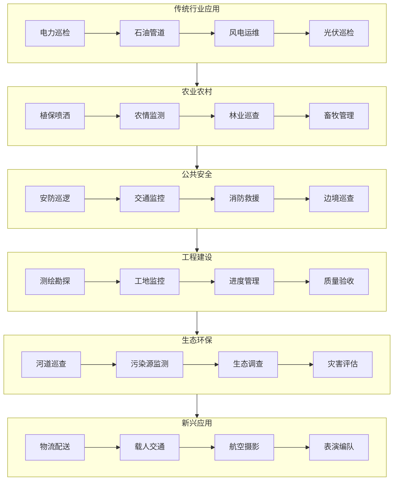
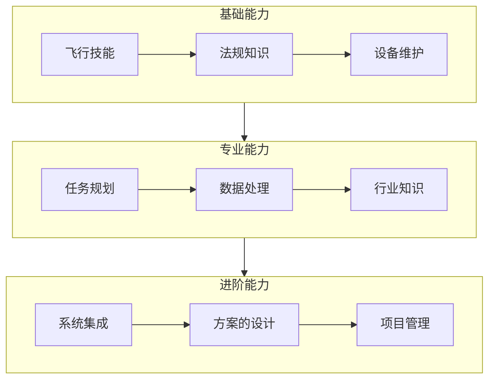

# 无人机行业全景图

> 30 分钟建立无人机行业系统性认知 —— 分类、应用场景、产业链图谱

---

## 一、无人机是什么？

**无人驾驶航空器（Unmanned Aerial Vehicle, UAV）**，简称无人机，是指由无线电遥控设备或自身程序控制装置操纵的、不载人航空器。

### 核心特征

- ✅ 无人驾驶（自主飞行或遥控）
- ✅ 可重复使用
- ✅ 可搭载多种载荷（相机、传感器、货物等）
- ✅ 成本低于有人机

---

## 二、无人机分类

### 按平台构型分类

| 类型 | 特点 | 典型应用 | 代表机型 |
|------|------|---------|---------|
| **多旋翼** | 垂直起降、悬停稳定、操作简单 | 航拍、巡检、安防 | DJI Mavic、Phantom |
| **固定翼** | 续航长、速度快、载重大 | 测绘、巡线、物流 | DJI FlyCart、纵横股份 |
| **垂起固定翼** | 结合两者优点、无需跑道 | 大范围巡检、测绘 | 科比特、普宙 |
| **直升机** | 载重大、抗风强、复杂机动 | 特殊作业、军事 | 各型无人直升机 |
| **倾转旋翼** | 高速巡航 + 垂直起降 | 长距离巡检、物流 | 亿航、峰飞 |

### 按尺寸/重量分类


### 按用途分类

| 类别 | 消费级 | 工业级 | 军用级 |
|------|-------|-------|-------|
| 价格区间 | <1 万元 | 1 万 -50 万元 | 50 万元以上 |
| 核心需求 | 易用性、画质 | 可靠性、专业性 | 隐身、抗干扰 |
| 典型用户 | 个人爱好者 | 企业用户 | 军队、政府 |

---

## 三、应用场景图谱



### 各场景核心需求

| 场景 | 核心需求 | 典型配置 |
|------|---------|---------|
| 电力巡检 | 高清变焦、红外测温、激光雷达 | 可见光 + 红外 + 激光雷达 |
| 农业植保 | 大容量药箱、变量喷洒、RTK 定位 | 植保机 + 多光谱相机 |
| 安防监控 | 实时图传、AI 识别、长续航 | 喊话器 + 探照灯 + 变焦相机 |
| 测绘勘探 | 高精度 POS、倾斜摄影、激光雷达 | RTK+ 倾斜相机/激光雷达 |
| 物流配送 | 大载重、长航时、精准投放 | 大载重多旋翼/垂起固定翼 |

---

## 四、产业链图谱

```mermaid
graph TB
    subgraph 上游 - 核心零部件
        A1[飞控系统] --> A2[动力系统]
        A2 --> A3[通信模块]
        A3 --> A4[传感器]
        A4 --> A5[电池系统]
    end
    
    subgraph 中游 - 整机制造
        B1[消费级无人机] --> B2[工业级无人机]
        B2 --> B3[军用无人机]
        B3 --> B4[零部件供应商]
    end
    
    subgraph 下游 - 应用服务
        C1[飞行服务] --> C2[数据处理]
        C2 --> C3[培训服务]
        C3 --> C4[维修保养]
        C4 --> C5[保险金融]
    end
    
    subgraph 支撑体系
        D1[政策法规] --> D2[标准体系]
        D2 --> D3[空域管理]
        D3 --> D4[人才培养]
    end
    
    上游 - 核心零部件 --> 中游 - 整机制造
    中游 - 整机制造 --> 下游 - 应用服务
    支撑体系 --> 上游 - 核心零部件
    支撑体系 --> 中游 - 整机制造
    支撑体系 --> 下游 - 应用服务
```

### 产业链核心企业

| 环节 | 代表企业 |
|------|---------|
| 整机制造 | 大疆、纵横股份、亿航、极飞、科比特 |
| 飞控系统 | 极飞、拓攻、零度智控 |
| 任务载荷 | 禅思、海康、大华、睿铂 |
| 数据处理 | 大疆智图、ContextCapture、Pix4D |
| 飞行服务 | 各省市无人机协会、专业服务商 |

---

## 五、市场规模与趋势

### 全球市场规模

| 年份 | 市场规模（亿美元） | 增长率 |
|------|------------------|-------|
| 2023 | 307 | 18% |
| 2024 | 362 | 18% |
| 2025 | 428 | 18% |
| 2026E | 505 | 18% |
| 2030E | 1000+ | - |

### 中国市场特点

- 📈 **政策驱动**：低空经济写入政府工作报告
- 🏭 **制造优势**：全球 70% 消费级无人机产自中国
- 🚀 **应用爆发**：电力巡检、农业植保、安防监控快速普及
- 🌐 **出海加速**：中国无人机企业全球化布局

### 技术趋势

| 趋势 | 说明 | 影响 |
|------|------|------|
| 智能化 | AI 识别、自主飞行、集群协同 | 降低操作门槛、提升作业效率 |
| 长航时 | 氢能源、油电混合、系留供电 | 拓展应用场景、提升经济性 |
| 网联化 | 5G 通信、云端协同、远程操控 | 实现超视距作业、集中管控 |
| 规范化 | 实名登记、空域申请、适航认证 | 行业合规发展、良性竞争 |

---

## 六、低空经济政策环境

### 国家政策

| 文件 | 发布时间 | 核心内容 |
|------|---------|---------|
| 《无人驾驶航空器飞行管理暂行条例》 | 2023-06 | 统一监管框架、分类管理 |
| 《国家综合立体交通网规划纲要》 | 2021-02 | 发展低空经济、通用航空 |
| 《"十四五"通用航空发展专项规划》 | 2021-12 | 无人机物流、城市空中交通 |

### 地方政策

- 📍 **深圳**：低空经济产业创新中心
- 📍 **湖南**：全国首个全域低空管理改革试点
- 📍 **安徽**：低空经济综合改革试点
- 📍 **四川**：无人机协同运行管理平台

---

## 七、入行建议

### 三类入行路径

| 路径 | 适合人群 | 核心能力 | 学习周期 |
|------|---------|---------|---------|
| **飞手/操作手** | 喜欢飞行、户外工作 | 飞行技能、法规知识 | 1-3 个月 |
| **技术开发** | 软件/硬件工程师 | 飞控/算法/嵌入式 | 6-12 个月 |
| **行业应用** | 销售/方案/交付 | 行业知识、项目管理 | 3-6 个月 |

### 能力模型



---

## 八、下一步学习

完成本文后，建议继续学习：

1. 📖 [术语表](./02-术语表.md) — 掌握电调/飞控/IMU/RTK 等核心概念
2. 📖 [学习路径图](./03-学习路径图.md) — 规划你的成长路线
3. 📖 [避坑指南](./04-避坑指南.md) — 新手常见问题与解决方案

---

## 九、参考资料

- 中国航空运输协会通用航空分会
- 民航局无人机管理平台
- 各省市低空经济产业政策
- 大疆行业应用案例库

---

<div align="center">

**继续学习 →** [术语表](./02-术语表.md)

</div>
