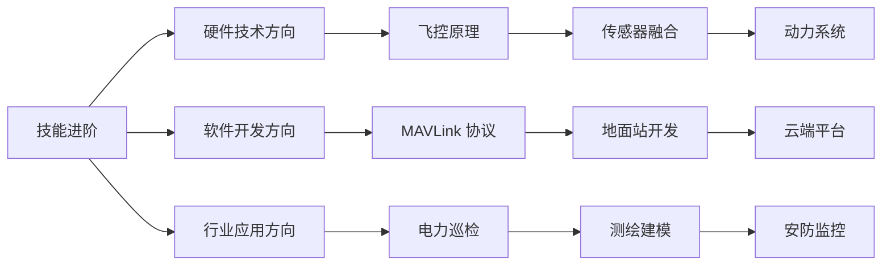
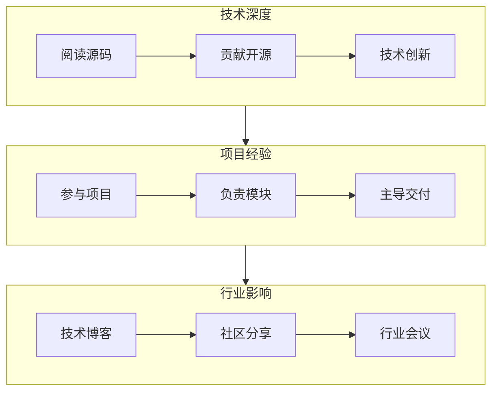

# 无人机学习路径图

> 从零开始到专业开发者的三阶段成长路线

---

## 一、学习路径总览

```mermaid
graph TB
    subgraph 第一阶段：入门认知（1-2 个月）
        A1[行业认知] --> A2[法规合规]
        A2 --> A3[基础飞行]
        A3 --> A4[设备操作]
    end
    
    subgraph 第二阶段：技能进阶（3-6 个月）
        B1[硬件技术] --> B2[通讯协议]
        B2 --> B3[任务规划]
        B3 --> B4[数据处理]
    end
    
    subgraph 第三阶段：专业发展（6-12 个月）
        C1[飞控开发] --> C2[AI 算法]
        C2 --> C3[系统集成]
        C3 --> C4[项目交付]
    end
    
    第一阶段：入门认知 --> 第二阶段：技能进阶
    第二阶段：技能进阶 --> 第三阶段：专业发展
```

---

## 二、第一阶段：入门认知（1-2 个月）

### 目标

- ✅ 建立无人机行业系统性认知
- ✅ 掌握基础法规和飞行安全知识
- ✅ 能够独立操作消费级无人机

### 学习内容

| 周次 | 主题 | 学习资源 | 实践任务 |
|------|------|---------|---------|
| 第 1 周 | 行业认知 | [行业全景图](./01-行业全景图.md) | 阅读 10 个行业案例 |
| 第 2 周 | 术语入门 | [术语表](./02-术语表.md) | 制作术语卡片 |
| 第 3 周 | 法规合规 | [01-Policy-Standard](../01-Policy-Standard/) | 完成 UOM 实名登记 |
| 第 4 周 | 基础飞行 | 模拟器 + 实机 | 累计飞行 10 小时 |
| 第 5-6 周 | 设备操作 | 厂商教程 | 熟练掌握 1 款机型 |
| 第 7-8 周 | 安全与应急 | 飞行手册 | 演练 5 种应急场景 |

### 推荐资源

- 📖 书籍：《无人机驾驶员教程》
- 🎥 视频：B 站"无人机飞行学院"
- 📱 App：UOM 平台、Flysafe
- 🖥️ 模拟器：DJI Flight Simulator、VelociDrone

### 阶段成果

- ✅ 通过 CAAC 无人机驾驶员考试（视距内）
- ✅ 累计安全飞行 20+ 小时
- ✅ 能够独立完成航拍/巡检任务

---

## 三、第二阶段：技能进阶（3-6 个月）

### 目标

- ✅ 掌握无人机硬件系统原理
- ✅ 理解通讯协议与地面站开发
- ✅ 能够进行任务规划与数据处理

### 学习方向选择



### 3.1 硬件技术方向

| 月次 | 主题 | 学习资源 | 实践任务 |
|------|------|---------|---------|
| 第 1 月 | 飞控原理 | [02-Hardware-Systems](../02-Hardware-Systems/) | 拆解 1 台飞控 |
| 第 2 月 | 传感器 | IMU/GPS/气压计原理 | 传感器数据采集 |
| 第 3 月 | 动力系统 | 电机/电调/螺旋桨匹配 | 动力计算与选型 |

### 3.2 软件开发方向

| 月次 | 主题 | 学习资源 | 实践任务 |
|------|------|---------|---------|
| 第 1 月 | MAVLink 协议 | [03-Protocols-Dev](../03-Protocols-Dev/) | 解析 MAVLink 消息 |
| 第 2 月 | 地面站开发 | QGC 源码阅读 | 定制地面站功能 |
| 第 3 月 | 云端平台 | 无人机云系统架构 | 搭建简易云平台 |

### 3.3 行业应用方向

| 月次 | 主题 | 学习资源 | 实践任务 |
|------|------|---------|---------|
| 第 1 月 | 电力巡检 | [06-Industry-Solutions](../06-Industry-Solutions/) | 跟随巡检 1 次 |
| 第 2 月 | 测绘建模 | 大疆智图教程 | 完成 1 个建模项目 |
| 第 3 月 | 安防监控 | 图传 +AI 识别 | 搭建监控系统 |

### 阶段成果

- ✅ 掌握 1 个方向的专业技术
- ✅ 完成 3-5 个实战项目
- ✅ 能够独立承担行业应用任务

---

## 四、第三阶段：专业发展（6-12 个月）

### 目标

- ✅ 具备系统集成能力
- ✅ 能够独立负责项目交付
- ✅ 形成个人技术专长

### 专业路径

| 角色 | 核心能力 | 学习重点 |
|------|---------|---------|
| **飞控开发工程师** | 嵌入式 C/C++、控制算法 | PX4/ArduPilot 二次开发 |
| **算法工程师** | Python、深度学习、部署优化 | YOLO、SLAM、边缘计算 |
| **系统集成工程师** | 硬件选型、软件集成、调试 | 完整系统搭建与交付 |
| **行业方案专家** | 行业知识、方案设计、项目管理 | 电力/农业/安防深度应用 |

### 能力提升



### 阶段成果

- ✅ 主导完成 3+ 个行业项目交付
- ✅ 在 GitHub 有开源贡献
- ✅ 形成个人技术品牌（博客/分享）

---

## 五、学习资源推荐

### 在线课程

| 平台 | 课程 | 适合阶段 |
|------|------|---------|
| 中国大学 MOOC | 《无人机概论》 | 入门 |
| 极客时间 | 《无人机开发实战》 | 进阶 |
| Udemy | Drone Programming with Python | 进阶 |
| Coursera | Robotics Specialization | 专业 |

### 开源项目

| 项目 | 用途 | 学习价值 |
|------|------|---------|
| ArduPilot | 开源飞控 | 飞控原理 |
| PX4 | 开源飞控 | 模块化设计 |
| QGroundControl | 地面站 | 用户交互 |
| MAVSDK | 开发 SDK | 协议封装 |
| ZLMediaKit | 流媒体 | 视频传输 |

### 社区与资讯

| 类型 | 名称 |
|------|------|
| 论坛 | 5iMX、模友之家 |
| 公众号 | 无人机世界、无人机网 |
| 资讯 | 全球无人机网、宇辰网 |
| GitHub | drone、uav 标签 |

---

## 六、认证与资质

### 国内认证

| 证书 | 颁发机构 | 用途 |
|------|---------|------|
| CAAC 驾驶员执照 | 民航局 | 合法飞行资质 |
| AOPA 合格证 | 航空器拥有者协会 | 行业认可 |
| UTC 证书 | 大疆慧飞 | 行业应用（航拍/植保/巡检） |

### 国际认证

| 证书 | 国家/地区 | 说明 |
|------|----------|------|
| Part 107 | 美国 | 商业飞行许可 |
| GVC | 英国 | 通用飞行资质 |
| RPL | 澳大利亚 | 远程飞行员执照 |

---

## 七、职业发展建议

### 岗位方向

| 岗位 | 薪资范围（1-3 年） | 核心要求 |
|------|------------------|---------|
| 无人机飞手 | 6-15k | 飞行技能、行业经验 |
| 飞控开发工程师 | 15-35k | C/C++、嵌入式、控制理论 |
| 算法工程师 | 20-40k | 深度学习、部署优化 |
| 行业方案经理 | 15-30k | 行业知识、方案设计 |
| 项目经理 | 15-35k | 项目管理、交付经验 |

### 发展建议

1. **早期（1-3 年）**：深耕技术，积累项目经验
2. **中期（3-5 年）**：拓展行业视野，建立人脉
3. **长期（5 年+）**：成为行业专家或创业者

---

<div align="center">

**继续学习 →** [避坑指南](./04-避坑指南.md)

</div>
