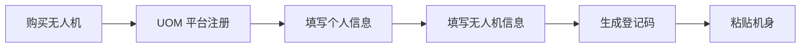
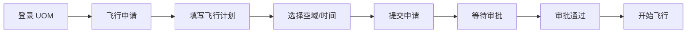

# 无人机政策法规汇编

> 《无人驾驶航空器飞行管理暂行条例》深度解读 —— 合规飞行必备

---

## 一、法规体系概览

### 国家层面法规

| 法规名称 | 发布时间 | 实施时间 | 核心内容 |
|---------|---------|---------|---------|
| 《无人驾驶航空器飞行管理暂行条例》 | 2023-06-28 | 2024-01-01 | 统一监管框架、分类管理 |
| 《民用航空法》 | 2018-12-29 | - | 航空活动基本法律 |
| 《飞行基本规则》 | 2007-08-23 | - | 飞行活动通用规则 |

### 部门规章

| 规章名称 | 发布部门 | 适用范围 |
|---------|---------|---------|
| 《民用无人驾驶航空器实名登记管理规定》 | 民航局 | 所有无人机 |
| 《民用无人驾驶航空器驾驶员管理暂行规定》 | 民航局 | 操作人员 |
| 《民用无人驾驶航空器系统空中交通管理办法》 | 民航局 | 空域管理 |

### 地方性法规

| 地区 | 法规名称 | 特点 |
|------|---------|------|
| 深圳 | 《深圳经济特区低空经济产业促进条例》 | 全国首部低空经济立法 |
| 湖南 | 《湖南省低空空域管理改革试点方案》 | 全域低空管理改革 |
| 安徽 | 《安徽省低空经济高质量发展行动计划》 | 产业发展支持 |

---

## 二、《暂行条例》核心解读

### 2.1 无人机分类管理

| 类别 | 空机重量 | 起飞全重 | 管理要求 |
|------|---------|---------|---------|
| 微型 | <250g | <250g | 备案即可，无需执照 |
| 轻型 | 250g-4kg | <4kg | 实名登记，视距内飞行 |
| 小型 | 4kg-25kg | <25kg | 需要执照，空域申请 |
| 中型 | 25kg-150kg | <150kg | 严格管理，适航认证 |
| 大型 | >150kg | >150kg | 按有人机标准管理 |

### 2.2 实名登记要求

**登记对象：**
- 所有民用无人机（除玩具外）
- 包括境外无人机入境使用

**登记流程：**

**登记信息：**
- 所有人姓名/名称
- 联系方式
- 无人机型号、序列号
- 用途类型

**未登记处罚：**
- 个人：罚款 1000-10000 元
- 单位：罚款 10000-100000 元

### 2.3 飞行空域管理

**空域分类：**

| 类型 | 说明 | 飞行要求 |
|------|------|---------|
| 管制空域 | 机场、军事区、政治敏感区 | 禁止飞行（除非特批） |
| 报告空域 | 城市建成区、人口密集区 | 提前报告 |
| 监视空域 | 其他区域 | 保持通讯畅通 |
| 适飞空域 | 真高 120 米以下 | 无需申请 |

**禁飞区域：**
- 机场净空保护区（20-55km）
- 军事管理区
- 政治敏感区（中南海、核电站等）
- 大型活动现场
- 高铁站、火车站周边

### 2.4 驾驶员资质要求

| 无人机类别 | 资质要求 | 考试机构 |
|-----------|---------|---------|
| 微型 | 无需执照 | - |
| 轻型（视距内） | CAAC 执照 | 民航局指定机构 |
| 小型及以上 | CAAC 执照 + 等级 | 民航局指定机构 |
| 商用飞行 | CAAC 执照 + 运营合格证 | 民航局 |

**执照类型：**
- 视距内驾驶员（VLOS）
- 超视距驾驶员（BVLOS）
- 教员等级

---

## 三、UOM 平台实操指南

### 3.1 平台入口

- **官网**: https://uom.caac.gov.cn
- **App**: "UOM"（应用商店下载）
- **功能**: 实名登记、飞行申请、空域查询、驾驶员管理

### 3.2 实名登记流程

**步骤 1：账号注册**
- 下载 UOM App
- 手机号注册
- 实名认证（身份证）

**步骤 2：无人机登记**
- 点击"无人机登记"
- 填写无人机信息（型号、序列号、购买日期）
- 上传购买凭证（可选）
- 生成登记二维码

**步骤 3：粘贴登记码**
- 打印二维码贴纸
- 粘贴于机身明显位置
- 拍照存档

### 3.3 飞行申请流程

**需要申请的场景：**
- 小型及以上无人机飞行
- 轻型无人机超视距飞行
- 在报告空域飞行
- 夜间飞行

**申请步骤：**

**申请信息：**
- 飞行时间（起止）
- 飞行区域（坐标或地图选点）
- 飞行高度
- 无人机信息
- 驾驶员信息

**审批时限：**
- 常规申请：提前 1 天
- 紧急任务：可加急处理

---

## 四、违规处罚案例

### 案例 1：黑飞被查处

**案情：** 2024 年 3 月，张某在机场净空区飞行无人机，被雷达发现。

**处罚：**
- 罚款 20000 元
- 没收无人机
- 纳入征信记录

**教训：** 飞行前必须查询禁飞区

### 案例 2：未实名登记

**案情：** 2024 年 5 月，李某驾驶无人机航拍，被群众举报。

**处罚：**
- 罚款 1000 元
- 责令限期登记

**教训：** 购买无人机后第一时间登记

### 案例 3：伤人事故

**案情：** 2023 年 12 月，王某无人机失控坠落，砸伤路人。

**处罚：**
- 赔偿医疗费 50000 元
- 罚款 10000 元
- 吊销执照

**教训：** 必须购买第三方责任险

---

## 五、合规飞行清单

### 飞行前检查

- [ ] 无人机已实名登记
- [ ] 登记码已粘贴机身
- [ ] 驾驶员执照有效（如需）
- [ ] 第三方保险在有效期
- [ ] 查询禁飞区（UOM 平台）
- [ ] 确认天气条件良好
- [ ] 电池电量充足
- [ ] 螺旋桨完好

### 飞行中注意

- [ ] 保持视距内（如需）
- [ ] 飞行高度<120 米（适飞空域）
- [ ] 远离人群、建筑物
- [ ] 注意周围航空器
- [ ] 保持通讯畅通

### 飞行后记录

- [ ] 填写飞行日志
- [ ] 设备检查保养
- [ ] 数据备份
- [ ] 异常情况记录

---

## 六、常见问题解答

### Q1：玩具无人机需要登记吗？

**答：** 不需要。但需满足：
- 重量<250g
- 无摄像头
- 仅限室内或封闭场地

### Q2：在自家院子飞需要申请吗？

**答：** 分情况：
- 微型无人机：不需要
- 轻型无人机（视距内）：不需要
- 小型及以上：需要申请

### Q3：航拍需要额外许可吗？

**答：** 分情况：
- 个人娱乐：不需要
- 商业航拍：需要运营合格证
- 涉及敏感区域：需要额外审批

### Q4：无人机可以夜间飞行吗？

**答：** 需要满足：
- 驾驶员持有夜航资质
- 无人机有夜航灯
- 提前申请空域

### Q5：境外无人机可以在中国使用吗？

**答：** 可以，但需：
- 在 UOM 平台登记
- 遵守中国法规
- 部分品牌可能限飞

---

## 七、政策动态追踪

### 2026 年政策展望

| 政策方向 | 预计内容 | 影响 |
|---------|---------|------|
| 低空经济立法 | 国家层面立法 | 产业规范化 |
| 空域开放 | 扩大适飞空域 | 降低飞行门槛 |
| 无人机物流 | 专项管理办法 | 促进行业发展 |
| 城市空中交通 | eVTOL 管理规则 | 新兴业态规范 |

### 地方政策趋势

- **深圳**: 低空经济产业创新中心
- **湖南**: 全域低空管理改革深化
- **安徽**: 低空经济综合改革试点
- **四川**: 无人机协同运行管理平台

---

## 八、参考资料

- 民航局官网：https://www.caac.gov.cn
- UOM 平台：https://uom.caac.gov.cn
- 《无人驾驶航空器飞行管理暂行条例》全文
- 各省市低空经济产业政策汇编

---

**继续学习 →** [02-UOM 平台实操](./02-UOM 平台实操.md)

**最后更新**: 2026-04-05

