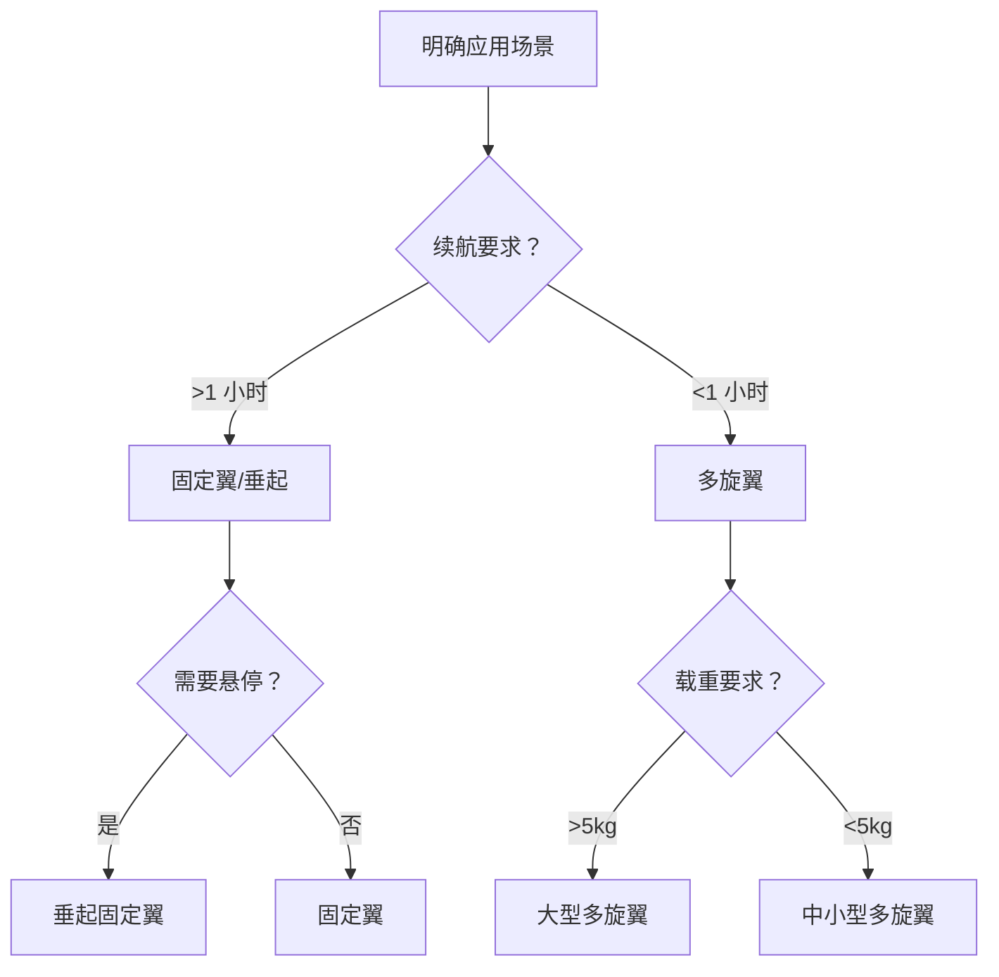

# 飞行平台选型指南

> 多旋翼/固定翼/垂起固定翼对比与选型 —— 找到最适合你的无人机

---

## 一、平台类型对比

### 1.1 多旋翼无人机

**结构特点：**
- 3 个以上旋翼
- 通过差速控制姿态
- 垂直起降、可悬停

**优点：**
- ✅ 操作简单，上手快
- ✅ 垂直起降，场地要求低
- ✅ 可悬停，适合精细作业
- ✅ 成本低，维护方便

**缺点：**
- ❌ 续航短（20-40 分钟）
- ❌ 速度慢（40-80km/h）
- ❌ 载重小（<5kg）
- ❌ 抗风能力弱

**典型应用：**
- 航拍摄影
- 近距离巡检
- 安防监控
- 城市配送

**代表机型：**
| 机型 | 轴距 | 续航 | 载重 | 价格 |
|------|------|------|------|------|
| DJI Mavic 3 | 221mm | 46min | 1kg | 1.5 万 |
| DJI Matrice 350 | 719mm | 55min | 2.7kg | 10 万 + |
| 极飞 P150 | 1650mm | 40min | 50kg | 15 万 + |

### 1.2 固定翼无人机

**结构特点：**
- 有机翼，靠升力飞行
- 需要滑跑/弹射起飞
- 不能悬停

**优点：**
- ✅ 续航长（1-4 小时）
- ✅ 速度快（60-150km/h）
- ✅ 载重大（5-50kg）
- ✅ 抗风能力强
- ✅ 覆盖面积大

**缺点：**
- ❌ 需要起降场地
- ❌ 不能悬停
- ❌ 操作复杂
- ❌ 成本高

**典型应用：**
- 大面积测绘
- 长距离巡线
- 物流货运
- 海洋监测

**代表机型：**
| 机型 | 翼展 | 续航 | 载重 | 价格 |
|------|------|------|------|------|
| 纵横股份 CW-15 | 1.5m | 90min | 1.5kg | 8 万 |
| 纵横股份 CW-100 | 3.5m | 240min | 10kg | 50 万 + |
| 科比特 PH-10 | 2.8m | 180min | 5kg | 30 万 |

### 1.3 垂起固定翼（VTOL）

**结构特点：**
- 结合多旋翼和固定翼
- 垂直起降 + 水平巡航
- 无需跑道

**优点：**
- ✅ 垂直起降，场地要求低
- ✅ 续航长（1-3 小时）
- ✅ 速度快（80-120km/h）
- ✅ 可悬停（起降阶段）

**缺点：**
- ❌ 结构复杂
- ❌ 成本高
- ❌ 维护复杂
- ❌ 效率略低于纯固定翼

**典型应用：**
- 大范围巡检
- 测绘勘探
- 边境巡逻
- 海洋监测

**代表机型：**
| 机型 | 翼展 | 续航 | 载重 | 价格 |
|------|------|------|------|------|
| 大疆 FlyCart 30 | 2.2m | 120min | 30kg | 20 万 |
| 峰飞航空 V2000CG | 3.2m | 180min | 50kg | 80 万 + |
| 亿航 EH216 | 5.6m | 25min | 220kg | 200 万 + |

---

## 二、选型决策流程

### 2.1 需求分析

### 2.2 关键参数对比

| 参数 | 多旋翼 | 固定翼 | 垂起固定翼 |
|------|-------|-------|-----------|
| 续航 | 20-60min | 60-240min | 60-180min |
| 速度 | 40-80km/h | 60-150km/h | 80-120km/h |
| 载重 | 0.5-50kg | 1-50kg | 5-50kg |
| 起降场地 | 2×2m | 50×50m | 5×5m |
| 抗风等级 | 4-6 级 | 5-7 级 | 5-6 级 |
| 价格 | 0.5-20 万 | 5-100 万 | 10-100 万 |

### 2.3 场景推荐

| 场景 | 推荐类型 | 理由 |
|------|---------|------|
| 城市航拍 | 多旋翼 | 灵活、可悬停 |
| 电力巡检 | 多旋翼/垂起 | 可悬停检查、续航适中 |
| 大面积测绘 | 固定翼/垂起 | 效率高、覆盖广 |
| 物流配送 | 垂起/多旋翼 | 垂直起降、载重大 |
| 边境巡逻 | 固定翼/垂起 | 续航长、速度快 |
| 安防监控 | 多旋翼 | 可悬停、响应快 |

---

## 三、核心系统选型

### 3.1 动力系统

**电机选择：**
| 类型 | KV 值 | 适用螺旋桨 | 特点 |
|------|------|-----------|------|
| 低 KV | <500 | 大桨（15-30 寸） | 扭矩大、效率高 |
| 中 KV | 500-1000 | 中桨（8-15 寸） | 平衡 |
| 高 KV | >1000 | 小桨（5-8 寸） | 转速高、响应快 |

**电调选择：**
- 持续电流 = 电机最大电流 × 1.2
- 支持电池 S 数匹配
- 协议：PWM/Oneshot/Dshot

**螺旋桨选择：**
- 大桨：效率高、噪音低
- 小桨：响应快、速度快
- 材质：塑料/碳纤维/木质

### 3.2 飞控系统

**开源飞控：**
| 飞控 | 特点 | 适用 |
|------|------|------|
| Pixhawk 4 | 稳定、生态好 | 通用 |
| Cube Orange+ | 高可靠、冗余 | 工业级 |
| Holybro Kakute | 小巧、性价比高 | 小型机 |

**商业飞控：**
- DJI A3/N3：大疆生态
- 极飞 P150：农业专用
- 拓攻 TC16：行业应用

### 3.3 导航系统

**GPS 模块：**
- 单系统：GPS 或 北斗
- 多系统：GPS+ 北斗+GLONASS+Galileo
- 精度：普通米级、RTK 厘米级

**RTK 系统：**
- 基站 + 移动站
- 精度：1-2cm
- 应用：测绘、精准农业

### 3.4 图传系统

**模拟图传：**
- 延迟：<10ms
- 距离：1-10km
- 用途：FPV 竞速

**数字图传：**
| 方案 | 延迟 | 画质 | 距离 |
|------|------|------|------|
| DJI O3 | 120ms | 1080p/60fps | 15km |
| DJI Air Unit | <50ms | 1080p | 10km |
| Walksnail | 30ms | 1080p | 10km |

**4G/5G 图传：**
- 延迟：100-500ms
- 距离：全网覆盖
- 用途：超视距飞行

---

## 四、成本估算

### 4.1 整机成本

| 类型 | 入门级 | 进阶级 | 专业级 |
|------|-------|--------|-------|
| 多旋翼 | 0.5-2 万 | 2-10 万 | 10-50 万 |
| 固定翼 | 5-15 万 | 15-50 万 | 50-200 万 |
| 垂起 | 10-30 万 | 30-80 万 | 80-300 万 |

### 4.2 配件成本

| 配件 | 价格 | 更换周期 |
|------|------|---------|
| 备用电池 | 500-5000 元 | 2-3 年 |
| 螺旋桨 | 50-500 元/对 | 3-6 个月 |
| 电机 | 200-2000 元 | 1-2 年 |
| 图传模块 | 1000-10000 元 | 3-5 年 |

### 4.3 运营成本

| 项目 | 费用 | 说明 |
|------|------|------|
| 保险 | 500-5000 元/年 | 第三方责任险 |
| 维修 | 设备价值 5-10%/年 | 日常维护 |
| 培训 | 5000-20000 元 | 飞手培训 |
| 软件 | 0-50000 元/年 | 地面站、处理软件 |

---

## 五、避坑指南

### 5.1 常见误区

**误区 1：越大越好**
- 实际：根据需求选择
- 大型机：成本高、操作复杂
- 小型机：灵活、成本低

**误区 2：续航越长越好**
- 实际：续航与载重、成本平衡
- 过长续航：增加电池重量
- 建议：多备电池更灵活

**误区 3：进口一定好**
- 实际：国产已领先
- 大疆：消费级全球第一
- 极飞：农业无人机领先

### 5.2 采购建议

**预算分配：**
- 整机：60-70%
- 配件：15-20%
- 培训：5-10%
- 保险：5%

**采购渠道：**
- 官方渠道：质量保障、售后好
- 授权经销商：价格优惠、本地服务
- 二手市场：成本低、风险高

**验收要点：**
- 外观检查（无损伤）
- 功能测试（飞行、图传）
- 配件清点（电池、充电器等）
- 资料齐全（说明书、保修卡）

---

## 六、维护与保养

### 6.1 日常检查

**飞行前：**
- [ ] 螺旋桨无裂纹
- [ ] 电机转动顺畅
- [ ] 电池电量充足
- [ ] 螺丝紧固

**飞行后：**
- [ ] 清洁机身
- [ ] 检查磨损
- [ ] 电池存放（50-60% 电量）
- [ ] 记录飞行日志

### 6.2 定期保养

| 周期 | 保养项目 |
|------|---------|
| 每月 | 螺丝紧固、电机润滑 |
| 每季 | 螺旋桨更换、电池检测 |
| 每年 | 全面检修、固件升级 |

### 6.3 常见故障

| 故障 | 原因 | 解决 |
|------|------|------|
| 抖动 | 螺旋桨不平衡 | 更换螺旋桨 |
| 偏航 | 指南针干扰 | 重新校准 |
| 失控 | 图传干扰 | 检查天线 |
| 掉电快 | 电池老化 | 更换电池 |

---

## 七、未来趋势

### 7.1 技术趋势

| 趋势 | 说明 | 影响 |
|------|------|------|
| 电动化 | 氢能源、固态电池 | 续航提升 |
| 智能化 | AI 避障、自主飞行 | 降低门槛 |
| 网联化 | 5G、卫星通信 | 超视距作业 |
| 大型化 | 载人、重载 | 新应用场景 |

### 7.2 市场趋势

- 消费级：稳定增长
- 工业级：快速增长
- 军用级：持续发展
- eVTOL：新兴蓝海

---

**继续学习 →** [02-动力系统](./02-动力系统.md)

**最后更新**: 2026-04-05

