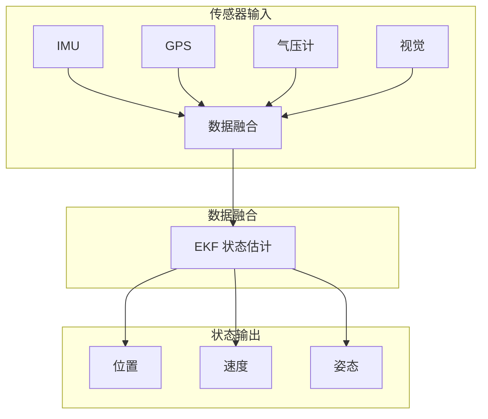

# 传感器详解

> IMU/GPS/气压计/避障传感器 —— 无人机感知系统核心

---

## 一、IMU（惯性测量单元）

### 1.1 工作原理

**核心组件：**
- 加速度计（3 轴）：测量线加速度
- 陀螺仪（3 轴）：测量角速度
- （有时包含磁力计）

**数据融合：**
```
原始数据 → 滤波 → 姿态解算 → 输出姿态角

常用算法：
- 互补滤波（简单、快速）
- 卡尔曼滤波（精确、复杂）
- 扩展卡尔曼滤波（EKF）
```

### 1.2 关键参数

| 参数 | 说明 | 典型值 |
|------|------|-------|
| 零偏稳定性 | 静止时输出波动 | <0.1mg |
| 噪声密度 | 噪声水平 | <100μg/√Hz |
| 量程 | 测量范围 | ±2g/±8g/±16g |
| 采样率 | 数据更新频率 | 1kHz-8kHz |

### 1.3 主流型号

| 型号 | 厂商 | 特点 | 价格 |
|------|------|------|------|
| MPU6000 | InvenSense | 经典、性价比高 | ~20 元 |
| MPU9250 | InvenSense | 9 轴（含磁力计） | ~30 元 |
| ICM20689 | InvenSense | 高性能 | ~50 元 |
| BMI088 | Bosch | 工业级 | ~80 元 |
| ADIS16470 | ADI | 战术级 | ~2000 元 |

### 1.4 校准方法

**加速度计校准：**
```
1. 水平放置 → 记录 Z 轴读数（应为 1g）
2. 翻转 180° → 记录 Z 轴读数（应为 -1g）
3. 计算零偏和比例因子
```

**陀螺仪校准：**
```
1. 静止放置
2. 采集 1000 组数据
3. 计算平均值作为零偏
```

---

## 二、GPS/北斗模块

### 2.1 定位原理

**三边测量：**
```
卫星 1 距离 → 球面 1
卫星 2 距离 → 球面 2
卫星 3 距离 → 球面 3
三球交点 → 位置坐标
```

**需要 4 颗卫星：**
- 3 颗用于定位（X,Y,Z）
- 1 颗用于时间同步

### 2.2 关键参数

| 参数 | 说明 | 典型值 |
|------|------|-------|
| 定位精度 | 位置误差 | 2-5m（单点） |
| 更新频率 | 数据输出率 | 5-10Hz |
| 冷启动时间 | 首次定位 | <30s |
| 灵敏度 | 信号捕获 | -165dBm |

### 2.3 主流型号

| 型号 | 星座 | 通道 | 精度 | 价格 |
|------|------|------|------|------|
| NEO-M8N | GPS+ 北斗 | 72 | 2.5m | ~100 元 |
| NEO-M9N | 全星座 | 99 | 2m | ~150 元 |
| F9P | GPS+ 北斗 +RTK | 84 | 厘米级 | ~800 元 |
| AT6558R | 北斗为主 | 65 | 2.5m | ~80 元 |

### 2.4 安装要点

**位置选择：**
- 远离金属物体
- 远离电机和电调
- 天空视野开阔
- 固定牢固

**干扰抑制：**
- 使用有源屏蔽罩
- 远离数传天线
- 电源滤波

---

## 三、气压计

### 3.1 工作原理

**气压 - 高度关系：**
```
P = P0 × (1 - 2.25577×10^-5 × h)^5.25588

其中：
P：当前气压
P0：海平面气压（1013.25hPa）
h：高度（米）
```

### 3.2 关键参数

| 参数 | 说明 | 典型值 |
|------|------|-------|
| 精度 | 气压测量误差 | ±0.12hPa |
| 分辨率 | 最小变化量 | 0.01hPa |
| 响应时间 | 数据更新 | <10ms |
| 温度漂移 | 温度影响 | <0.5Pa/K |

### 3.3 主流型号

| 型号 | 厂商 | 精度 | 价格 |
|------|------|------|------|
| BMP280 | Bosch | ±1hPa | ~10 元 |
| BME280 | Bosch | ±1hPa（含温湿度） | ~15 元 |
| MS5611 | MEAS | ±0.012hPa | ~50 元 |
| SPL06 | Infineon | ±0.002hPa | ~80 元 |

### 3.4 使用技巧

**温度补偿：**
```python
# BME280 温度补偿公式
var1 = (temp_fine - 64000.0 + 4.0 * dig_T2 * 
        ((temp_fine * temp_fine) / 131072.0)) / 16.0
pressure = 1048576.0 - adc_P
pressure = (pressure - var1 / 4096.0) * 6250.0 / dig_P1
```

**高度滤波：**
```python
# 低通滤波
filtered_alt = alpha * raw_alt + (1 - alpha) * filtered_alt
# alpha 取 0.1-0.3
```

---

## 四、避障传感器

### 4.1 类型对比

| 类型 | 原理 | 距离 | 精度 | 价格 |
|------|------|------|------|------|
| 超声波 | 声波反射 | 0.1-5m | ±1cm | ~20 元 |
| 红外 ToF | 光飞行时间 | 0.1-10m | ±1cm | ~50 元 |
| 结构光 | 图案投射 | 0.5-10m | ±1cm | ~200 元 |
| 激光雷达 | 激光扫描 | 0.1-100m | ±2cm | ~500 元 + |
| 视觉 | 图像识别 | 0.5-50m | ±5cm | ~300 元 |

### 4.2 超声波传感器

**HC-SR04：**
```python
import time
import RPi.GPIO as GPIO

TRIG = 23
ECHO = 24

GPIO.setup(TRIG, GPIO.OUT)
GPIO.setup(ECHO, GPIO.IN)

def get_distance():
    GPIO.output(TRIG, True)
    time.sleep(0.00001)
    GPIO.output(TRIG, False)
    
    while GPIO.input(ECHO) == 0:
        pulse_start = time.time()
    
    while GPIO.input(ECHO) == 1:
        pulse_end = time.time()
    
    duration = pulse_end - pulse_start
    distance = duration * 17150  # 声速 343m/s
    
    return round(distance, 2)
```

**应用场景：**
- 定高（低空）
- 下视避障
- 自动降落

### 4.3 激光雷达

**TF-Luna（单点）：**
- 距离：0.2-8m
- 频率：100Hz
- 接口：UART/I2C
- 价格：~150 元

**Livox Mid-40（3D）：**
- 距离：0.5-260m
- 视场角：38.4°
- 点频：24 万点/秒
- 价格：~2 万元

**应用场景：**
- SLAM 定位
- 3D 建模
- 自主避障

### 4.4 视觉传感器

**Intel RealSense D435i：**
- 深度范围：0.2-10m
- RGB 分辨率：1280×720
- 深度分辨率：1280×720
- IMU：内置
- 价格：~1500 元

**应用场景：**
- 视觉 SLAM
- 目标跟踪
- 手势识别

---

## 五、传感器融合

### 5.1 融合架构



### 5.2 EKF 原理

**状态预测：**
```
x_k = F × x_{k-1} + B × u_k
P_k = F × P_{k-1} × F^T + Q
```

**观测更新：**
```
K_k = P_k × H^T × (H × P_k × H^T + R)^-1
x_k = x_k + K_k × (z_k - H × x_k)
P_k = (I - K_k × H) × P_k
```

### 5.3 PX4 EKF2 配置

**关键参数：**
```
EKF2_AID_MASK：传感器选择
- 0：GPS
- 1：视觉
- 2：虚拟 GPS（无 GPS 环境）

EKF2_HGT_MODE：高度源
- 0：气压计
- 1：GPS 高度
- 2：测距仪
```

---

## 六、故障排查

### 6.1 IMU 故障

| 故障 | 现象 | 解决 |
|------|------|------|
| 漂移 | 姿态缓慢变化 | 重新校准 |
| 跳变 | 姿态突然变化 | 检查振动 |
| 无数据 | 连接失败 | 检查接线 |

### 6.2 GPS 故障

| 故障 | 现象 | 解决 |
|------|------|------|
| 搜星少 | <6 颗卫星 | 检查安装位置 |
| 定位漂移 | 位置跳动 | 检查干扰 |
| 无数据 | 无输出 | 检查波特率 |

### 6.3 气压计故障

| 故障 | 现象 | 解决 |
|------|------|------|
| 高度跳变 | 高度不稳定 | 检查漏光 |
| 漂移 | 高度缓慢变化 | 温度补偿 |
| 无数据 | 无输出 | 检查 I2C |

---

## 七、选型建议

### 7.1 入门级配置

| 传感器 | 型号 | 价格 |
|--------|------|------|
| IMU | MPU6000 | 20 元 |
| GPS | NEO-M8N | 100 元 |
| 气压计 | BMP280 | 10 元 |
| 避障 | HC-SR04 | 20 元 |
| **合计** | - | **150 元** |

### 7.2 进阶级配置

| 传感器 | 型号 | 价格 |
|--------|------|------|
| IMU | ICM20689 | 50 元 |
| GPS | NEO-M9N | 150 元 |
| 气压计 | MS5611 | 50 元 |
| 避障 | TF-Luna | 150 元 |
| **合计** | - | **400 元** |

### 7.3 专业级配置

| 传感器 | 型号 | 价格 |
|--------|------|------|
| IMU | BMI088 | 80 元 |
| GPS | F9P（RTK） | 800 元 |
| 气压计 | SPL06 | 80 元 |
| 避障 | RealSense D435i | 1500 元 |
| 激光雷达 | Livox Mid-40 | 20000 元 |
| **合计** | - | **22460 元** |

---

<div align="center">

**继续学习 →** [04-图传系统](./04-图传系统.md)

**最后更新**: 2026-04-05

</div>
