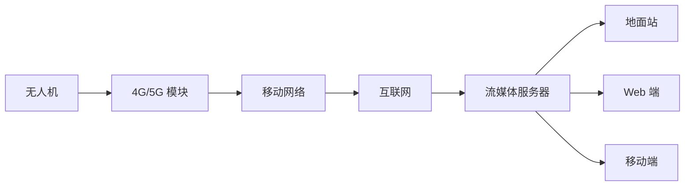

# 图传系统详解

> 模拟/数字/O3/4G 图传 —— 选择最适合的图像传输方案

---

## 一、图传类型对比

### 1.1 模拟图传

**工作原理：**
```
摄像头 → 模拟编码 → 5.8GHz 发射 → 接收端 → 模拟解码 → 显示器
```

**特点：**
- ✅ 延迟极低（<10ms）
- ✅ 兼容性好
- ✅ 价格便宜
- ❌ 画质一般（576P/720P）
- ❌ 易受干扰
- ❌ 距离有限（1-5km）

**适用场景：**
- FPV 竞速
- 视距内飞行
- 低成本方案

### 1.2 数字图传

**工作原理：**
```
摄像头 → H.264/H.265 编码 → 数字调制 → 接收端 → 解码 → 显示器
```

**特点：**
- ✅ 画质好（1080P/4K）
- ✅ 抗干扰强
- ✅ 距离远（5-15km）
- ❌ 延迟较高（50-200ms）
- ❌ 价格较贵

**适用场景：**
- 航拍
- 行业应用
- 超视距飞行

### 1.3 主流方案对比

| 方案 | 延迟 | 画质 | 距离 | 价格 |
|------|------|------|------|------|
| 模拟 5.8G | <10ms | 576P | 1-5km | 低 |
| DJI O3 | 120ms | 1080P/60fps | 15km | 中 |
| DJI Air Unit | <50ms | 1080P | 10km | 中 |
| Walksnail | 30ms | 1080P | 10km | 中 |
| HDZero | <30ms | 720P | 5km | 中 |
| 4G/5G | 100-500ms | 1080P | 全网 | 高 |

---

## 二、DJI O3 系统

### 2.1 系统组成

**机载端：**
- O3 Air Unit（发射模块）
- 摄像头（1/1.7 英寸 CMOS）
- 天线×2

**地面端：**
- DJI Goggles 2（飞行眼镜）
- 或 DJI RC Pro（带屏遥控器）

### 2.2 技术参数

| 参数 | 数值 |
|------|------|
| 分辨率 | 1080P/60fps |
| 码率 | 最高 60Mbps |
| 延迟 | 最低 120ms |
| 频段 | 2.4/5.8GHz |
| 距离 | FCC:15km, CE:8km, SRRC:8km |

### 2.3 安装配置

**机载安装：**
```
1. 固定 O3 Air Unit 到机架
2. 连接天线（注意方向）
3. 连接摄像头
4. 连接电源（7-26V）
5. 连接飞控（SBUS/UART）
```

**对频流程：**
```
1. 开启 O3 Air Unit
2. 长按对频键（眼镜/遥控器）
3. 等待自动连接
4. 确认图像正常
```

---

## 三、4G/5G 图传

### 3.1 系统架构



### 3.2 核心组件

**机载端：**
- 4G/5G 模块（华为/中兴）
- SIM 卡（物联网卡）
- 编码器（硬件/软件）
- 天线

**地面端：**
- 流媒体服务器（ZLMediaKit/SRS）
- 播放器（VLC/Web 端）
- 控制终端

### 3.3 部署方案

**ZLMediaKit 服务器：**
```bash
# Docker 部署
docker run -d \
  -p 1935:1935 \
  -p 8080:80 \
  -p 10000:10000/udp \
  zlmediakit/zlmediakit:latest
```

**机载推流：**
```bash
# 使用 FFmpeg
ffmpeg -i /dev/video0 \
  -c:v libx264 -preset ultrafast \
  -b:v 2000k \
  -f flv rtmp://server_ip/live/drone1
```

**地面拉流：**
```bash
# VLC 播放
vlc rtsp://server_ip/live/drone1

# Web 端播放（flv.js）
<video id="video"></video>
<script>
  flvjs.createPlayer({
    type: 'flv',
    url: 'http://server_ip/live/drone1.flv'
  }).attachMediaElement(document.getElementById('video'));
</script>
```

### 3.4 延迟优化

**编码器优化：**
```bash
ffmpeg -i input \
  -c:v libx264 \
  -preset ultrafast \
  -tune zerolatency \
  -x264-params keyint=30:min-keyint=30 \
  -b:v 2000k \
  -f flv rtmp://server/live/stream
```

**关键参数：**
- `preset ultrafast`：最快编码
- `tune zerolatency`：零延迟模式
- `keyint=30`：关键帧间隔（GOP）

---

## 四、图传天线

### 4.1 天线类型

| 类型 | 增益 | 方向性 | 适用场景 |
|------|------|-------|---------|
| 全向天线 | 2-5dBi | 360° | 视距内、环绕飞行 |
| 定向天线 | 8-14dBi | 定向 | 远距离、直线飞行 |
| 平板天线 | 10-16dBi | 定向 | 固定站、超远距离 |

### 4.2 天线选型

**接收端配置：**
- 近距（<3km）：全向天线
- 中距（3-10km）：定向天线 + 追踪器
- 远距（>10km）：平板天线 + 追踪器

**发射端配置：**
- 全向天线（默认）
- 定向天线（特殊需求）

### 4.3 安装要点

**极化方向：**
- 发射和接收天线极化方向一致
- 垂直极化或水平极化

**位置选择：**
- 远离金属物体
- 远离电机和电调
- 避免遮挡

---

## 五、故障排查

### 5.1 常见问题

| 问题 | 可能原因 | 解决方法 |
|------|---------|---------|
| 无图像 | 电源故障 | 检查供电 |
| 雪花/卡顿 | 信号弱 | 调整天线 |
| 延迟高 | 编码设置 | 降低分辨率/GOP |
| 距离短 | 天线问题 | 更换高增益天线 |
| 干扰严重 | 频段冲突 | 更换频点 |

### 5.2 信号质量优化

**RSSI 优化：**
```
RSSI > -60dBm：优秀
-60 ~ -70dBm：良好
-70 ~ -80dBm：一般
< -80dBm：差
```

**SNR 优化：**
```
SNR > 20dB：优秀
15 ~ 20dB：良好
10 ~ 15dB：一般
< 10dB：差
```

---

## 六、选型建议

### 6.1 场景推荐

| 场景 | 推荐方案 | 理由 |
|------|---------|------|
| FPV 竞速 | 模拟/HDZero | 低延迟 |
| 航拍 | DJI O3 | 高画质 |
| 行业巡检 | DJI O3/4G | 远距离 |
| 超视距 | 4G/5G | 无距离限制 |
| 室内飞行 | 模拟/Walksnail | 穿墙好 |

### 6.2 成本估算

| 方案 | 机载端 | 地面端 | 合计 |
|------|-------|-------|------|
| 模拟 | 300 元 | 500 元 | 800 元 |
| DJI O3 | 1500 元 | 3500 元 | 5000 元 |
| 4G 图传 | 800 元 | 0 元（服务器） | 800 元 + 流量费 |

---

<div align="center">

**继续学习 →** [03-边缘计算方案](./03-边缘计算方案.md)

**最后更新**: 2026-04-05

</div>
