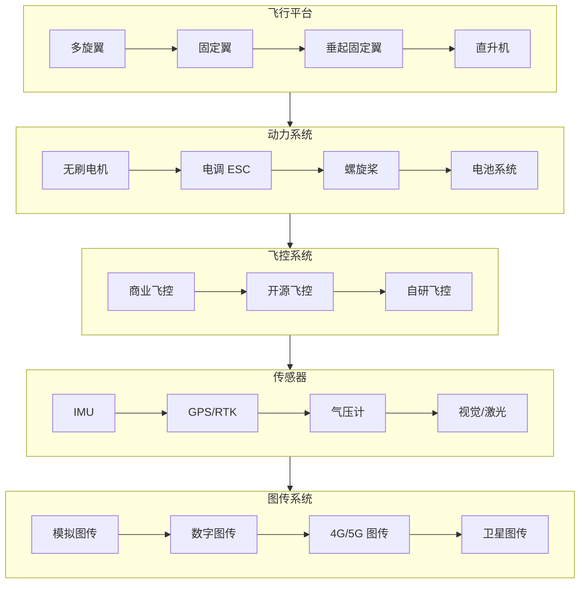

# 02-Hardware-Systems：无人机硬件系统

> 🔧 从飞行平台到图传系统 —— 掌握无人机硬件选型与核心技术

---

## 📌 模块定位

本模块面向**硬件工程师、系统集成商、技术选型人员**，深度解析无人机各子系统的技术原理与选型指南。

---

## 🎯 目标读者

- 硬件工程师（飞控/动力/传感器选型）
- 系统集成商（整机方案搭建）
- 技术采购人员（硬件评估）
- DIY 爱好者（自组无人机）

---

## 📚 内容导航

| 文档 | 预计耗时 | 核心内容 |
|------|---------|---------|
| [01-飞行平台选型](./01-飞行平台选型.md) | 20 分钟 | 多旋翼/固定翼/垂起固定翼对比与选型 |
| [02-动力系统](./02-动力系统.md) | 25 分钟 | 电机/电调/螺旋桨匹配计算 |
| [03-传感器详解](./03-传感器详解.md) | 30 分钟 | IMU/GPS/气压计/光流/避障传感器 |
| [04-图传系统](./04-图传系统.md) | 20 分钟 | 模拟/数字/O3/DJI Air Unit 对比 |

---

## 🔧 核心技术栈

---

## 🔗 相关模块

| 关联内容 | 推荐模块 |
|---------|---------|
| 飞控协议解析 | [03-Protocols-Dev/MAVLink](../03-Protocols-Dev/01-MAVLink 协议详解.md) |
| 开源飞控推荐 | [07-OpenSource-Awesome/开源飞控](../07-OpenSource-Awesome/01-开源飞控.md) |
| 硬件成本估算 | [08-Project-Analysis/成本估算表](../08-Project-Analysis/03-成本估算表.md) |

---

## 📅 更新记录

| 日期 | 更新内容 |
|------|---------|
| 2026-04-05 | 模块初始化完成 |
| 每日 02:30 | 自动追踪硬件新品与技术进展 |

---

**开始学习 →** [飞行平台选型](./01-飞行平台选型.md)

