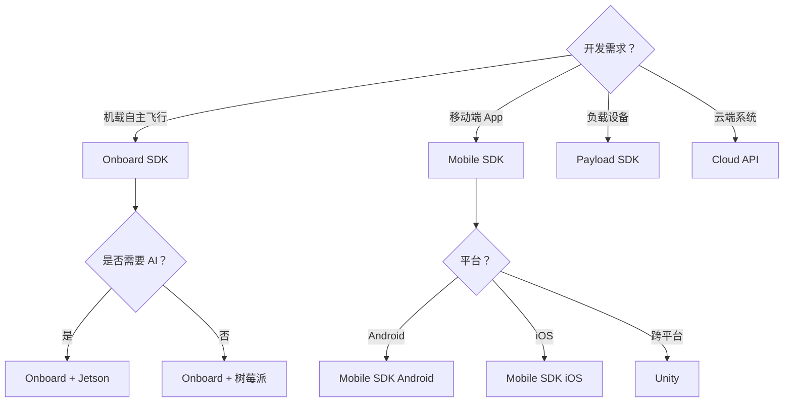

# DJI SDK 对比与选型

> Onboard/Mobile/Payload/Cloud API —— 找到最适合的开发方式

---

## 一、DJI SDK 体系概览

### 1.1 SDK 类型对比

| SDK | 开发语言 | 运行平台 | 适用场景 |
|-----|---------|---------|---------|
| **Onboard SDK** | C++/Python/ROS | 机载计算机 | 自主飞行、AI 识别 |
| **Mobile SDK** | Java/Swift/Unity | 移动端 App | 定制地面站 |
| **Payload SDK** | C | 负载设备 | 云台相机、喊话器 |
| **Cloud API** | RESTful API | 云端服务器 | 机库调度、远程指挥 |

### 1.2 支持机型

| 系列 | 支持 SDK | 代表机型 |
|------|---------|---------|
| 消费级 | Mobile SDK | Mavic、Air、Mini |
| 行业应用 | Onboard/Mobile/Payload | Matrice、Mavic 3 行业 |
| 农业 | Mobile/Onboard | T 系列植保机 |
| 机库 | Cloud API | Dock、机场 |

---

## 二、Onboard SDK（机载开发）

### 2.1 适用场景

**典型应用：**
- ✅ 自主飞行（航线规划、避障）
- ✅ AI 识别（目标检测、跟踪）
- ✅ 边缘计算（实时处理）
- ✅ 第三方负载集成

**硬件要求：**
- 机载计算机（Manifold 2、Jetson、树莓派）
- 支持机型（Matrice 系列、M300/M350）
- X-Port 或 SkyPort 接口

### 2.2 核心功能

**飞行控制：**
```python
from djitellopy import Tello

# 连接无人机
tello = Tello()
tello.connect()

# 起飞
tello.takeoff()

# 飞行到指定位置
tello.move_up(100)  # 上升 100cm
tello.move_forward(200)  # 前进 200cm

# 降落
tello.land()
```

**相机控制：**
```python
# 拍照
camera.start_capture(CameraMode.SHOT_PHOTO)

# 录像
camera.start_capture(CameraMode.RECORD_VIDEO)

# 云台控制
gimbal.set_rotation(rotation=[0, -90, 0])  # 朝下
```

**任务规划：**
```python
# 创建航点任务
mission = WaypointMission()
mission.add_waypoint(Waypoint(lat, lon, alt))
mission.add_waypoint(Waypoint(lat, lon, alt))

# 上传并执行
mission_manager.upload_mission(mission)
mission_manager.start_mission()
```

### 2.3 开发流程


---

## 三、Mobile SDK（移动端开发）

### 3.1 适用场景

**典型应用：**
- ✅ 定制地面站 App
- ✅ 行业应用界面
- ✅ 培训教学软件
- ✅ 演示 Demo

**支持平台：**
- Android（Java/Kotlin）
- iOS（Swift/Objective-C）
- Unity（跨平台）

### 3.2 核心功能

**实时图传：**
```java
// Android 示例
VideoFeeder.getInstance().getPrimaryVideoFeed().addVideoDataListener(
    (videoData, length) -> {
        // 处理视频帧
        bitmap = decodeVideoData(videoData, length);
        videoView.setImageBitmap(bitmap);
    }
);
```

**飞行数据显示：**
```java
// 获取飞机状态
Aircraft.getInstance().getState().addUpdate(
    state -> {
        double altitude = state.getAltitude();
        double distance = state.getDistanceFromHome();
        int battery = state.getBatteryPercent();
        
        // 更新 UI
        updateTelemetryUI(altitude, distance, battery);
    }
);
```

**相机参数设置：**
```java
// 设置 ISO
camera.setISO(ISOValue.ISO_100, callback);

// 设置快门
camera.setShutterSpeed(ShutterSpeed.SHUTTER_SPEED_1_1000, callback);

// 设置对焦模式
camera.setFocusMode(FocusMode.AUTO, callback);
```

### 3.3 UI 组件

**内置组件：**
- VideoView（视频显示）
- AltitudeView（高度显示）
- BatteryWidget（电池显示）
- CompassView（罗盘）

**自定义组件：**
```java
public class CustomWidget extends RelativeLayout {
    // 自定义飞行数据显示组件
    private TextView altitudeText;
    private TextView distanceText;
    
    public void updateData(FlightControllerState state) {
        altitudeText.setText(String.format("%.1fm", state.getAltitude()));
        distanceText.setText(String.format("%.1fm", state.getDistanceFromHome()));
    }
}
```

---

## 四、Payload SDK（负载开发）

### 4.1 适用场景

**典型应用：**
- ✅ 第三方云台相机
- ✅ 喊话器/探照灯
- ✅ 气体检测仪
- ✅ 激光雷达

**硬件接口：**
- X-Port（Matrice 系列）
- SkyPort（Inspire 系列）
- PSDK 扩展口

### 4.2 开发流程


### 4.3 示例代码

```c
// 负载初始化
void payload_init() {
    // 初始化传感器
    sensor_init();
    
    // 注册回调
    dji_payload_register_data_callback(data_callback);
    
    // 启动数据上报
    start_data_reporting();
}

// 数据上报回调
void data_callback(uint8_t* data, uint32_t len) {
    // 读取传感器数据
    float temperature = read_temperature();
    float humidity = read_humidity();
    
    // 打包上报
    pack_data(data, temperature, humidity);
}
```

---

## 五、Cloud API（云端对接）

### 5.1 适用场景

**典型应用：**
- ✅ 无人机机库调度
- ✅ 远程指挥控制
- ✅ 多机协同作业
- ✅ 数据云端管理

### 5.2 API 接口

**设备管理：**
```bash
# 获取设备列表
GET /v1/devices
Authorization: Bearer {token}

# 获取设备状态
GET /v1/devices/{device_id}/status
```

**任务管理：**
```bash
# 创建任务
POST /v1/tasks
{
  "name": "巡检任务 001",
  "type": "waypoint",
  "waypoints": [...],
  "device_id": "drone_001"
}

# 执行任务
POST /v1/tasks/{task_id}/execute
```

**媒体文件：**
```bash
# 获取照片列表
GET /v1/media/photos?device_id=drone_001

# 下载照片
GET /v1/media/photos/{photo_id}/download
```

### 5.3 机库调度

**典型流程：**


---

## 六、SDK 选型指南

### 6.1 选型决策树



### 6.2 组合方案

**方案 1：智能巡检系统**
- Onboard SDK（机载 AI 识别）
- Mobile SDK（地面站 App）
- Cloud API（数据管理）

**方案 2：安防监控系统**
- Onboard SDK（自主巡逻）
- Payload SDK（喊话器）
- Cloud API（远程指挥）

**方案 3：测绘系统**
- Mobile SDK（任务规划）
- Payload SDK（激光雷达）
- 本地处理（点云生成）

---

## 七、开发资源

### 7.1 官方资源

| 资源 | 地址 |
|------|------|
| 开发者官网 | https://developer.dji.com |
| GitHub | https://github.com/dji-sdk |
| 文档中心 | https://developer.dji.com/doc |
| 论坛 | https://forum.dji.com |

### 7.2 学习路径

**Onboard SDK：**
1. 环境搭建（Ubuntu + ROS）
2. 示例运行（hello_world）
3. 飞行控制（起飞/降落/航线）
4. 相机集成（拍照/录像）
5. 高级功能（AI 识别/避障）

**Mobile SDK：**
1. 环境搭建（Android Studio/Xcode）
2. 注册应用（获取 App Key）
3. 示例运行（UXSDK Demo）
4. 自定义开发（UI/功能）
5. 上架发布

---

## 八、常见问题

### Q1：Onboard SDK 支持哪些机载电脑？

**答：** 
- DJI Manifold 2/2C
- NVIDIA Jetson 系列
- 树莓派 4/5
- Intel NUC

### Q2：Mobile SDK 需要付费吗？

**答：** 
- 基础功能免费
- 商业应用需要企业认证
- 部分高级功能需授权

### Q3：Cloud API 支持私有化部署吗？

**答：** 
- 支持
- 需要联系大疆商务
- 适合大型企业/政府

### Q4：SDK 版本如何选择？

**答：** 
- 使用最新稳定版
- 查看版本兼容性
- 关注更新日志

---

<div align="center">

**继续学习 →** [03-ROS2 无人机集成](./03-ROS2 无人机集成.md)

**最后更新**: 2026-04-05

</div>
