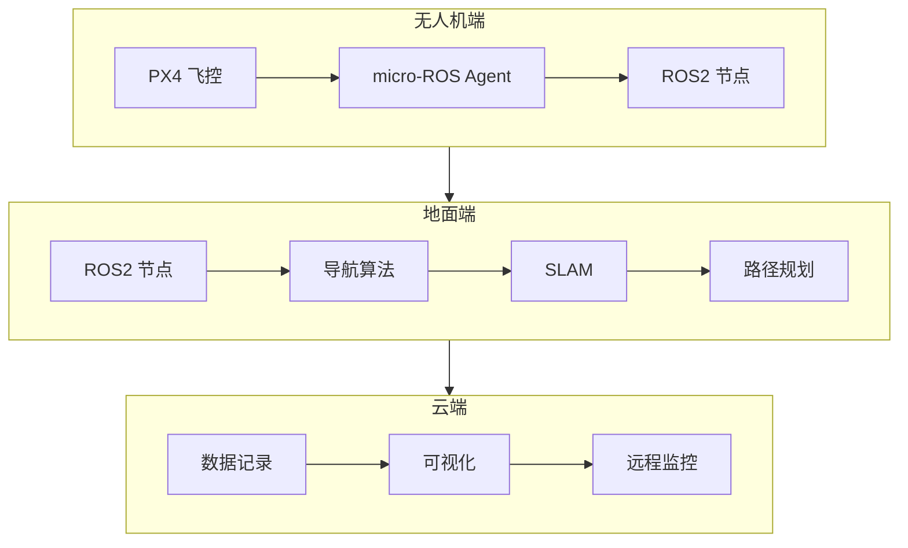

# ROS2 无人机集成

> micro-ROS、px4_ros2、自定义消息 —— 打造机器人生态系统

---

## 一、ROS2 概述

### 1.1 ROS2 vs ROS1

| 特性 | ROS1 | ROS2 |
|------|------|------|
| 通信中间件 | 自定义 | DDS |
| 实时性 | 弱 | 强 |
| 分布式 | 单 Master | 无中心 |
| 平台支持 | Linux 为主 | 全平台 |
| 版本 | EOL（2025） | 持续维护 |

### 1.2 无人机应用架构



---

## 二、环境搭建

### 2.1 Ubuntu 22.04 安装 ROS2

```bash
# 添加仓库
sudo apt install software-properties-common
sudo add-apt-repository universe
wget https://raw.githubusercontent.com/ros/rosdistro/master/ros.key -O /usr/share/keyrings/ros-archive-keyring.gpg
echo "deb [arch=$(dpkg --print-architecture) signed-by=/usr/share/keyrings/ros-archive-keyring.gpg] http://packages.ros.org/ros2/ubuntu $(. /etc/os-release && echo $UBUNTU_CODENAME) main" | sudo tee /etc/apt/sources.list.d/ros2.list > /dev/null

# 安装 ROS2 Humble
sudo apt update
sudo apt install ros-humble-desktop
sudo apt install ros-humble-ros-base

# 环境配置
echo "source /opt/ros/humble/setup.bash" >> ~/.bashrc
source ~/.bashrc

# 安装依赖
sudo apt install python3-colcon-common-extensions python3-rosdep
```

### 2.2 创建工作空间

```bash
mkdir -p ~/uav_ros2_ws/src
cd ~/uav_ros2_ws
colcon build
source install/setup.bash
```

---

## 三、PX4 + ROS2 集成

### 3.1 px4_ros2 安装

```bash
cd ~/uav_ros2_ws/src
git clone https://github.com/PX4/px4_ros2.git
cd ..
rosdep install --from-paths src --ignore-src -r -y
colcon build --symlink-install
source install/setup.bash
```

### 3.2 核心节点

**fmu_bridge：**
- 连接 PX4 飞控
- 转发 MAVLink 消息
- 发布 ROS2 Topic

**启动命令：**
```bash
# 启动 fmu_bridge
ros2 run px4_ros2 fmu_bridge --ros-args -p serial_port:=/dev/ttyUSB0 -p baudrate:=921600

# 启动 offboard 控制
ros2 run px4_ros2 offboard_control
```

### 3.3 Topic 列表

| Topic | 类型 | 说明 |
|------|------|------|
| /fmu/out/vehicle_local_position | VehicleLocalPosition | 局部位置 |
| /fmu/out/vehicle_global_position | VehicleGlobalPosition | 全局位置 |
| /fmu/out/vehicle_attitude | VehicleAttitude | 姿态 |
| /fmu/in/offboard_control_setpoint | OffboardControlSetpoint | 控制指令 |

---

## 四、自定义消息

### 4.1 创建消息包

```bash
cd ~/uav_ros2_ws/src
ros2 pkg create --build-type ament_cmake uav_msgs
```

### 4.2 定义消息

**msg/DroneStatus.msg：**
```msg
Header header
geometry_msgs/Point position
geometry_msgs/Quaternion orientation
float32 battery_voltage
float32 battery_current
int32 flight_mode
bool armed
```

**CMakeLists.txt：**
```cmake
find_package(rosidl_default_generators REQUIRED)

rosidl_generate_interfaces(${PROJECT_NAME}
  "msg/DroneStatus.msg"
  DEPENDENCIES geometry_msgs std_msgs
)
```

### 4.3 发布自定义消息

```python
#!/usr/bin/env python3
import rclpy
from rclpy.node import Node
from uav_msgs.msg import DroneStatus
from geometry_msgs.msg import Point, Quaternion

class DroneStatusPublisher(Node):
    def __init__(self):
        super().__init__('drone_status_publisher')
        self.publisher_ = self.create_publisher(DroneStatus, 'drone/status', 10)
        timer_period = 0.1
        self.timer = self.create_timer(timer_period, self.timer_callback)
    
    def timer_callback(self):
        msg = DroneStatus()
        msg.header.stamp = self.get_clock().now().to_msg()
        msg.position = Point(x=10.0, y=20.0, z=50.0)
        msg.orientation = Quaternion(x=0.0, y=0.0, z=0.0, w=1.0)
        msg.battery_voltage = 22.2
        msg.battery_current = 5.0
        msg.flight_mode = 4  # AUTO.MISSION
        msg.armed = True
        
        self.publisher_.publish(msg)

def main(args=None):
    rclpy.init(args=args)
    node = DroneStatusPublisher()
    rclpy.spin(node)
    node.destroy_node()
    rclpy.shutdown()

if __name__ == '__main__':
    main()
```

---

## 五、offboard 控制

### 5.1 位置控制

```python
#!/usr/bin/env python3
import rclpy
from rclpy.node import Node
from px4_msgs.msg import OffboardControlMode, TrajectorySetpoint, VehicleCommand

class OffboardController(Node):
    def __init__(self):
        super().__init__('offboard_controller')
        
        # 创建发布者
        self.offboard_control_mode_pub = self.create_publisher(
            OffboardControlMode, '/fmu/in/offboard_control_mode', 10)
        self.trajectory_setpoint_pub = self.create_publisher(
            TrajectorySetpoint, '/fmu/in/trajectory_setpoint', 10)
        self.vehicle_command_pub = self.create_publisher(
            VehicleCommand, '/fmu/in/vehicle_command', 10)
        
        # 创建定时器
        timer_period = 0.1
        self.timer = self.create_timer(timer_period, self.timer_callback)
        self.count = 0
    
    def timer_callback(self):
        # 发布控制模式
        control_mode = OffboardControlMode()
        control_mode.position = True
        control_mode.velocity = False
        control_mode.acceleration = False
        self.offboard_control_mode_pub.publish(control_mode)
        
        # 发布轨迹设定点
        setpoint = TrajectorySetpoint()
        setpoint.position = [0.0, 0.0, -10.0]  # 10 米高度
        setpoint.yaw = 0.0
        self.trajectory_setpoint_pub.publish(setpoint)
        
        # 解锁无人机（第一次调用）
        if self.count == 0:
            self.arm()
            self.count += 1
    
    def arm(self):
        cmd = VehicleCommand()
        cmd.command = VehicleCommand.VEHICLE_CMD_COMPONENT_ARM_DISARM
        cmd.param1 = 1.0  # 1=解锁，0=上锁
        cmd.target_system = 1
        cmd.target_component = 1
        self.vehicle_command_pub.publish(cmd)

def main(args=None):
    rclpy.init(args=args)
    node = OffboardController()
    rclpy.spin(node)
    node.destroy_node()
    rclpy.shutdown()

if __name__ == '__main__':
    main()
```

### 5.2 起飞流程

```bash
# 1. 启动 PX4 仿真
make px4_sitl_default gazebo

# 2. 启动 fmu_bridge
ros2 run px4_ros2 fmu_bridge

# 3. 启动 offboard 控制
ros2 run px4_ros2 offboard_control

# 4. 切换模式到 Offboard
# 在 QGroundControl 中切换，或通过 MAVLink 命令
```

---

## 六、导航与 SLAM

### 6.1 Cartographer SLAM

**安装：**
```bash
sudo apt install ros-humble-slam-toolbox
```

**配置：**
```yaml
# slam_toolbox.yaml
slam_toolbox:
  ros__parameters:
    map_frame: map
    odom_frame: odom
    base_frame: base_link
    scan_topic: /scan
    use_laser_scan: true
```

**启动：**
```bash
ros2 launch slam_toolbox online_async_launch.py \
  params_file:=slam_toolbox.yaml
```

### 6.2 Nav2 导航

**安装：**
```bash
sudo apt install ros-humble-navigation2
```

**启动：**
```bash
ros2 launch nav2_bringup navigation_launch.py \
  use_sim_time:=True
```

---

## 七、实战案例

### 7.1 自主巡检

**系统架构：**
```
视觉传感器 → 目标检测 → 航点生成 → 路径规划 → 飞控执行
```

**实现代码：**
```python
class InspectionMission(Node):
    def __init__(self):
        super().__init__('inspection_mission')
        
        # 订阅目标检测结果
        self.detection_sub = self.create_subscription(
            DetectionArray,
            '/yolo/detections',
            self.detection_callback,
            10)
        
        # 发布航点
        self.waypoint_pub = self.create_publisher(
            TrajectorySetpoint,
            '/fmu/in/trajectory_setpoint',
            10)
    
    def detection_callback(self, detections):
        for det in detections.detections:
            if det.results[0].hypothesis.class_id == 'power_line':
                # 发现电线，生成巡检航点
                waypoint = TrajectorySetpoint()
                waypoint.position = [
                    det.bbox.center.position.x,
                    det.bbox.center.position.y,
                    det.bbox.center.position.z + 5.0  # 上方 5 米
                ]
                self.waypoint_pub.publish(waypoint)
```

### 7.2 编队飞行

**架构：**
```
长机（Leader）→ 发布位置 → 从机（Follower）→ 跟踪位置
```

**长机代码：**
```python
class Leader(Node):
    def __init__(self):
        super().__init__('leader')
        self.position_pub = self.create_publisher(
            PoseStamped, '/leader/position', 10)
    
    def publish_position(self, x, y, z):
        msg = PoseStamped()
        msg.header.stamp = self.get_clock().now().to_msg()
        msg.pose.position.x = x
        msg.pose.position.y = y
        msg.pose.position.z = z
        self.position_pub.publish(msg)
```

**从机代码：**
```python
class Follower(Node):
    def __init__(self):
        super().__init__('follower')
        self.leader_sub = self.create_subscription(
            PoseStamped,
            '/leader/position',
            self.leader_callback,
            10)
        self.offset = [5.0, 0.0, 0.0]  # 保持 5 米距离
    
    def leader_callback(self, msg):
        target_x = msg.pose.position.x + self.offset[0]
        target_y = msg.pose.position.y + self.offset[1]
        target_z = msg.pose.position.z + self.offset[2]
        
        # 发布到飞控
        self.send_position(target_x, target_y, target_z)
```

---

## 八、常见问题

### Q1：PX4 与 ROS2 连接失败？

**答：**
- 检查串口是否正确（/dev/ttyUSB0）
- 检查波特率（通常 921600）
- 检查 MAVLink 配置
- 重启 fmu_bridge

### Q2：offboard 模式无法进入？

**答：**
- 确保控制频率>20Hz
- 先发布控制模式，再发布设定点
- 检查无人机已解锁
- 检查 GPS 锁定

### Q3：SLAM 建图漂移？

**答：**
- 检查传感器标定
- 增加回环检测
- 优化参数配置
- 增加特征点

---

<div align="center">

**继续学习 →** [04-通信模版代码](./04-通信模版代码.md)

**最后更新**: 2026-04-05

</div>
