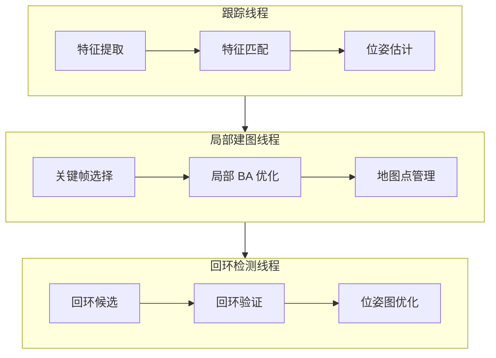

# SLAM 入门教程

> ORB-SLAM、VINS —— 无人机视觉定位与建图

---

## 一、SLAM 概述

### 1.1 什么是 SLAM

**SLAM（Simultaneous Localization and Mapping）** 即同时定位与地图构建，指移动设备在未知环境中，通过传感器数据估计自身位置并构建环境地图。

**核心问题：**
- 定位（Localization）：我在哪？
- 建图（Mapping）：环境什么样？

### 1.2 SLAM 类型对比

| 类型 | 传感器 | 优点 | 缺点 | 适用场景 |
|------|-------|------|------|---------|
| 视觉 SLAM | 相机 | 成本低、信息丰富 | 受光照影响、计算量大 | 室内、纹理丰富环境 |
| 激光 SLAM | 激光雷达 | 精度高、不受光照影响 | 成本高、数据稀疏 | 室外、大场景 |
| 视觉惯性 SLAM | 相机+IMU | 鲁棒性强、可恢复尺度 | 标定复杂 | 无人机、快速运动 |

### 1.3 无人机应用

**室内定位：**
- 无 GPS 环境飞行
- 精准悬停
- 自主避障

**三维重建：**
- 建筑物建模
- 地形测绘
- 灾害评估

**自主导航：**
- 路径规划
- 动态避障
- 目标跟踪

---

## 二、ORB-SLAM2

### 2.1 系统架构



### 2.2 环境搭建

```bash
# 安装依赖
sudo apt install libeigen3-dev libopencv-dev libboost-all-dev

# 克隆 ORB-SLAM2
git clone https://github.com/raulmur/ORB_SLAM2.git
cd ORB_SLAM2

# 编译
chmod +x build.sh
./build.sh

# 设置环境变量
export ROS_PACKAGE_PATH=${ROS_PACKAGE_PATH}:$(pwd)/Examples/ROS
```

### 2.3 运行示例

**单目 SLAM：**
```bash
# 使用 EuRoC 数据集
./Examples/Monocular/mono_euroc \
  Vocabulary/ORBvoc.txt \
  Examples/Monocular/EuRoC.yaml \
  /path/to/euroc_dataset/mav0/cam0/data \
  Examples/Monocular/EuRoC_TimeStamps.txt
```

**双目 SLAM：**
```bash
./Examples/Stereo/stereo_euroc \
  Vocabulary/ORBvoc.txt \
  Examples/Stereo/EuRoC.yaml \
  /path/to/euroc_dataset/mav0/cam0/data \
  /path/to/euroc_dataset/mav0/cam1/data \
  Examples/Stereo/EuRoC_TimeStamps.txt
```

### 2.4 ROS 集成

```bash
# 编译 ROS 节点
cd ORB_SLAM2
./build_ros.sh

# 运行
rosrun ORB_SLAM2 Mono \
  $(rospack find ORB_SLAM2)/Vocabulary/ORBvoc.txt \
  $(rospack find ORB_SLAM2)/Examples/Monocular/Asus.yaml
```

**发布话题：**
- `/camera/image_raw`：输入图像
- `/orb_slam2/camera_pose`：相机位姿
- `/orb_slam2/map_points`：地图点

---

## 三、VINS-Fusion

### 3.1 系统特点

**VINS-Fusion** 是基于优化框架的多传感器融合定位系统，支持：
- 单目 + IMU
- 双目 + IMU
- 鱼眼相机 + IMU
- GPS + 视觉 + IMU

### 3.2 环境搭建

```bash
# 安装 Ceres Solver
sudo apt install libceres-dev

# 克隆 VINS-Fusion
git clone https://github.com/HKUST-Aerial-Robotics/VINS-Fusion.git
cd VINS-Fusion

# 编译
catkin_make
source devel/setup.bash
```

### 3.3 运行示例

**单目 + IMU：**
```bash
roslaunch vins_estimator euroc.launch

# 播放数据集
rosbag play /path/to/euroc_dataset.bag
```

**双目 + IMU：**
```bash
roslaunch vins_estimator stereo.launch
rosbag play /path/to/stereo_dataset.bag
```

**GPS 融合：**
```bash
roslaunch vins_estimator gps.launch
```

### 3.4 配置文件

**config_euroc.yaml：**
```yaml
%YAML:1.0

# 相机参数
cam0_calib: "cam0.yaml"

# IMU 参数
imu_noise: 0.08
acc_n: 0.08
gyr_n: 0.004
acc_w: 0.00004
gyr_w: 0.000002
ex_acc_cov: 0.001
ex_gyr_cov: 0.001

# 优化参数
max_solver_time: 0.04
max_num_iterations: 10
keyframe_parallax: 10.0

# GPS 参数（可选）
use_gps: true
gps_factor: 10.0
```

---

## 四、无人机 SLAM 实战

### 4.1 室内自主飞行

**系统架构：**
```
无人机（PX4 飞控）
├── 下视相机 → VIO 定位
├── 激光雷达 → 避障
└── ROS → 路径规划

地面站
├── 实时监控
├── 地图显示
└── 任务规划
```

**启动流程：**
```bash
# 1. 启动 PX4 仿真
make px4_sitl_default gazebo

# 2. 启动 VINS-Fusion
roslaunch vins_estimator euroc.launch

# 3. 启动避障节点
rosrun avoid_obstacle obstacle_avoidance

# 4. 启动路径规划
rosrun path_planner planner
```

### 4.2 三维重建

**工作流程：**


**工具链：**
- COLMAP：SFM 重建
- OpenMVS：稠密重建
- MeshLab：模型处理

**运行 COLMAP：**
```bash
colmap feature_extractor \
  --database_path database.db \
  --image_path images/

colmap exhaustive_matcher \
  --database_path database.db

colmap mapper \
  --database_path database.db \
  --image_path images/ \
  --output_path sparse/

colmap densifier \
  --input_path sparse/0 \
  --output_path dense/
```

---

## 五、性能优化

### 5.1 特征提取优化

**GPU 加速：**
```cpp
// 使用 CUDA 加速 ORB 特征提取
cv::cuda::ORB::create(
    nfeatures,     // 特征点数量
    1.2f,          // 尺度因子
    nlevels,       // 金字塔层数
    edgeThreshold, // 边缘阈值
    firstLevel,    // 第一层
    WTA_K,         // 赢者通吃
    scoreType,     // 评分类型
    patchSize,     // 补丁大小
    fastThreshold  // FAST 阈值
);
```

**参数调优：**
| 参数 | 默认值 | 推荐值 | 说明 |
|------|-------|-------|------|
| 特征点数量 | 1000 | 500-2000 | 越多越精确，但计算量大 |
| 金字塔层数 | 8 | 4-8 | 影响尺度不变性 |
| 补丁大小 | 31 | 15-31 | 影响描述子质量 |

### 5.2 回环检测优化

**词袋模型：**
```cpp
// 使用 DBoW2 进行回环检测
#include "DBoW2/DBoW2.h"

// 创建词汇表
DBoW2::Vocabulary vocab("orbvoc.yml.gz");

// 创建数据库
DBoW2::Database db(vocab, false, 0);

// 添加关键帧
db.add(entry);

// 查询回环
db.query(entry, results);
```

### 5.3 后端优化

**BA 优化：**
```cpp
// 使用 g2o 进行 Bundle Adjustment
#include "g2o/core/sparse_optimizer.h"
#include "g2o/solvers/csparse/linear_solver_csparse.h"

g2o::SparseOptimizer optimizer;
auto linearSolver = new g2o::LinearSolverCSparse<g2o::BlockSolver_6_3::PoseMatrixType>();
auto blockSolver = new g2o::BlockSolver_6_3(linearSolver);
auto solver = new g2o::OptimizationAlgorithmLevenberg(blockSolver);
optimizer.setAlgorithm(solver);

// 添加顶点和边
// ...

// 优化
optimizer.initializeOptimization();
optimizer.optimize(20);
```

---

## 六、常见问题

### Q1：特征点太少怎么办？

**答：**
- 增加特征点数量参数
- 改善光照条件
- 增加纹理（如贴标记点）
- 使用更好的相机

### Q2：漂移严重怎么办？

**答：**
- 启用回环检测
- 增加关键帧数量
- 优化 IMU 标定
- 使用 GPS 辅助

### Q3：计算量太大怎么办？

**答：**
- 降低特征点数量
- 使用 GPU 加速
- 降低图像分辨率
- 使用更轻量的算法（如 ORB-SLAM3）

### Q4：快速运动跟丢怎么办？

**答：**
- 提高相机帧率（>60fps）
- 使用全局快门相机
- 增加 IMU 权重
- 降低运动速度

---

<div align="center">

**算法区学习完成！** 🎉

下一步：选择进阶方向 → [05-GIS-DigitalTwin](../05-GIS-DigitalTwin/) · [06-Industry-Solutions](../06-Industry-Solutions/)

**最后更新**: 2026-04-05

</div>
