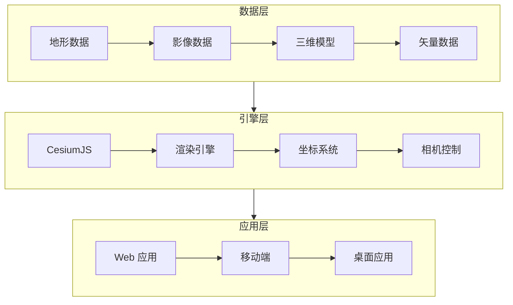

# Cesium 入门教程

> 三维地球引擎 —— 无人机成果 Web 端展示

---

## 一、Cesium 概述

### 1.1 什么是 Cesium

**Cesium** 是一个开源的三维地球和地图引擎，基于 WebGL 技术，可在浏览器中展示大规模三维地理数据。

**核心特点：**
- ✅ 开源免费（Apache 2.0 许可证）
- ✅ 跨平台（Web/移动端/桌面）
- ✅ 支持多种数据格式（3D Tiles、glTF、KML 等）
- ✅ 支持海量数据（TB 级）
- ✅ 高精度（亚米级定位）

### 1.2 应用场景

**无人机相关：**
- 正射影像展示
- 三维模型浏览
- 航线规划回放
- 巡检成果汇报

**其他应用：**
- 智慧城市
- 数字孪生
- 应急指挥
- 教育培训

### 1.3 技术架构



---

## 二、快速开始

### 2.1 环境准备

**基础要求：**
- 浏览器：Chrome/Firefox/Edge（支持 WebGL）
- 服务器：任意静态文件服务器
- Token：Cesium ion 账号（免费）

**获取 Token：**
1. 访问 https://cesium.com/ion/signup
2. 注册账号
3. 创建 Access Token
4. 复制 Token 备用

### 2.2 HTML 示例

**最小可运行示例：**
```html
<!DOCTYPE html>
<html lang="zh-CN">
<head>
  <meta charset="UTF-8">
  <title>Cesium 示例</title>
  <script src="https://cesium.com/downloads/cesiumjs/releases/1.111/Build/Cesium/Cesium.js"></script>
  <link href="https://cesium.com/downloads/cesiumjs/releases/1.111/Build/Cesium/Widgets/widgets.css" rel="stylesheet">
  <style>
    #cesiumContainer { width: 100%; height: 100vh; margin: 0; padding: 0; }
  </style>
</head>
<body>
  <div id="cesiumContainer"></div>
  <script>
    // 设置 Token
    Cesium.Ion.defaultAccessToken = 'YOUR_ACCESS_TOKEN';
    
    // 创建查看器
    const viewer = new Cesium.Viewer('cesiumContainer', {
      terrainProvider: Cesium.createWorldTerrain()
    });
    
    // 定位到北京
    viewer.camera.flyTo({
      destination: Cesium.Cartesian3.fromDegrees(116.3913, 39.9075, 5000),
      orientation: {
        heading: Cesium.Math.toRadians(0),
        pitch: Cesium.Math.toRadians(-45),
        roll: 0
      }
    });
  </script>
</body>
</html>
```

### 2.3 本地服务器

**Python 快速启动：**
```bash
# Python 3
python -m http.server 8080

# 访问
http://localhost:8080/index.html
```

**Node.js 服务器：**
```bash
npm install -g http-server
http-server -p 8080
```

---

## 三、数据加载

### 3.1 加载正射影像

**WMS 服务：**
```javascript
const wmsLayer = viewer.imageryLayers.addImageryProvider(
  new Cesium.WebMapServiceImageryProvider({
    url: 'http://localhost:8080/geoserver/wms',
    layers: 'workspace:orthophoto',
    parameters: {
      format: 'image/png',
      transparent: true
    }
  })
);
```

**本地图片：**
```javascript
const imageLayer = viewer.imageryLayers.addImageryProvider(
  new Cesium.SingleTileImageryProvider({
    url: 'data/orthophoto.jpg',
    rectangle: Cesium.Rectangle.fromDegrees(116.0, 39.5, 117.0, 40.5)
  })
);
```

### 3.2 加载三维模型

**glTF 模型：**
```javascript
const entity = viewer.entities.add({
  position: Cesium.Cartesian3.fromDegrees(116.3913, 39.9075, 0),
  model: {
    uri: 'data/drone.glb',
    scale: 1.0,
    minimumPixelSize: 64
  }
});

viewer.trackedEntity = entity;
```

**3D Tiles（倾斜摄影）：**
```javascript
const tileset = await Cesium.Cesium3DTileset.fromUrl(
  'http://localhost:8080/data/tileset.json'
);

viewer.scene.primitives.add(tileset);

// 调整到模型范围
viewer.zoomTo(tileset);
```

### 3.3 加载矢量数据

**KML 文件：**
```javascript
const kmlDataSource = await Cesium.KmlDataSource.load('data/route.kml', {
  camera: viewer.camera,
  canvas: viewer.canvas
});

viewer.dataSources.add(kmlDataSource);
```

**GeoJSON 文件：**
```javascript
const geojsonDataSource = await Cesium.GeoJsonDataSource.load('data/towers.geojson', {
  stroke: Cesium.Color.RED,
  strokeWidth: 3,
  markerSymbol: '?'
});

viewer.dataSources.add(geojsonDataSource);
```

---

## 四、无人机成果展示

### 4.1 航线回放

**加载飞行日志：**
```javascript
// 模拟飞行路径
const positions = new Cesium.SampledPositionProperty();

const flightPath = [
  { time: 0, lon: 116.0, lat: 39.5, alt: 100 },
  { time: 10, lon: 116.1, lat: 39.5, alt: 100 },
  { time: 20, lon: 116.1, lat: 39.6, alt: 100 },
  { time: 30, lon: 116.0, lat: 39.6, alt: 100 }
];

flightPath.forEach(point => {
  const time = Cesium.JulianDate.addSeconds(
    Cesium.JulianDate.now(), point.time, new Cesium.JulianDate()
  );
  positions.addSample(
    time,
    Cesium.Cartesian3.fromDegrees(point.lon, point.lat, point.alt)
  );
});

// 创建飞机模型
const aircraft = viewer.entities.add({
  availability: new Cesium.TimeIntervalCollection([
    new Cesium.TimeInterval({
      start: Cesium.JulianDate.addSeconds(Cesium.JulianDate.now(), 0, new Cesium.JulianDate()),
      stop: Cesium.JulianDate.addSeconds(Cesium.JulianDate.now(), 30, new Cesium.JulianDate())
    })
  ]),
  position: positions,
  orientation: new Cesium.VelocityOrientationProperty(positions),
  model: {
    uri: 'data/drone.glb',
    scale: 0.5
  },
  path: {
    resolution: 1,
    material: new Cesium.PolylineGlowMaterialProperty({
      glowPower: 0.1,
      color: Cesium.Color.YELLOW
    }),
    width: 10
  }
});

viewer.trackedEntity = aircraft;

// 播放动画
viewer.clock.shouldAnimate = true;
```

### 4.2 巡检成果标注

**标注缺陷点：**
```javascript
// 添加缺陷标注
const defects = [
  { lon: 116.1, lat: 39.51, type: '绝缘子破损', level: '严重' },
  { lon: 116.11, lat: 39.52, type: '导线断股', level: '危急' }
];

defects.forEach(defect => {
  const color = defect.level === '危急' ? Cesium.Color.RED : Cesium.Color.ORANGE;
  
  viewer.entities.add({
    position: Cesium.Cartesian3.fromDegrees(defect.lon, defect.lat, 50),
    point: {
      pixelSize: 10,
      color: color,
      outlineColor: Cesium.Color.WHITE,
      outlineWidth: 2
    },
    label: {
      text: defect.type,
      font: '14pt monospace',
      style: Cesium.LabelStyle.FILL_AND_OUTLINE,
      outlineWidth: 2,
      verticalOrigin: Cesium.VerticalOrigin.BOTTOM,
      pixelOffset: new Cesium.Cartesian2(0, -9)
    }
  });
});
```

### 4.3 量测工具

**距离量测：**
```javascript
const handler = new Cesium.DrawHandler(viewer, Cesium.DrawMode.Polyline);

handler.polylineDrawEvt.addEventListener(positions => {
  let distance = 0;
  for (let i = 0; i < positions.length - 1; i++) {
    distance += Cesium.Cartesian3.distance(positions[i], positions[i+1]);
  }
  console.log(`距离：${distance.toFixed(2)}米`);
});

handler.activate();
```

**面积量测：**
```javascript
const handler = new Cesium.DrawHandler(viewer, Cesium.DrawMode.Polygon);

handler.polygonDrawEvt.addEventListener(positions => {
  const area = Cesium.PolygonGeometry.computeArea({
    positions: positions,
    ellipsoid: Cesium.Ellipsoid.WGS84
  });
  console.log(`面积：${(area / 10000).toFixed(2)}公顷`);
});

handler.activate();
```

---

## 五、性能优化

### 5.1 数据优化

**3D Tiles 优化：**
- 使用批量 3D 网格（Batched 3D Model）
- 启用层次细节（LOD）
- 设置合理的几何误差

**影像优化：**
- 使用金字塔结构
- 压缩格式（WebP/JPEG）
- 分块加载

### 5.2 渲染优化

```javascript
// 设置最大帧率
viewer.targetFrameRate = 60;

// 关闭不必要的后处理
viewer.scene.postProcessStages.fxaa.enabled = false;
viewer.scene.postProcessStages.bloom.enabled = false;

// 设置屏幕空间误差
viewer.scene.screenSpaceCameraController.maximumZoomDistance = 100000;
```

### 5.3 内存管理

```javascript
// 清理不用的资源
viewer.dataSources.remove(dataSource);
viewer.scene.primitives.remove(primitive);

// 强制垃圾回收
viewer.scene.frameState.globeCache.clear();
```

---

## 六、部署方案

### 6.1 静态部署

**Nginx 配置：**
```nginx
server {
    listen 80;
    server_name your-domain.com;
    root /var/www/cesium-app;
    
    location / {
        try_files $uri $uri/ /index.html;
    }
    
    # 启用 Gzip 压缩
    gzip on;
    gzip_types text/plain application/javascript text/css;
    
    # 缓存静态资源
    location ~* \.(js|css|png|jpg|jpeg|gif|ico)$ {
        expires 1y;
        add_header Cache-Control "public, immutable";
    }
}
```

### 6.2 Docker 部署

**Dockerfile：**
```dockerfile
FROM nginx:alpine

COPY dist/ /usr/share/nginx/html/
COPY nginx.conf /etc/nginx/conf.d/default.conf

EXPOSE 80

CMD ["nginx", "-g", "daemon off;"]
```

**运行容器：**
```bash
docker build -t cesium-app .
docker run -d -p 8080:80 --name cesium cesium-app
```

---

## 七、常见问题

### Q1：Cesium 和 Cesium ion 有什么区别？

**答：**
- Cesium：开源引擎（CesiumJS）
- Cesium ion：云平台（提供数据托管、处理服务）

### Q2：可以离线使用吗？

**答：** 可以。
- 下载 CesiumJS 本地部署
- 使用离线地形和影像数据
- 不需要 ion Token

### Q3：支持哪些坐标系？

**答：**
- WGS84（默认）
- CGCS2000（中国 2000）
- 支持自定义投影

### Q4：如何加载国内地图？

**答：**
```javascript
// 天地图
const tianditu = new Cesium.WebMapTileServiceImageryProvider({
  url: 'http://t0.tianditu.gov.cn/img_w/wmts?tk=your_token',
  layer: 'img',
  style: 'default',
  tileMatrixSetID: 'w'
});
```

---

<div align="center">

**继续学习 →** [02-倾斜摄影建模](./02-倾斜摄影建模.md)

**最后更新**: 2026-04-05

</div>
