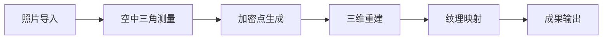

# 倾斜摄影建模

> ContextCapture、大疆智图 —— 从航拍照片到三维模型

---

## 一、倾斜摄影概述

### 1.1 什么是倾斜摄影

**倾斜摄影**是指从多个角度（前、后、左、右、垂直）对同一区域进行拍摄，通过摄影测量技术生成三维模型。

**与传统航测对比：**

| 特性 | 垂直摄影 | 倾斜摄影 |
|------|---------|---------|
| 拍摄角度 | 垂直向下 | 多角度（5 个方向） |
| 成果类型 | 正射影像 | 三维模型 |
| 建筑物效果 | 侧面缺失 | 完整立面 |
| 应用场景 | 地图制作 | 数字城市、实景三维 |

### 1.2 系统组成

**硬件系统：**
- 无人机平台
- 五镜头相机（或单镜头多角度飞行）
- POS 系统（GPS+IMU）
- 地面基站

**软件系统：**
- 航线规划软件
- 空三加密软件
- 密集匹配软件
- 三维建模软件

---

## 二、数据采集

### 2.1 飞行参数

| 参数 | 推荐值 | 说明 |
|------|-------|------|
| 航高 | 50-200m | 影响 GSD |
| GSD | 2-5cm | 地面采样距离 |
| 航向重叠 | ≥80% | 前后重叠 |
| 旁向重叠 | ≥70% | 左右重叠 |
| 相机角度 | 45° | 倾斜角度 |
| 飞行速度 | 5-10m/s | 影响模糊 |

### 2.2 像控点布设

**布设原则：**
- 均匀分布
- 特征明显
- 易于识别
- 永久保存

**数量要求：**
| 测区面积 | 像控点数量 |
|---------|-----------|
| <1km² | 4-6 个 |
| 1-5km² | 6-10 个 |
| >5km² | 每 km² 2 个 |

**测量精度：**
- 平面精度：<5cm
- 高程精度：<5cm

### 2.3 DJI Terra 航线规划

**操作步骤：**
```
1. 打开 DJI Terra
2. 新建任务 → 可见光重建
3. 导入测区范围（KML 或手绘）
4. 设置参数：
   - 航高：100m
   - 航向重叠：80%
   - 旁向重叠：70%
   - 相机角度：45°
5. 生成航线
6. 上传到无人机
7. 执行飞行任务
```

---

## 三、ContextCapture 建模

### 3.1 软件概述

**ContextCapture**（原名 Smart3D）是 Bentley 公司推出的实景建模软件，支持：
- 航拍照片建模
- 地面照片建模
- 激光雷达融合
- 大规模集群处理

### 3.2 工作流程



### 3.3 详细步骤

**步骤 1：创建工程**
```
1. 打开 ContextCapture Center
2. File → New Project
3. 设置工程名称和路径
4. 选择坐标系统
```

**步骤 2：导入照片**
```
1. Photos → Add photos
2. 选择所有照片
3. 自动读取 EXIF 信息
4. 检查照片数量
```

**步骤 3：空中三角测量**
```
1. Submit → New Aerotriangulation
2. 设置参数：
   - Tie point extraction: High
   - Calibration: Automatic
3. 提交处理
4. 等待完成（数小时）
```

**步骤 4：三维重建**
```
1. Submit → New Reconstruction
2. 设置参数：
   - Spatial resolution: 根据 GSD
   - Format: 3MX / S3C / OSGB
3. 提交处理
4. 等待完成（数小时到数天）
```

**步骤 5：成果输出**
```
1. 查看三维模型
2. 导出需要的格式：
   - OSGB：倾斜摄影标准格式
   - OBJ：通用三维格式
   - 3MX：Bentley 格式
   - S3C：Web 浏览格式
```

### 3.4 参数优化

**空三加密参数：**
| 参数 | 默认值 | 推荐值 | 说明 |
|------|-------|-------|------|
| 连接点提取 | Normal | High | 影响匹配精度 |
| 相机标定 | Auto | Auto | 自动优化内参 |
| GPS 权重 | 1.0 | 1.0 | POS 数据权重 |

**重建参数：**
| 参数 | 说明 | 推荐设置 |
|------|------|---------|
| 空间分辨率 | 输出模型精度 | 与 GSD 一致 |
| 面片大小 | 模型分块 | 500-1000m |
| 纹理大小 | 贴图分辨率 | 4096×4096 |

---

## 四、大疆智图建模

### 4.1 软件概述

**大疆智图（DJI Terra）** 是大疆创新推出的二维/三维重建软件，支持：
- 二维正射影像
- 三维实景模型
- 激光雷达点云
- 航线规划

### 4.2 三维重建流程

**步骤 1：导入数据**
```
1. 打开大疆智图
2. 新建任务 → 三维重建
3. 导入照片（支持 DJI 格式）
4. 自动读取 POS 数据
```

**步骤 2：设置参数**
```
重建参数：
- 模型格式：OSGB / OBJ / B3DM
- 坐标系：CGCS2000 / WGS84
- 输出分辨率：根据需求
- 分块大小：500m
```

**步骤 3：提交处理**
```
1. 点击"开始重建"
2. 等待处理（数小时）
3. 查看进度
```

**步骤 4：查看成果**
```
1. 三维浏览
2. 量测工具
3. 剖面分析
4. 导出成果
```

### 4.3 二维重建

**正射影像流程：**
```
1. 新建任务 → 二维重建
2. 导入照片
3. 设置参数：
   - 输出格式：GeoTIFF
   - 坐标系：CGCS2000
   - GSD：自动/手动
4. 开始重建
5. 导出 DOM
```

---

## 五、精度控制

### 5.1 误差来源

| 误差类型 | 来源 | 影响 |
|---------|------|------|
| 相机误差 | 镜头畸变、焦距 | 系统误差 |
| POS 误差 | GPS 定位、IMU 漂移 | 位置误差 |
| 匹配误差 | 特征匹配错误 | 局部误差 |
| 控制点误差 | 测量误差 | 整体误差 |

### 5.2 精度评估

**检查点法：**
```
1. 布设检查点（不参与空三）
2. 测量检查点坐标（RTK）
3. 在模型上量测检查点
4. 计算误差：
   - 平面误差 = √(Δx² + Δy²)
   - 高程误差 = |Δz|
```

**精度标准：**
| 成果类型 | 平面精度 | 高程精度 |
|---------|---------|---------|
| 1:500 DOM | ≤5cm | ≤10cm |
| 1:1000 DOM | ≤10cm | ≤15cm |
| 三维模型 | ≤10cm | ≤15cm |

### 5.3 精度优化

**数据采集阶段：**
- 使用 RTK/PPK 定位
- 增加像控点数量
- 提高重叠率
- 选择良好天气

**内业处理阶段：**
- 手动添加连接点
- 优化相机参数
- 剔除粗差点
- 分区平差

---

## 六、成果应用

### 6.1 Cesium 加载

**OSGB 转 3D Tiles：**
```bash
# 使用 FME 或第三方工具
fme_osgb_to_3dtiles \
  --input data/osgb \
  --output data/3dtiles \
  --srs EPSG:4490
```

**Cesium 加载：**
```javascript
const tileset = await Cesium.Cesium3DTileset.fromUrl(
  'http://localhost:8080/data/3dtiles/tileset.json'
);
viewer.scene.primitives.add(tileset);
viewer.zoomTo(tileset);
```

### 6.2 Web 发布

**SuperMap iServer：**
```
1. 导入 OSGB 数据
2. 发布为三维服务
3. Web 端访问
```

**Skyline：**
```
1. 导入 OSGB 数据
2. 创建 MPT 文件
3. 发布 TerraExplorer 服务
```

### 6.3 行业应用

| 行业 | 应用场景 |
|------|---------|
| 城市规划 | 规划方案展示、日照分析 |
| 不动产登记 | 三维地籍、房产测量 |
| 应急管理 | 灾害评估、救援指挥 |
| 智慧园区 | 园区管理、安防监控 |
| 文物保护 | 文物数字化、虚拟修复 |

---

## 七、常见问题

### Q1：照片数量多少合适？

**答：**
- 1km² 约需 500-1000 张
- 根据 GSD 和重叠率计算
- 宁多勿少

### Q2：处理时间多长？

**答：**
- 空三加密：1-4 小时（1000 张）
- 三维重建：4-24 小时
- 与硬件配置相关

### Q3：模型空洞怎么办？

**答：**
- 补充拍摄（低空、多角度）
- 手动修补
- 使用地面照片补充

### Q4：纹理模糊怎么办？

**答：**
- 降低航高
- 使用更高像素相机
- 提高纹理分辨率

---

<div align="center">

**继续学习 →** [03-点云处理](./03-点云处理.md)

**最后更新**: 2026-04-05

</div>
