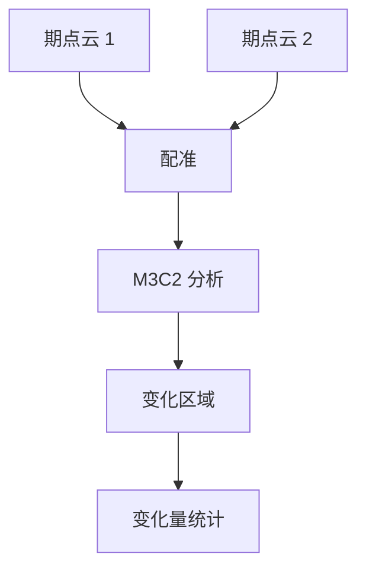

# 点云处理

> CloudCompare、PDAL —— 激光雷达点云数据处理全流程

---

## 一、点云概述

### 1.1 什么是点云

**点云（Point Cloud）** 是由大量三维坐标点组成的数据集，每个点包含：
- 三维坐标（X, Y, Z）
- 颜色信息（R, G, B）
- 反射强度（Intensity）
- 分类信息（Classification）

### 1.2 点云来源

| 来源 | 设备 | 精度 | 特点 |
|------|------|------|------|
| 机载激光雷达 | 无人机 + LiDAR | 5-10cm | 覆盖广、效率高 |
| 地面激光雷达 | 三脚架 + LiDAR | 2-5mm | 精度高、细节丰富 |
| 倾斜摄影 | 多视角照片 | 5-10cm | 成本低、纹理好 |
| 卫星遥感 | 卫星 | 1-5m | 覆盖极大、精度低 |

### 1.3 应用场景

**测绘领域：**
- 数字高程模型（DEM）
- 数字表面模型（DSM）
- 等高线生成
- 体积计算

**电力巡检：**
- 导线提取
- 通道分析
- 安全距离检测

**城市规划：**
- 建筑物提取
- 道路提取
- 变化检测

---

## 二、数据格式

### 2.1 常见格式

| 格式 | 说明 | 特点 |
|------|------|------|
| LAS | 行业标准 | 支持分类、压缩 |
| LAZ | LAS 压缩版 | 体积小 70% |
| PCD | PCL 格式 | 开源常用 |
| XYZ | 纯文本 | 简单、体积大 |
| PLY | 多边形格式 | 支持颜色 |

### 2.2 LAS 文件结构

```
LAS 文件
├── 文件头（227 字节）
│   ├── 文件签名
│   ├── 版本信息
│   ├── 点记录数
│   └── 坐标范围
├── 可变长度记录（VLR）
│   ├── 投影信息
│   ├── 用户数据
│   └── 元数据
├── 点数据记录
│   ├── X, Y, Z 坐标
│   ├── 反射强度
│   ├── 分类
│   └── RGB 颜色
└── 扩展可变长度记录（EVLR）
```

---

## 三、CloudCompare 实战

### 3.1 软件安装

**下载安装：**
- 官网：https://www.danielgm.net/cc/
- 版本：2.13+（支持最新 LAS 版本）
- 平台：Windows/Mac/Linux

**插件安装：**
- 默认安装包含常用插件
- 额外插件：qLAS、qPDAL、qM3C2

### 3.2 数据导入

**导入点云：**
```
File → Open → 选择 LAS/LAZ 文件
或拖拽文件到窗口
```

**导入多个文件：**
```
File → Open → 多选文件
自动对齐（如有重叠）
```

### 3.3 点云预处理

**去噪：**
```
1. 选择点云
2. Tools → Cleanup → Remove Outliers
3. 设置参数：
   - 邻域点数：6
   - 标准差倍数：3
4. 点击 OK
```

**抽稀：**
```
1. 选择点云
2. Edit → Subsample
3. 选择方法：
   - 随机抽稀（Random）
   - 空间抽稀（Space）
4. 设置参数：
   - 目标点数：100 万
   - 或空间间隔：0.1m
5. 点击 OK
```

**裁剪：**
```
1. 选择点云
2. Tools → Segmentation → Clip
3. 绘制裁剪区域
4. 点击 OK
```

### 3.4 点云分类

**地面点分类：**
```
1. 选择点云
2. Tools → Projection → Grid
3. 设置参数：
   - 格网大小：0.5m
   - 最小 Z 值
4. 生成地面点
```

**建筑物分类：**
```
1. 选择点云
2. Tools → Segmentation → Segment
3. 手动或自动选择建筑物点
4. 设置分类码：6（建筑物）
```

### 3.5 DEM 生成

**步骤：**
```
1. 选择地面点
2. Tools → Projection → 2.5D Volume
3. 设置参数：
   - 格网大小：0.5m
   - 投影方向：Z
   - 插值方法：Kriging
4. 生成 DEM
5. 导出为 GeoTIFF
```

### 3.6 体积计算

**填挖方计算：**
```
1. 导入两期点云（原始地形、设计地形）
2. Tools → M3C2 → Compute M3C2
3. 设置参数：
   - 法线方向：Z
   - 投影直径：0.5m
   - 最大深度：10m
4. 计算体积
5. 导出报告
```

---

## 四、PDAL 命令行

### 4.1 安装 PDAL

**Ubuntu：**
```bash
sudo apt install pdal
```

**Windows：**
```powershell
# 使用 OSGeo4W
osgeo4w-setup.exe
# 选择 pdal 包
```

**Conda：**
```bash
conda install -c conda-forge pdal
```

### 4.2 基本命令

**查看信息：**
```bash
pdal info input.las
```

**转换格式：**
```bash
pdal translate input.las output.laz
```

**裁剪：**
```bash
pdal translate input.las output.las \
  --filters.crop.bounds="([300000,301000],[4000000,4001000])"
```

**抽稀：**
```bash
pdal translate input.las output.las \
  --filters.sample.radius=0.5
```

### 4.3 管道处理

**pipeline.json：**
```json
{
  "pipeline": [
    "input.las",
    {
      "type": "filters.outlier",
      "method": "statistical",
      "mean_k": 6,
      "multiplier": 3.0
    },
    {
      "type": "filters.smrf",
      "slope": 0.15,
      "threshold": 0.5,
      "window": 14.0
    },
    {
      "type": "filters.hag_delaunay"
    },
    "output.las"
  ]
}
```

**执行管道：**
```bash
pdal pipeline pipeline.json
```

---

## 五、点云分析

### 5.1 导线提取

**流程：**


**PDAL 实现：**
```json
{
  "pipeline": [
    "power_line.las",
    {
      "type": "filters.smrf",
      "slope": 0.15,
      "threshold": 0.5,
      "window": 14.0
    },
    {
      "type": "filters.range",
      "limits": "Classification[2:2]"
    },
    {
      "type": "filters.dbscan",
      "min_pts": 10,
      "tolerance": 0.5
    },
    "power_line_ground.las"
  ]
}
```

### 5.2 建筑物提取

**流程：**
```
1. 归一化点云（减去地面）
2. 高度滤波（>2m）
3. 平面拟合
4. 建筑物边界提取
5. 矢量化
```

**CloudCompare 操作：**
```
1. 导入点云
2. Tools → Projection → Compute 2.5D Grid
3. 设置高度阈值：2m
4. 提取建筑物点
5. 导出为 Shapefile
```

### 5.3 变化检测

**流程：**


**CloudCompare 操作：**
```
1. 导入两期点云
2. 配准（ICP）
3. Tools → M3C2 → Compute M3C2
4. 设置参数：
   - 投影直径：0.5m
   - 最大深度：10m
5. 查看变化图
6. 导出变化报告
```

---

## 六、精度评估

### 6.1 检查点法

**步骤：**
```
1. 布设检查点（RTK 测量）
2. 在点云中量测检查点
3. 计算误差：
   - 平面误差 = √(Δx² + Δy²)
   - 高程误差 = |Δz|
4. 统计 RMSE
```

**精度标准：**
| 等级 | 平面精度 | 高程精度 |
|------|---------|---------|
| 一级 | ≤5cm | ≤5cm |
| 二级 | ≤10cm | ≤10cm |
| 三级 | ≤20cm | ≤20cm |

### 6.2 重叠区分析

**方法：**
```
1. 选择航带重叠区
2. 计算重叠区高差
3. 统计标准差
4. 评估精度
```

**标准：**
- 高程标准差：<10cm
- 平面标准差：<15cm

---

## 七、常见问题

### Q1：点云密度不够怎么办？

**答：**
- 降低飞行高度
- 减小航向/旁向间隔
- 使用更高性能 LiDAR
- 多次飞行叠加

### Q2：点云有噪点怎么办？

**答：**
- 统计滤波（SOR）
- 半径滤波
- 高度滤波
- 手动清理

### Q3：点云配不准怎么办？

**答：**
- 检查控制点精度
- 增加控制点数量
- 使用 ICP 精配准
- 检查坐标系统

### Q4：处理速度慢怎么办？

**答：**
- 分块处理
- 降低点云密度
- 使用 GPU 加速
- 升级硬件配置

---

<div align="center">

**继续学习 →** [04-三维重建流程](./04-三维重建流程.md)

**最后更新**: 2026-04-05

</div>
