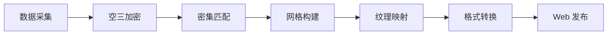

# 三维重建流程

> 从航拍建模到 Web 展示 —— 完整三维重建工作流

---

## 一、工作流程

### 1.1 整体流程



### 1.2 软件选型

| 阶段 | 推荐软件 | 备选方案 |
|------|---------|---------|
| 空三加密 | ContextCapture | Pix4D、大疆智图 |
| 密集匹配 | ContextCapture | Photoscan、OpenMVS |
| 网格构建 | ContextCapture | RealityCapture |
| 纹理映射 | ContextCapture | 3DF Zephyr |
| 格式转换 | FME | Global Mapper |
| Web 发布 | Cesium | SuperMap、Skyline |

---

## 二、数据采集

### 2.1 飞行参数

| 参数 | 推荐值 | 说明 |
|------|-------|------|
| 航高 | 50-150m | 影响 GSD |
| GSD | 2-5cm | 地面采样距离 |
| 航向重叠 | ≥80% | 前后重叠 |
| 旁向重叠 | ≥70% | 左右重叠 |
| 拍摄角度 | 垂直 + 倾斜 | 五向或环绕 |
| 飞行速度 | 5-8m/s | 避免模糊 |

### 2.2 像控点布设

**布设原则：**
- 均匀分布在整个测区
- 特征明显、易于识别
- 永久保存、不易破坏
- 避开高大建筑物遮挡

**数量要求：**
| 测区面积 | 像控点数量 |
|---------|-----------|
| <0.5km² | 4-6 个 |
| 0.5-2km² | 6-10 个 |
| >2km² | 每 km² 4-6 个 |

**测量要求：**
- 使用 RTK 测量
- 平面精度：<5cm
- 高程精度：<5cm
- 记录点之记

---

## 三、空三加密

### 3.1 ContextCapture 空三

**步骤：**
```
1. 创建工程
   File → New Project
   设置工程名称和路径

2. 导入照片
   Photos → Add photos
   选择所有航拍照片

3. 导入 POS 数据
   Photos → Add GPS positions
   选择 POS 文件（CSV/TXT）

4. 提交空三
   Submit → New Aerotriangulation
   设置参数：
   - Tie point extraction: High
   - Calibration: Automatic
   提交处理

5. 等待完成
   查看进度
   检查空三报告
```

### 3.2 空三质量检查

**检查项：**
| 检查项 | 标准 | 说明 |
|--------|------|------|
| 连接点数量 | >10 万 | 越多越好 |
| 重投影误差 | <0.5 像素 | 越小越好 |
| 控制点残差 | <5cm | 平面/高程 |
| 相机参数 | 合理 | 焦距、畸变 |

**问题处理：**
- 连接点少：增加照片、提高重叠率
- 误差大：检查控制点、剔除粗差
- 相机参数异常：手动固定或重新标定

---

## 四、密集匹配

### 4.1 ContextCapture 重建

**步骤：**
```
1. 提交重建
   Submit → New Reconstruction

2. 设置参数
   Spatial resolution: 根据 GSD
   Format: OSGB / 3MX / S3C
   Tile size: 500m

3. 选择处理范围
   整个测区或分块

4. 提交处理
   选择处理节点
   提交任务

5. 等待完成
   数小时到数天
   查看进度
```

### 4.2 参数优化

**空间分辨率：**
```
推荐设置：与 GSD 一致

例：GSD=3cm
Spatial resolution = 0.03m
```

**分块大小：**
```
小测区（<1km²）：不分块
中测区（1-5km²）：500m
大测区（>5km²）：1000m
```

---

## 五、纹理映射

### 5.1 纹理优化

**纹理大小：**
| 应用场景 | 纹理大小 | 说明 |
|---------|---------|------|
| Web 浏览 | 1024×1024 | 加载快 |
| 桌面浏览 | 2048×2048 | 平衡 |
| 高精度展示 | 4096×4096 | 细节好 |

**纹理压缩：**
- JPEG：有损压缩，体积小
- PNG：无损压缩，体积大
- WebP：高压缩比，新标准

### 5.2 纹理修复

**常见问题：**
- 纹理模糊：重新映射、提高分辨率
- 纹理错位：检查 UV 展开
- 颜色不均：匀光匀色处理

**修复工具：**
- Photoshop：手动修复
- Substance Painter：批量修复
- 自研工具：自动化修复

---

## 六、格式转换

### 6.1 OSGB 转 3D Tiles

**使用 FME：**
```
1. 打开 FME Workbench
2. 添加 Reader：OSGB
3. 添加 Writer：3D Tiles
4. 设置参数：
   - 坐标系：WGS84
   - 精度：0.01m
5. 运行转换
```

**使用第三方工具：**
```bash
# osgb23dtiles
osgb23dtiles \
  --input data/osgb \
  --output data/3dtiles \
  --srs EPSG:4490 \
  --quality 100
```

### 6.2 其他格式

**OBJ 格式：**
```
ContextCulture → Export → OBJ
适用于：3D Max、Blender 等建模软件
```

**FBX 格式：**
```
ContextCulture → Export → FBX
适用于：Unity、Unreal 等游戏引擎
```

**glTF/GLB 格式：**
```
ContextCulture → Export → glTF
适用于：Web 端、移动端
```

---

## 七、Web 发布

### 7.1 Cesium 加载

**数据准备：**
```
1. 转换 3D Tiles
2. 部署到 Web 服务器
3. 配置 CORS（跨域）
```

**代码示例：**
```javascript
// 加载 3D Tiles
const tileset = await Cesium.Cesium3DTileset.fromUrl(
  'http://localhost:8080/data/3dtiles/tileset.json'
);

viewer.scene.primitives.add(tileset);

// 调整视角
viewer.zoomTo(tileset, new Cesium.HeadingPitchRange(
  0,
  Cesium.Math.toRadians(-45),
  tileset.boundingSphere.radius * 2
));
```

### 7.2 性能优化

**LOD 优化：**
```
1. 设置屏幕空间误差
2. 启用渐进式加载
3. 预加载关键区域
```

**缓存优化：**
```
1. 启用浏览器缓存
2. 使用 CDN 加速
3. 分块加载
```

**渲染优化：**
```javascript
// 设置最大帧率
viewer.targetFrameRate = 60;

// 关闭后处理
viewer.scene.postProcessStages.fxaa.enabled = false;

// 设置裁剪平面
viewer.scene.camera.frustum.near = 1.0;
viewer.scene.camera.frustum.far = 100000.0;
```

---

## 八、精度评估

### 8.1 检查点法

**步骤：**
```
1. 布设检查点（不参与空三）
2. RTK 测量检查点坐标
3. 在模型上量测检查点
4. 计算误差
```

**精度标准：**
| 成果类型 | 平面精度 | 高程精度 |
|---------|---------|---------|
| 1:500 | ≤5cm | ≤10cm |
| 1:1000 | ≤10cm | ≤15cm |
| 1:2000 | ≤20cm | ≤30cm |

### 8.2 重叠区分析

**方法：**
```
1. 选择航带重叠区
2. 计算重叠区高差
3. 统计标准差
```

**标准：**
- 高程标准差：<15cm
- 平面标准差：<20cm

---

## 九、常见问题

### Q1：空三失败怎么办？

**答：**
- 检查照片质量（模糊、过曝）
- 检查重叠率是否足够
- 检查 POS 数据准确性
- 手动添加连接点

### Q2：模型空洞怎么办？

**答：**
- 补充拍摄（低空、多角度）
- 使用地面照片补充
- 手动修补（Blender）
- AI 修复（纹理生成）

### Q3：纹理模糊怎么办？

**答：**
- 降低航高
- 使用更高像素相机
- 提高纹理分辨率
- 重新映射纹理

### Q4：Web 加载慢怎么办？

**答：**
- 降低纹理分辨率
- 启用 LOD
- 使用 CDN 加速
- 分块加载

---

<div align="center">

**GIS 与数字孪生模块学习完成！** 🎉

下一步：查看 [06-Industry-Solutions](../06-Industry-Solutions/) 了解行业应用方案

**最后更新**: 2026-04-05

</div>
