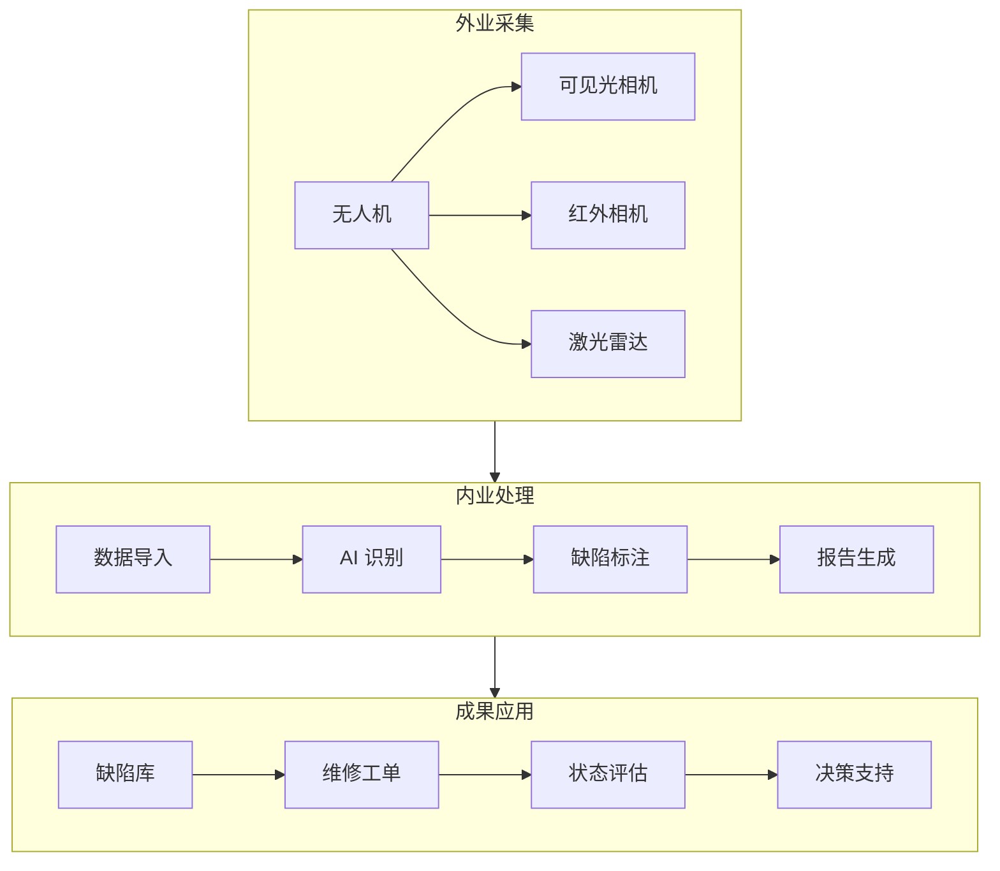
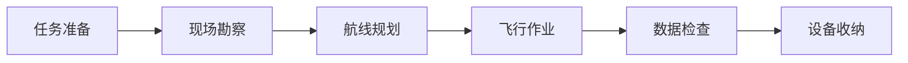
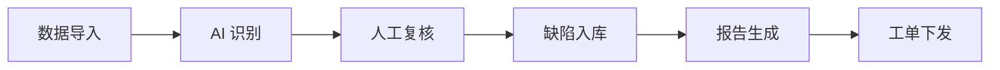

# 电力巡检方案

> 航线规划、缺陷识别、报告生成 —— 无人机电力巡检全流程

---

## 一、方案概述

### 1.1 应用场景

**输电线路巡检：**
- 杆塔检查
- 绝缘子检测
- 导线/地线检查
- 金具检查
- 通道环境检查

**变电站巡检：**
- 设备外观检查
- 红外测温
- 仪表读数
- 异物检测

**配电网巡检：**
- 配电杆塔
- 配电变压器
- 开关设备
- 线路通道

### 1.2 方案优势

| 对比项 | 传统人工 | 无人机巡检 |
|--------|---------|-----------|
| 效率 | 2-3km/天 | 20-30km/天 |
| 成本 | 高（人工 + 设备） | 降低 50-70% |
| 风险 | 高空作业风险 | 无人员风险 |
| 精度 | 目视检查 | 高清 + 红外 |
| 数据 | 纸质记录 | 数字化管理 |

### 1.3 系统架构



---

## 二、硬件配置

### 2.1 无人机选型

| 场景 | 推荐机型 | 配置 | 预算 |
|------|---------|------|------|
| 输电线路 | DJI M350 RTK | H20T 负载 | 25-30 万 |
| 变电站 | DJI M30 | H20N 负载 | 20-25 万 |
| 配电网 | DJI Mavic 3T | 双光相机 | 5-8 万 |
| 精细化 | DJI Phantom 4 RTK | 可见光 | 3-5 万 |

### 2.2 负载配置

**可见光相机：**
- 分辨率：≥2000 万像素
- 变焦：≥20 倍混合变焦
- 焦距：24-160mm 等效

**红外相机：**
- 分辨率：≥640×512
- 热灵敏度：<50mK
- 测温范围：-20℃~150℃

**激光雷达（可选）：**
- 测距精度：±2cm
- 点频：≥20 万点/秒
- 重量：<1kg

### 2.3 辅助设备

| 设备 | 用途 | 推荐型号 |
|------|------|---------|
| 基站 | RTK 定位 | DJI D-RTK 2 |
| 电池 | 续航保障 | 智能飞行电池×6 |
| 充电器 | 快速充电 | 100W 充电管家 |
| 平板电脑 | 航线规划 | iPad Pro |
| 发电机 | 野外供电 | 2kW 静音发电机 |

---

## 三、航线规划

### 3.1 规划原则

**安全原则：**
- 与导线保持≥30m 水平距离
- 与杆塔保持≥15m 距离
- 飞行高度≥导线 10m

**效率原则：**
- 直线飞行，减少转弯
- 连续拍摄，避免遗漏
- 合理分组，单次覆盖

**质量原则：**
- 重叠率≥70%（航向）
- 重叠率≥60%（旁向）
- 拍摄角度 45°-90°

### 3.2 杆塔拍摄点位

**典型杆塔拍摄方案：**
```
        点位 5（塔顶）
           ●
          /|\
         / | \
    点位 2 ●  ● 点位 3
       /   |   \
      /    |    \
点位 1 ●----●----● 点位 4
      塔基   塔身   横担
```

**拍摄顺序：**
1. 塔基全景（点位 1）
2. 左侧横担（点位 2）
3. 右侧横担（点位 3）
4. 塔身细节（点位 4）
5. 塔顶俯视（点位 5）

### 3.3 航线规划软件

**DJI Pilot 2：**
```
打开 Pilot 2 → 新建任务 → 航点飞行 → 添加杆塔 → 设置拍摄点 → 执行任务
```

**第三方软件：**
- UgCS（专业航线规划）
- Pix4Dcapture（正射航线）
- Mission Planner（开源）

---

## 四、缺陷识别

### 4.1 常见缺陷类型

**杆塔缺陷：**
| 缺陷 | 特征 | 危害 |
|------|------|------|
| 锈蚀 | 表面红褐色 | 结构强度下降 |
| 裂纹 | 可见裂缝 | 断裂风险 |
| 变形 | 弯曲、扭曲 | 结构失稳 |
| 螺栓缺失 | 连接件缺少 | 连接松动 |

**绝缘子缺陷：**
| 缺陷 | 特征 | 危害 |
|------|------|------|
| 自爆 | 玻璃破裂 | 绝缘失效 |
| 闪络 | 表面放电痕迹 | 绝缘下降 |
| 污秽 | 表面积尘 | 污闪风险 |
| 破损 | 缺口、裂纹 | 机械强度下降 |

**导线缺陷：**
| 缺陷 | 特征 | 危害 |
|------|------|------|
| 断股 | 股线断裂 | 载流能力下降 |
| 磨损 | 表面磨痕 | 机械强度下降 |
| 腐蚀 | 表面氧化 | 导电性能下降 |
| 异物 | 悬挂物 | 短路风险 |

### 4.2 AI 识别模型

**YOLO 检测模型：**
```python
from ultralytics import YOLO

# 加载训练好的模型
model = YOLO('power_line_defect.pt')

# 推理
results = model('tower_image.jpg')

# 输出结果
for result in results:
    boxes = result.boxes
    for box in boxes:
        cls = box.cls  # 缺陷类别
        conf = box.conf  # 置信度
        xyxy = box.xyxy  # 边界框
        print(f"发现{cls}缺陷，置信度{conf:.2f}")
```

**训练数据集：**
- 样本数量：≥5000 张
- 缺陷类别：10-20 类
- 标注格式：YOLO/COCO
- 训练平台：PyTorch

### 4.3 红外测温

**温度异常判断：**
| 温差 | 判断 | 处理 |
|------|------|------|
| <5℃ | 正常 | 无需处理 |
| 5-15℃ | 一般缺陷 | 跟踪观察 |
| 15-30℃ | 严重缺陷 | 计划维修 |
| >30℃ | 危急缺陷 | 立即处理 |

**测温报告：**
```
设备名称：#123 杆塔 A 相绝缘子
检测温度：65.3℃
环境温度：25.1℃
温差：40.2℃
判断：危急缺陷
建议：立即更换
```

---

## 五、作业流程

### 5.1 外业流程



**详细步骤：**

**1. 任务准备**
- [ ] 检查天气（风速<5 级、无雨）
- [ ] 检查设备（电池、螺旋桨）
- [ ] 准备资料（线路台账、杆塔坐标）
- [ ] 办理手续（空域申请、工作票）

**2. 现场勘察**
- [ ] 确认起降点（平坦、无障碍）
- [ ] 观察环境（高压线、建筑物）
- [ ] 设置警示标志
- [ ] 确认通讯畅通

**3. 航线规划**
- [ ] 导入杆塔坐标
- [ ] 设置拍摄点位
- [ ] 设置安全高度
- [ ] 模拟飞行验证

**4. 飞行作业**
- [ ] 设备检查（电池、GPS、图传）
- [ ] 解锁起飞
- [ ] 执行航线
- [ ] 实时监控
- [ ] 自动返航

**5. 数据检查**
- [ ] 照片数量核对
- [ ] 照片质量检查
- [ ] 缺陷初步识别
- [ ] 数据备份

### 5.2 内业流程



**详细步骤：**

**1. 数据导入**
- 照片导入系统
- 关联杆塔台账
- 建立任务档案

**2. AI 识别**
- 自动识别缺陷
- 标注缺陷位置
- 输出识别结果

**3. 人工复核**
- 专业人员审核
- 修正误识别
- 补充遗漏缺陷

**4. 报告生成**
- 缺陷统计表
- 典型缺陷照片
- 维修建议
- 导出 PDF/Excel

---

## 六、成果交付

### 6.1 交付清单

| 成果 | 格式 | 说明 |
|------|------|------|
| 巡检报告 | PDF | 汇总分析 |
| 缺陷清单 | Excel | 详细列表 |
| 原始照片 | JPG | 按杆塔分类 |
| 缺陷照片 | JPG | 标注框选 |
| 红外数据 | JPG+CSV | 温度数据 |
| 飞行日志 | TXT | 飞行记录 |

### 6.2 报告模板

```markdown
# 电力线路无人机巡检报告

## 一、项目概况
- 线路名称：220kV XX 线
- 巡检区段：#001-#100 杆塔
- 巡检日期：2026-04-05
- 天气情况：晴，风速 2 级

## 二、巡检结果
- 巡检杆塔：100 基
- 发现缺陷：35 处
  - 一般缺陷：25 处
  - 严重缺陷：8 处
  - 危急缺陷：2 处

## 三、典型缺陷
（附照片）

## 四、维修建议
1. 立即处理危急缺陷 2 处
2. 计划维修严重缺陷 8 处
3. 跟踪观察一般缺陷 25 处

## 五、附件
- 缺陷清单
- 照片集
```

---

## 七、成本估算

### 7.1 设备投资

| 项目 | 数量 | 单价 | 总价 |
|------|------|------|------|
| DJI M350 RTK | 1 套 | 28 万 | 28 万 |
| H20T 负载 | 1 台 | 8 万 | 8 万 |
| 备用电池 | 6 块 | 0.3 万 | 1.8 万 |
| 充电器 | 2 套 | 0.2 万 | 0.4 万 |
| 平板电脑 | 1 台 | 0.8 万 | 0.8 万 |
| **合计** | - | - | **39 万** |

### 7.2 运营成本

| 项目 | 费用 | 说明 |
|------|------|------|
| 飞手工资 | 1-1.5 万/月 | 2 人 |
| 设备折旧 | 5 万/年 | 5 年折旧 |
| 维修保养 | 2 万/年 | 日常维护 |
| 保险 | 0.5 万/年 | 第三方责任险 |
| 差旅 | 3-5 万/年 | 项目现场 |

### 7.3 项目报价

**计费方式：**
- 按杆塔：50-200 元/基
- 按公里：500-2000 元/km
- 包年：50-200 万/年

**影响因素：**
- 电压等级（越高越贵）
- 地形条件（山区更贵）
- 巡检精度（精细化更贵）
- 交付要求（报告复杂度）

---

## 八、常见问题

### Q1：雨天可以飞行吗？

**答：** 不可以。雨天影响：
- 相机镜头模糊
- 电子设备短路风险
- 飞行稳定性下降

### Q2：夜间可以巡检吗？

**答：** 需要特殊配置：
- 探照灯负载
- 夜视相机
- 飞手夜航资质
- 额外安全措施

### Q3：AI 识别准确率多少？

**答：** 
- 常见缺陷：>90%
- 罕见缺陷：>70%
- 仍需人工复核

### Q4：巡检周期多久合适？

**答：** 
- 常规巡检：1 次/年
- 重要线路：1 次/半年
- 特殊时期：增加频次

---

## 九、案例分享

### 案例 1：220kV 线路精细化巡检

**项目概况：**
- 线路长度：50km
- 杆塔数量：120 基
- 地形：丘陵 + 平原

**实施方案：**
- 无人机：DJI M350 RTK
- 负载：H20T（可见光 + 红外）
- 飞手：2 人
- 工期：5 天

**成果：**
- 发现缺陷：45 处
- 危急缺陷：3 处（立即处理）
- 节省成本：较人工节省 60%

### 案例 2：变电站红外测温

**项目概况：**
- 变电站：500kV XX 变
- 设备数量：200 台
- 检测项目：红外测温

**实施方案：**
- 无人机：DJI M30
- 负载：H20N（红外夜视）
- 飞手：2 人
- 工期：2 天

**成果：**
- 发现过热：15 处
- 最高温度：85℃（环境温度 25℃）
- 避免事故：1 起（隔离开关过热）

---

<div align="center">

**继续学习 →** [02-农业植保方案](./02-农业植保方案.md)

**最后更新**: 2026-04-05

</div>
