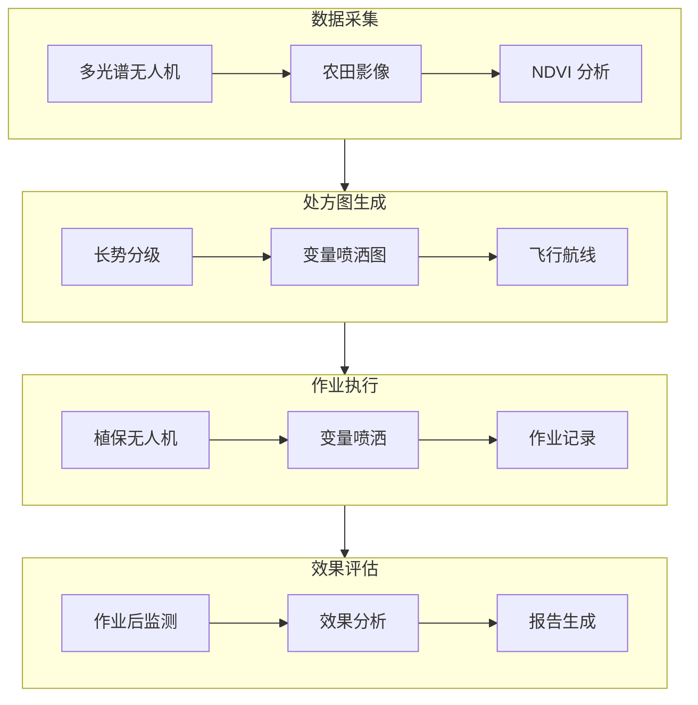

# 农业植保方案

> 变量喷洒、多光谱分析、处方图生成 —— 智慧农业无人机应用

---

## 一、方案概述

### 1.1 应用场景

**农药喷洒：**
- 水稻、小麦、玉米等大田作物
- 果树、茶园等经济作物
- 病虫害防治

**播种施肥：**
- 水稻直播
- 草籽播撒
- 颗粒肥撒施

**农情监测：**
- 长势分析
- 病虫害预警
- 产量预估

### 1.2 方案优势

| 对比项 | 传统人工 | 无人机植保 |
|--------|---------|-----------|
| 效率 | 2-5 亩/小时 | 300-500 亩/小时 |
| 用药量 | 常规 | 节省 20-30% |
| 用水 | 30-50L/亩 | 1-2L/亩 |
| 人工成本 | 高 | 降低 80% |
| 安全性 | 接触农药 | 人药分离 |

### 1.3 系统架构



---

## 二、硬件配置

### 2.1 植保无人机

| 机型 | 载重 | 药箱 | 幅宽 | 续航 | 价格 |
|------|------|------|------|------|------|
| DJI T40 | 40kg | 40L | 9m | 10min | 8 万 |
| DJI T30 | 30kg | 40L | 9m | 12min | 6 万 |
| 极飞 P150 | 50kg | 50L | 10m | 15min | 10 万 |
| 极飞 P80 | 40kg | 40L | 8m | 12min | 7 万 |

### 2.2 多光谱无人机

| 机型 | 波段 | 分辨率 | 价格 |
|------|------|-------|------|
| DJI M3M | 5 波段 | 200 万 | 5 万 |
| 极飞 MS | 6 波段 | 200 万 | 4 万 |
| Sequoia+ | 4 波段 | 120 万 | 8 万 |

### 2.3 辅助设备

| 设备 | 用途 | 价格 |
|------|------|------|
| RTK 基站 | 精准定位 | 2 万 |
| 充电器 | 快速充电 | 0.5 万 |
| 发电机 | 野外供电 | 0.5 万 |
| 药箱 | 备用 | 0.2 万 |

---

## 三、作业流程

### 3.1 测绘阶段

**操作步骤：**
```
1. 地块勘测
   - 测量地块边界
   - 标记障碍物
   - 确定起降点

2. 航线规划
   - 航高：30-50m
   - 重叠率：70%/60%
   - 速度：5-8m/s

3. 数据采集
   - 多光谱影像
   - RGB 影像
   - POS 数据
```

### 3.2 处方图生成

**NDVI 计算：**
```
NDVI = (NIR - Red) / (NIR + Red)

NDVI 值范围：-1 到 1
- <0.2：裸土/水体
- 0.2-0.4：低覆盖
- 0.4-0.6：中覆盖
- 0.6-0.8：高覆盖
- >0.8：茂密植被
```

**变量喷洒图：**
```
1. NDVI 分级
   - 0-0.3：不喷洒
   - 0.3-0.5：低剂量（50%）
   - 0.5-0.7：中剂量（80%）
   - 0.7-1.0：高剂量（100%）

2. 生成处方图
   - 格式：Shapefile / GeoTIFF
   - 分辨率：10cm
   - 坐标系：CGCS2000

3. 导入飞控
   - 通过 DJI Terra
   - 或通过极飞农服
```

### 3.3 喷洒作业

**作业参数：**
| 作物 | 航高 | 速度 | 亩用量 |
|------|------|------|-------|
| 水稻 | 2-3m | 5-7m/s | 1-2L |
| 小麦 | 2-3m | 6-8m/s | 1-2L |
| 玉米 | 3-4m | 5-7m/s | 1.5-2.5L |
| 果树 | 3-5m | 3-5m/s | 2-3L |

**作业流程：**
```
1. 药液配制
   - 按比例配药
   - 过滤杂质
   - 加入药箱

2. 无人机检查
   - 电池电量
   - 螺旋桨
   - 喷头
   - RTK 信号

3. 开始作业
   - 自动飞行
   - 实时监控
   - 自动避障
   - 自动返航加药

4. 作业记录
   - 作业面积
   - 用药量
   - 飞行时间
```

---

## 四、数据分析

### 4.1 长势分析

**NDVI 时序分析：**
```python
import rasterio
import numpy as np
import matplotlib.pyplot as plt

# 读取多期 NDVI 数据
ndvi_data = []
for date in dates:
    with rasterio.open(f'ndvi_{date}.tif') as src:
        ndvi_data.append(src.read(1))

# 计算变化趋势
trend = np.polyfit(range(len(ndvi_data)), ndvi_data, 1)[0]

# 生成趋势图
plt.imshow(trend, cmap='RdYlGn')
plt.colorbar(label='NDVI 变化率')
plt.savefig('ndvi_trend.png')
```

**长势分级：**
| 等级 | NDVI 范围 | 面积占比 | 措施 |
|------|---------|---------|------|
| 差 | <0.4 | 10% | 重点管理 |
| 中 | 0.4-0.6 | 30% | 常规管理 |
| 良 | 0.6-0.8 | 50% | 维持 |
| 优 | >0.8 | 10% | 保持 |

### 4.2 病虫害预警

**识别方法：**
- 多光谱异常检测
- 热红外温度异常
- AI 图像识别

**预警流程：**
```
1. 数据采集
   - 多光谱影像
   - 热红外影像

2. 异常检测
   - NDVI 异常区域
   - 温度异常区域

3. 实地验证
   - 田间调查
   - 确认病虫害类型

4. 防治建议
   - 农药选择
   - 喷洒剂量
   - 防治时间
```

### 4.3 产量预估

**估产模型：**
```
产量 = f(NDVI, 气象数据，历史产量)

常用模型：
- 线性回归
- 随机森林
- 神经网络
```

**精度验证：**
```
1. 样方实测
   - 随机选择样方
   - 实际收割测产

2. 精度评估
   - 相对误差 = |预估 - 实测| / 实测
   - 目标精度：<10%
```

---

## 五、成本效益

### 5.1 投资成本

| 项目 | 数量 | 单价 | 总价 |
|------|------|------|------|
| 植保无人机 | 1 套 | 8 万 | 8 万 |
| 多光谱无人机 | 1 套 | 5 万 | 5 万 |
| RTK 基站 | 1 套 | 2 万 | 2 万 |
| 备用电池 | 6 块 | 0.5 万 | 3 万 |
| 充电器 | 2 套 | 0.3 万 | 0.6 万 |
| 车辆 | 1 辆 | 5 万 | 5 万 |
| **合计** | - | - | **23.6 万** |

### 5.2 运营成本

| 项目 | 费用 | 说明 |
|------|------|------|
| 飞手工资 | 1 万/月 | 2 人 |
| 设备折旧 | 5 万/年 | 5 年折旧 |
| 维修保养 | 2 万/年 | 日常维护 |
| 保险 | 0.5 万/年 | 第三方责任险 |
| 油料/电费 | 1 万/年 | 发电机、充电器 |

### 5.3 收益分析

**作业收费：**
- 农药喷洒：8-15 元/亩
- 播种施肥：5-10 元/亩
- 测绘服务：3-5 元/亩

**年收入估算：**
```
作业面积：10 万亩/年
平均收费：10 元/亩
年收入：100 万元

成本：
- 设备折旧：5 万
- 人工：24 万
- 运营：5 万
- 总成本：34 万

年利润：66 万
投资回收期：4-6 个月
```

---

## 六、常见问题

### Q1：什么天气适合作业？

**答：**
- 风力：<4 级
- 温度：15-35℃
- 无雨
- 避开高温时段（中午）

### Q2：如何避免药害？

**答：**
- 严格按比例配药
- 避免重喷漏喷
- 注意农药混配禁忌
- 作业后清洗设备

### Q3：电池如何保养？

**答：**
- 存放电量 50-60%
- 避免高温暴晒
- 定期充放电
- 使用原装充电器

### Q4：如何提高作业效率？

**答：**
- 合理规划地块
- 多机协同作业
- 备用电池充足
- 优化加药流程

---

<div align="center">

**继续学习 →** [03-安防监控方案](./03-安防监控方案.md)

**最后更新**: 2026-04-05

</div>
