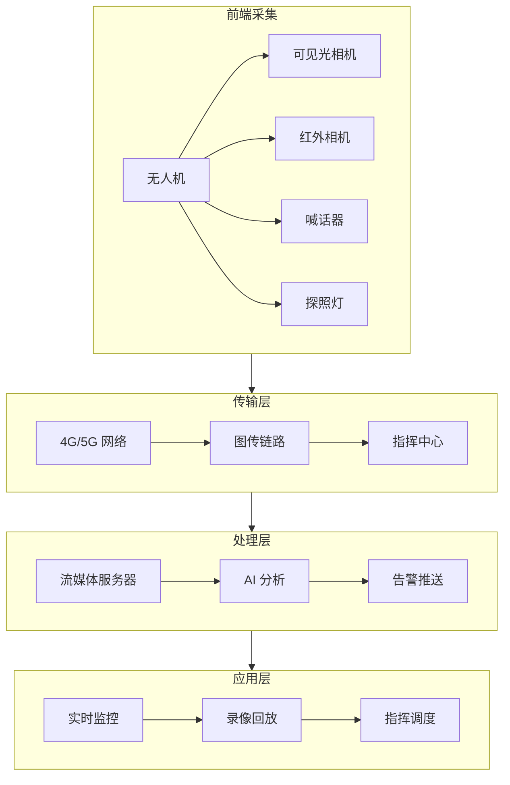
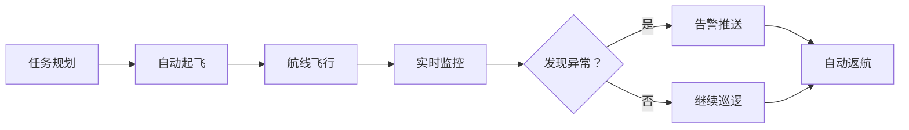

# 安防监控方案

> 实时图传、AI 预警、应急指挥 —— 无人机安防应用实战

---

## 一、方案概述

### 1.1 应用场景

**日常巡逻：**
- 园区巡逻
- 边境巡逻
- 河道巡逻
- 铁路巡逻

**大型活动安保：**
- 人群监控
- 交通疏导
- 应急处突
- 空中指挥

**应急指挥：**
- 灾害现场
- 事故现场
- 搜救行动
- 火情监控

### 1.2 方案优势

| 对比项 | 传统监控 | 无人机监控 |
|--------|---------|-----------|
| 覆盖范围 | 固定点位 | 灵活机动 |
| 响应速度 | 依赖现有摄像头 | 快速抵达 |
| 视角 | 固定角度 | 多角度、俯视 |
| 成本 | 前期投入大 | 按需使用 |
| 盲区 | 有死角 | 无死角 |

### 1.3 系统架构



---

## 二、硬件配置

### 2.1 无人机选型

| 场景 | 推荐机型 | 配置 | 预算 |
|------|---------|------|------|
| 园区巡逻 | DJI M30 | H20N 负载 | 25 万 |
| 边境巡逻 | DJI M350 RTK | H20T+ 喊话器 | 35 万 |
| 大型活动 | DJI Mavic 3T | 双光相机 | 8 万 |
| 应急指挥 | DJI M300 RTK | H20T+ 探照灯 | 40 万 |

### 2.2 任务载荷

**可见光相机：**
- 分辨率：≥2000 万像素
- 变焦：≥20 倍混合变焦
- 焦距：24-160mm 等效

**红外相机：**
- 分辨率：≥640×512
- 热灵敏度：<50mK
- 测温范围：-20℃~150℃

**喊话器：**
- 功率：≥30W
- 距离：≥500 米
- 录音播放：支持

**探照灯：**
- 功率：≥50W
- 距离：≥300 米
- 照射角度：可调

### 2.3 地面设备

| 设备 | 用途 | 价格 |
|------|------|------|
| 遥控器 | 飞行控制 | 标配 |
| 监视器 | 实时监看 | 0.5 万 |
| 4G/5G 模块 | 远程图传 | 0.5 万 |
| 发电机 | 野外供电 | 0.5 万 |
| 运输箱 | 设备保护 | 0.2 万 |

---

## 三、系统部署

### 3.1 图传方案

**短距离（<10km）：**
- DJI O3 图传
- 延迟：<200ms
- 画质：1080P

**长距离（>10km）：**
- 4G/5G 图传
- 延迟：500ms-2s
- 距离：全网覆盖

**混合方案：**
- 近距用 O3
- 远距用 4G
- 自动切换

### 3.2 流媒体服务器

**ZLMediaKit 部署：**
```bash
# Docker 部署
docker run -d \
  -p 1935:1935 \
  -p 8080:80 \
  -p 10000:10000/udp \
  -v /opt/zlmediakit/config:/opt/ZLMediaKit/config \
  zlmediakit/zlmediakit:latest
```

**推流配置：**
```bash
# 无人机端推流
ffmpeg -re -i rtmp_input \
  -c:v libx264 -preset ultrafast \
  -b:v 2000k \
  -f flv rtmp://server_ip/live/drone1
```

**拉流播放：**
```javascript
// Web 端播放（flv.js）
<video id="video" controls></video>
<script>
  const player = flvjs.createPlayer({
    type: 'flv',
    url: 'http://server_ip/live/drone1.flv'
  });
  player.attachMediaElement(document.getElementById('video'));
  player.load();
  player.play();
</script>
```

### 3.3 指挥中心

**硬件配置：**
| 设备 | 数量 | 用途 |
|------|------|------|
| 大屏 | 1-4 块 | 实时监看 |
| 工作站 | 2-4 台 | 数据处理 |
| 服务器 | 1-2 台 | 流媒体、AI |
| 网络设备 | 1 套 | 网络交换 |

**软件配置：**
- 视频管理平台
- AI 分析平台
- 指挥调度系统
- 电子地图系统

---

## 四、AI 预警

### 4.1 检测类型

**人员检测：**
- 入侵检测
- 人群聚集
- 异常行为

**车辆检测：**
- 违停检测
- 逆行检测
- 车流统计

**火情检测：**
- 烟雾识别
- 火焰识别
- 温度异常

### 4.2 部署方案

**云端分析：**
```
无人机 → 4G → 云端 AI → 告警推送

优点：算力充足、模型更新快
缺点：依赖网络、延迟高
```

**边缘分析：**
```
无人机 → 机载 AI → 告警推送

优点：低延迟、离线工作
缺点：算力有限、模型固定
```

**混合分析：**
```
无人机 → 边缘 AI（实时）
     → 云端 AI（深度分析）

优点：兼顾实时性和准确性
缺点：系统复杂
```

### 4.3 告警推送

**推送方式：**
- 短信通知
- 微信通知
- App 推送
- 声光告警

**告警内容：**
```json
{
  "type": "人员入侵",
  "location": "北纬 30.1234, 东经 120.5678",
  "time": "2026-04-05 15:30:00",
  "image": "http://server/alarm/001.jpg",
  "video": "http://server/alarm/001.mp4",
  "level": "高"
}
```

---

## 五、作业流程

### 5.1 日常巡逻

**流程：**


**操作要点：**
- 提前规划巡逻航线
- 设置关键监控点
- 保持通讯畅通
- 及时响应告警

### 5.2 应急处突

**流程：**
```
1. 接警
   - 记录位置
   - 了解情况

2. 起飞
   - 快速准备
   - 立即起飞

3. 侦查
   - 实时图传
   - AI 分析

4. 处置
   - 喊话警告
   - 探照灯照射
   - 引导地面力量

5. 撤离
   - 任务完成
   - 返航回收
```

### 5.3 大型活动安保

**前期准备：**
- 勘察场地
- 规划航线
- 设置禁飞区
- 准备备用机

**活动当天：**
- 提前部署
- 全程监控
- 应急响应
- 数据保存

**活动结束后：**
- 数据整理
- 报告生成
- 设备维护

---

## 六、成本效益

### 6.1 投资成本

| 项目 | 数量 | 单价 | 总价 |
|------|------|------|------|
| 无人机 | 2 套 | 25 万 | 50 万 |
| 负载 | 2 套 | 8 万 | 16 万 |
| 地面设备 | 1 套 | 5 万 | 5 万 |
| 指挥中心 | 1 套 | 50 万 | 50 万 |
| **合计** | - | - | **121 万** |

### 6.2 运营成本

| 项目 | 费用/年 | 说明 |
|------|--------|------|
| 飞手工资 | 24 万 | 2 人×1 万/月 |
| 设备折旧 | 24 万 | 5 年折旧 |
| 维修保养 | 5 万 | 日常维护 |
| 保险 | 1 万 | 第三方责任险 |
| **合计** | **54 万/年** | - |

### 6.3 效益分析

**人力替代：**
- 传统巡逻：10 人×10 万/年 = 100 万/年
- 无人机巡逻：2 人×10 万/年 = 20 万/年
- 节省：80 万/年

**效率提升：**
- 巡逻范围：扩大 5 倍
- 响应速度：提升 10 倍
- 盲区消除：100% 覆盖

**投资回收期：**
```
总投资：121 万
年节省：80 万
回收期：121 / 80 ≈ 1.5 年
```

---

## 七、常见问题

### Q1：雨天可以飞行吗？

**答：**
- 小雨：IP55 防护等级可飞
- 中雨：不建议飞行
- 大雨：禁止飞行

### Q2：夜间可以飞行吗？

**答：**
- 可以，需配备探照灯
- 使用红外相机
- 飞手需有夜航资质

### Q3：图传延迟高怎么办？

**答：**
- 检查网络信号
- 降低码率
- 使用 5G 网络
- 边缘 AI 分析

### Q4：隐私保护怎么做？

**答：**
- 避开私人区域
- 数据加密存储
- 访问权限控制
- 定期删除数据

---

<div align="center">

**行业方案区学习完成！** 🎉

下一步：查看 [07-OpenSource-Awesome](../07-OpenSource-Awesome/) 了解开源生态

**最后更新**: 2026-04-05

</div>
