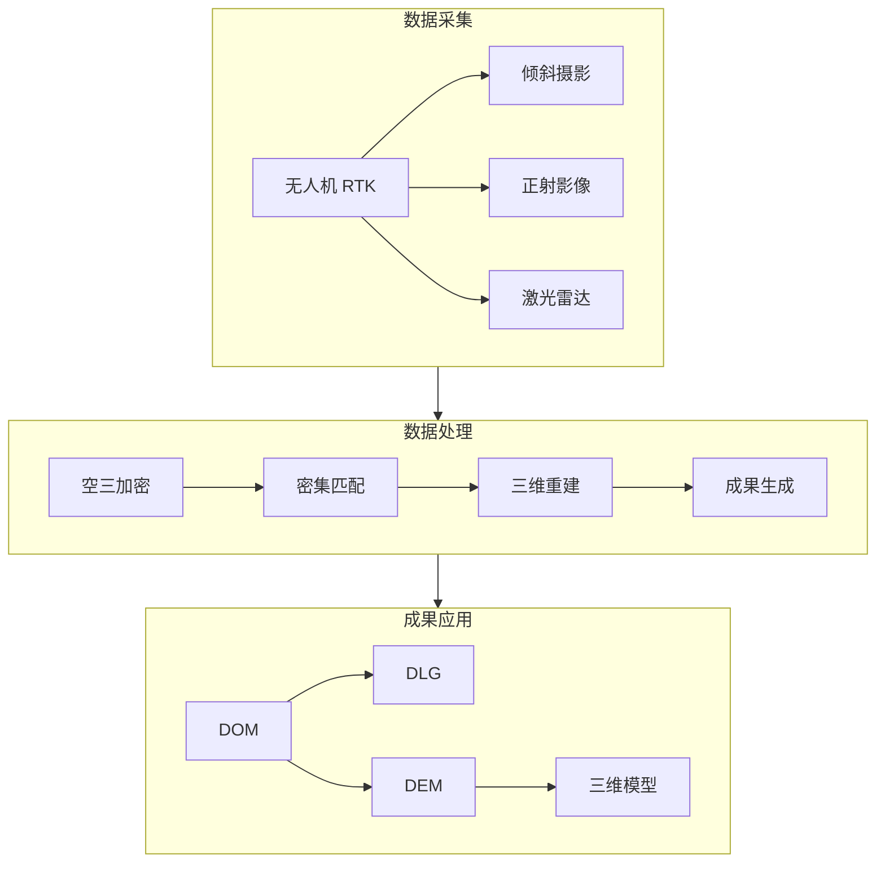

# 测绘勘探方案

> 正射影像、三维建模、成果交付 —— 无人机测绘全流程

---

## 一、方案概述

### 1.1 应用场景

**地形测绘：**
- 1:500~1:2000 比例尺地形图
- 等高线生成
- 高程模型（DEM/DSM）
- 正射影像图（DOM）

**工程测量：**
- 土方量计算
- 工程进度监测
- 变形监测
- 竣工测量

**矿山测绘：**
- 矿体建模
- 储量估算
- 开采监测
- 复垦规划

**城市规划：**
- 实景三维建模
- 建筑立面采集
- 规划验收
- 违建识别

### 1.2 方案优势

| 对比项 | 传统测绘 | 无人机测绘 |
|--------|---------|-----------|
| 效率 | 0.5-1km²/天 | 5-10km²/天 |
| 成本 | 高（人工 + 设备） | 降低 40-60% |
| 精度 | 厘米级 | 厘米级（RTK） |
| 安全 | 野外作业风险 | 远程操控 |
| 成果 | 二维为主 | 二三维一体 |

### 1.3 系统架构



---

## 二、硬件配置

### 2.1 无人机选型

| 场景 | 推荐机型 | 配置 | 预算 |
|------|---------|------|------|
| 大区域测绘 | DJI M350 RTK + P1 | 全画幅相机 | 30-35 万 |
| 倾斜摄影 | DJI M350 RTK + L2 | 激光雷达 | 35-40 万 |
| 中小区域 | DJI Phantom 4 RTK | 机械快门 | 8-10 万 |
| 复杂地形 | DJI Mavic 3E | 长焦相机 | 4-6 万 |

### 2.2 负载配置

**测绘相机：**
- 传感器：全画幅/APS-C
- 分辨率：≥2000 万像素
- 快门：机械全局快门
- 焦距：24/35/50mm 可换

**激光雷达：**
- 测距精度：±1cm
- 点频：≥50 万点/秒
- 扫描视场角：≥70°
- IMU 精度：≤0.005°

**RTK 定位：
- 定位精度：水平 1cm+1ppm，垂直 2cm+1ppm
- 支持：北斗/GPS/GLONASS/Galileo
- 基站：内置或外接 D-RTK 2

### 2.3 辅助设备

| 设备 | 用途 | 推荐型号 |
|------|------|---------|
| 像控点 | 精度验证 | 打印标靶 + RTK 测量 |
| 基站 | 差分定位 | DJI D-RTK 2 /  CORS 账号 |
| 地面站 | 航线规划 | DJI Pilot 2 / Mission Planner |
| 工作站 | 数据处理 | 高性能 GPU 工作站 |

---

## 三、作业流程

### 3.1 测区踏勘

**前期准备：**
1. 收集测区资料（范围、地形、地物）
2. 查询空域限制（禁飞区、限高）
3. 规划起降场地（平坦、开阔）
4. 准备像控点布设方案

**踏勘要点：**
- 测区边界确认
- 最高点/最低点高程
- 电磁干扰源排查
- 起降点选址

### 3.2 航线规划

**正射影像航线：**
```
飞行高度：80-120m（根据 GSD 要求）
航向重叠：≥80%
旁向重叠：≥70%
飞行速度：8-12m/s
相机角度：垂直向下（-90°）
```

**倾斜摄影航线：**
```
五向飞行：垂直 + 四倾斜（45°）
航向重叠：≥85%
旁向重叠：≥75%
井字形/环绕飞行
```

**RTK 设置：**
- 使用 CORS 账号或自建基站
- 固定解后开始作业
- 记录基站坐标

### 3.3 像控点布设

**布设原则：**
- 均匀分布（四角 + 中心）
- 地物特征明显处
- 避免遮挡和阴影
- 每平方公里≥4 个

**测量要求：**
- RTK 静态/动态测量
- 精度：平面≤2cm，高程≤3cm
- 记录点之记（照片 + 描述）

### 3.4 数据采集

**飞行前检查：**
- [ ] 电池电量充足
- [ ] RTK 固定解
- [ ] 相机参数正确
- [ ] 存储卡空间足够
- [ ] 返航点已记录

**飞行中监控：**
- 实时查看航迹覆盖
- 监控图传质量
- 注意电量预警（30% 返航）
- 记录异常情况

### 3.5 质量检查

**现场快检：**
- 照片数量核对
- POS 数据完整性
- 影像质量抽检（模糊、曝光）
- 覆盖范围确认

---

## 四、数据处理

### 4.1 软件选型

| 软件 | 用途 | 价格 |
|------|------|------|
| ContextCapture | 实景三维建模 | 10-20 万 |
| Pix4Dmapper | 正射/三维 | 5-10 万 |
| DJI Terra | 大疆生态 | 2-5 万 |
| OpenDroneMap | 开源方案 | 免费 |
| CC / 大疆智图 | 快速处理 | 按需 |

### 4.2 处理流程

**1. 数据导入**
- 导入照片和 POS 数据
- 导入像控点坐标
- 检查数据完整性

**2. 空中三角测量**
- 特征点提取与匹配
- 光束法平差
- 像控点刺点
- 精度报告生成

**3. 密集匹配**
- 生成密集点云
- 构建三角网（TIN）
- 生成 DSM/DEM

**4. 成果生成**
- 正射影像（DOM）
- 数字线划图（DLG）
- 三维模型（OSGB/3DTiles）

### 4.3 精度控制

**空三精度要求：**
- 平面中误差：≤2 倍 GSD
- 高程中误差：≤3 倍 GSD
- 像控点残差：≤3cm

**成果精度验证：**
- 检查点验证（未参与平差）
- 接边精度检查
- 逻辑一致性检查

---

## 五、成果交付

### 5.1 标准成果

| 成果类型 | 格式 | 内容 |
|---------|------|------|
| DOM | GeoTIFF | 正射影像图 |
| DEM | GeoTIFF | 数字高程模型 |
| DSM | GeoTIFF | 数字表面模型 |
| DLG | DWG/SHP | 数字线划图 |
| 三维模型 | OSGB/3DTiles | 实景三维 |
| 技术报告 | PDF | 作业说明 + 精度报告 |

### 5.2 元数据要求

- 坐标系：CGCS2000 / 地方坐标系
- 高程基准：1985 国家高程基准
- 分幅编号：按国家标准
- 数据格式：GeoTIFF（带坐标信息）

### 5.3 质量检查

**交付前检查清单：**
- [ ] 数学精度符合要求
- [ ] 地理精度无偏差
- [ ] 属性信息完整
- [ ] 图面整饰规范
- [ ] 元数据齐全
- [ ] 文档资料完整

---

## 六、成本估算

### 6.1 设备投入

| 项目 | 配置 | 预算（万元） |
|------|------|------------|
| 无人机系统 | M350 RTK + P1 | 32 |
| 激光雷达 | DJI L2 | 35 |
| 工作站 | 高性能图形工作站 | 5 |
| 软件 | 大疆智图 + CC | 8 |
| 辅助设备 | 基站、像控点等 | 3 |
| **合计** | | **83** |

### 6.2 项目报价参考

| 项目类型 | 单价 | 备注 |
|---------|------|------|
| 1:500 地形测绘 | 8000-12000 元/km² | 含像控 + 空三 |
| 正射影像 | 3000-5000 元/km² | 不含像控 |
| 倾斜三维 | 15000-25000 元/km² | 含建模 |
| 激光雷达 | 20000-30000 元/km² | 含点云分类 |
| 土方测量 | 2000-5000 元/次 | 小区域 |

---

## 七、常见问题

### Q1: GSD 与飞行高度的关系？

```
GSD = (传感器宽度 × 飞行高度) / (焦距 × 像元宽度)

简化估算（P1 相机）：
- 80m 高度 → GSD ≈ 2cm
- 100m 高度 → GSD ≈ 2.5cm
- 120m 高度 → GSD ≈ 3cm
```

### Q2: 像控点必须布设吗？

**必须布设的情况：**
- 1:500 大比例尺测图
- 高程精度要求高
- 测区地形起伏大
- 无 CORS 信号覆盖

**可简化的情况：**
- 小比例尺（1:2000 以上）
- 仅需要 DOM
- RTK 固定解质量好
- 精度要求不高

### Q3: 如何处理弱纹理区域？

**问题：** 水面、雪地、沙漠等区域特征点少

**解决方案：**
- 增加航向/旁向重叠（≥90%/80%）
- 布设人工标志点
- 结合激光雷达数据
- 分区域处理

### Q4: 三维模型拉花怎么办？

**原因：**
- 照片重叠度不足
- 弱纹理区域
- 运动物体干扰
- 空三精度差

**优化：**
- 补飞增加重叠
- 手动编辑修复
- 使用激光雷达
- 优化空三参数

---

## 八、案例参考

### 8.1 某市 1:500 地形测绘

**项目概况：**
- 测区面积：5km²
- 比例尺：1:500
- GSD 要求：≤2cm
- 工期：15 天

**技术方案：**
- 无人机：DJI Phantom 4 RTK
- 飞行高度：80m
- 像控点：25 个（5 个/km²）
- 处理软件：ContextCapture

**成果精度：**
- 平面中误差：2.1cm
- 高程中误差：2.8cm
- 合格率：100%

### 8.2 某矿区储量估算

**项目概况：**
- 矿区面积：2km²
- 高差：150m
- 精度要求：体积误差≤5%

**技术方案：**
- 无人机：DJI M350 RTK + L2
- 激光雷达点云：50 点/m²
- 处理软件：DJI Terra

**成果：**
- 点云分类（地面/非地面）
- DEM 生成
- 储量计算报告

---

## 九、相关资源

### 9.1 标准规范

- 《低空数字航空摄影规范》（CH/Z 3005-2010）
- 《无人机航摄安全作业规范》（CH/Z 3001-2010）
- 《数字航空摄影测量测图规范》（CH/T 3007-2011）

### 9.2 学习资源

- [大疆测绘学院](https://www.dji.com/cn/education)
- [Pix4D 学习中心](https://www.pix4d.com/learn/)
- [OpenDroneMap 文档](https://docs.opendronemap.org/)

---

## 十、更新记录

| 日期 | 更新内容 |
|------|---------|
| 2026-04-07 | 新增测绘勘探方案文档 |

---

<div align="center">

**返回 →** [行业解决方案首页](./README.md)

**相关文档：** [项目交付标准](../08-Project-Analysis/01-项目交付标准.md) | [成本估算表](../08-Project-Analysis/03-成本估算表.md)

</div>
