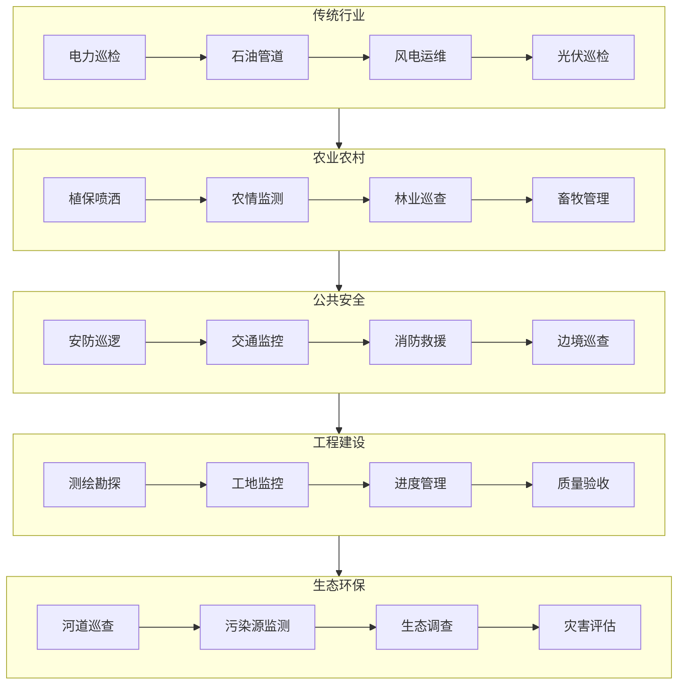

# 06-Industry-Solutions：行业解决方案

> 🏢 电力、农业、安防、测绘 —— 无人机行业应用实战指南

---

## 📌 模块定位

本模块面向**行业应用集成商、解决方案工程师、项目交付人员**，提供开箱即用的无人机行业解决方案。

---

## 🎯 目标读者

- 系统集成商（方案设计与交付）
- 行业应用工程师（电力/农业/安防/测绘）
- 项目管理人员（成本与进度管控）
- 企业用户（采购决策参考）

---

## 📚 内容导航

| 文档 | 预计耗时 | 核心内容 |
|------|---------|---------|
| [01-电力巡检方案](./01-电力巡检方案.md) | 40 分钟 | 航线规划、缺陷识别、报告生成 |
| [02-农业植保方案](./02-农业植保方案.md) | 30 分钟 | 变量喷洒、多光谱分析、处方图生成 |
| [03-安防监控方案](./03-安防监控方案.md) | 35 分钟 | 实时图传、AI 预警、应急指挥 |
| [04-测绘勘探方案](./04-测绘勘探方案.md) | 40 分钟 | 正射影像、三维建模、成果交付 |
| [05-无人机巡检行业调研报告](./05-无人机巡检行业调研报告.md) | 30 分钟 | 市场规模、竞争格局、应用场景、技术趋势 |
| [06-机场自动化巡检管控系统调研](./06-机场自动化巡检管控系统调研.md) | 35 分钟 | 机场+管控平台一体化方案、市场玩家、招投标 |

---

## 🏢 行业应用图谱

---

## 📋 方案要素

每个行业方案包含：

- ✅ 场景需求分析
- ✅ 硬件配置清单
- ✅ 软件系统架构
- ✅ 作业流程规范
- ✅ 交付成果标准
- ✅ 成本估算参考
- ✅ 常见问题解答

---

## 🔗 相关模块

| 关联内容 | 推荐模块 |
|---------|---------|
| 政策法规 | [01-Policy-Standard](../01-Policy-Standard/) |
| 项目交付标准 | [08-Project-Analysis/项目交付标准](../08-Project-Analysis/01-项目交付标准.md) |
| 成本估算 | [08-Project-Analysis/成本估算表](../08-Project-Analysis/03-成本估算表.md) |
| 避坑指南 | [08-Project-Analysis/避坑指南](../08-Project-Analysis/02-避坑指南.md) |

---

## 📅 更新记录

| 日期 | 更新内容 |
|------|---------|
| 2026-06-03 | 新增 05-无人机巡检行业调研报告、06-机场自动化巡检管控系统调研 |
| 2026-04-07 | 新增 04-测绘勘探方案文档 |
| 2026-04-05 | 模块初始化完成 |
| 每日 02:30 | 自动追踪行业动态与案例更新 |

---

**开始学习 →** [电力巡检方案](./01-电力巡检方案.md)

