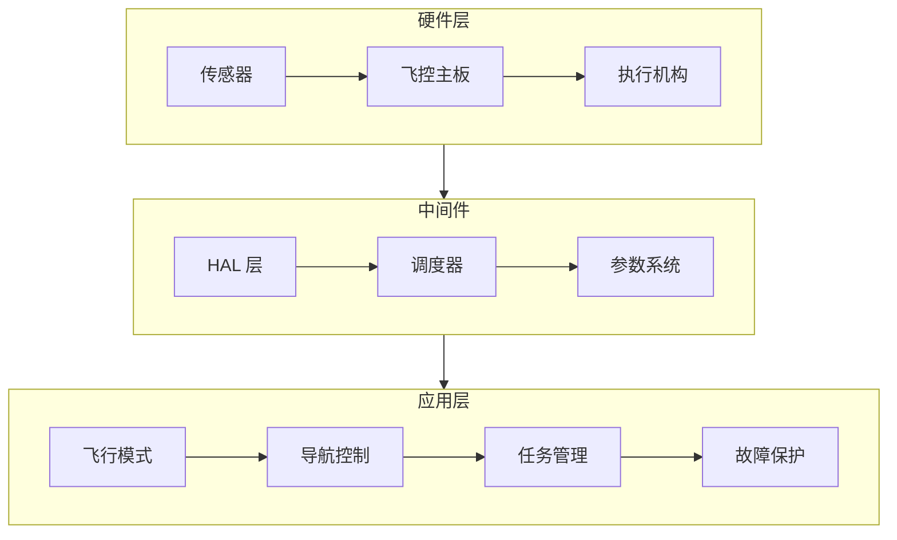
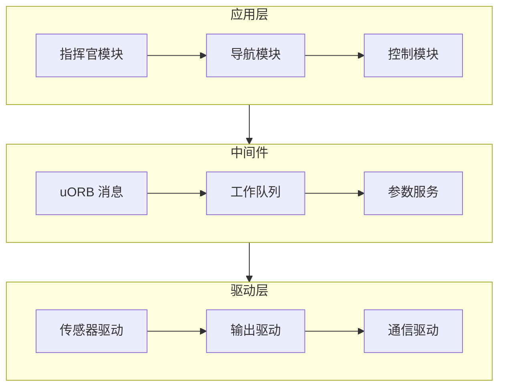

# 开源飞控对比

> ArduPilot vs PX4 —— 选择最适合的开源飞控平台

---

## 一、开源飞控概述

### 1.1 什么是开源飞控

**开源飞控**是指硬件设计、软件代码完全开源的飞行控制系统，用户可以自由修改、二次开发。

**核心优势：**
- ✅ 代码透明，可深度定制
- ✅ 社区活跃，持续更新
- ✅ 成本低，无需授权费
- ✅ 生态丰富，配件多样

### 1.2 主流开源飞控

| 飞控 | 开发语言 | 特点 | 适用场景 |
|------|---------|------|---------|
| **ArduPilot** | C++ | 功能最全、支持机型多 | 多旋翼/固定翼/直升机/车船 |
| **PX4** | C++ | 模块化、工业级 | 多旋翼/固定翼/垂直起降 |
| **iNav** | C | 专注固定翼 | 固定翼/飞翼 |
| **Betaflight** | C | 专注穿越机 | FPV 穿越机 |

---

## 二、ArduPilot 详解

### 2.1 系统架构



### 2.2 支持机型

**多旋翼：**
- Quad（四旋翼）
- Hexa（六旋翼）
- Octo（八旋翼）
- Y6（共轴六旋翼）

**固定翼：**
- 常规布局
- 飞翼布局
- V 尾/双尾撑

**垂直起降：**
- QuadPlane（四旋翼 + 固定翼）
- Tiltrotor（倾转旋翼）
- Tail sitter（尾座式）

**其他：**
- 直升机
- 无人车
- 无人船

### 2.3 飞行模式

| 模式 | 说明 | 适用场景 |
|------|------|---------|
| Stabilize | 自稳模式 | 手动飞行 |
| Loiter | 定点模式 | 悬停、精细操作 |
| Auto | 自动模式 | 航线飞行 |
| RTL | 返航模式 | 失控返航 |
| Land | 降落模式 | 自动降落 |
| AltHold | 定高模式 | 高度锁定 |

### 2.4 地面站软件

**Mission Planner：**
- 平台：Windows
- 功能：参数配置、航线规划、日志分析
- 下载：https://firmware.ardupilot.org/Tools/MissionPlanner/

**QGroundControl：**
- 平台：全平台（Win/Mac/Linux/Android/iOS）
- 功能：通用地面站
- 下载：https://qgroundcontrol.com/

### 2.5 二次开发

**添加新功能：**
```cpp
// ArduCopter 示例：添加自定义命令

// 1. 在 libraries/AC_Avoidance/AC_Avoid.h 中添加
void avoid_custom_zone(const Location& zone);

// 2. 在 AC_Avoid.cpp 中实现
void AC_Avoid::avoid_custom_zone(const Location& zone) {
    // 实现避障逻辑
}

// 3. 在主循环中调用
void Copter::avoidance_run() {
    avoidance.avoid_custom_zone(current_location);
}
```

**编译固件：**
```bash
# 克隆源码
git clone https://github.com/ArduPilot/ardupilot.git
cd ardupilot

# 初始化子模块
git submodule update --init --recursive

# 编译 Copter 固件
./waf configure --board Pixhawk
./waf copter

# 输出位置：build/Pixhawk/bin/arducopter.apj
```

---

## 三、PX4 详解

### 3.1 系统架构



### 3.2 核心特性

**模块化设计：**
- 每个功能独立模块
- 模块间通过 uORB 消息通信
- 易于扩展和维护

**多机支持：**
- 支持多旋翼、固定翼、垂直起降
- 支持无人车、无人船
- 支持倾转旋翼等特殊布局

**安全机制：**
- 地理围栏
- 返航保护
- 低电量保护
- 失控保护

### 3.3 开发环境

**环境搭建：**
```bash
# Ubuntu 20.04
# 安装依赖
sudo apt-get install git python3-argcomplete python3-jinja2 \
    python3-numpy python3-pip python3-pytest \
    python3-yaml python3-dev python3-setuptools \
    libeigen3-dev libgeographic-dev

# 克隆源码
git clone https://github.com/PX4/PX4-Autopilot.git
cd PX4-Autopilot
git submodule update --init --recursive

# 编译
make px4_fmu-v5_default
```

### 3.4 添加自定义模块

**创建模块：**
```bash
# 创建模块目录
mkdir -p src/examples/my_module

# 创建 CMakeLists.txt
cat > src/examples/my_module/CMakeLists.txt << EOF
px4_add_module(
    MODULE my_module
    MAIN my_module
    COMPILE_FLAGS
    SRCS
        my_module.cpp
    DEPENDS
)
EOF
```

**模块代码：**
```cpp
// my_module.cpp
#include <px4_platform_common/px4_config.h>
#include <px4_platform_common/tasks.h>
#include <px4_platform_common/posix.h>
#include <uORB/Subscription.hpp>
#include <uORB/topics/vehicle_local_position.h>

extern "C" __EXPORT int my_module_main(int argc, char *argv[]) {
    uORB::Subscription<vehicle_local_position_s> local_pos_sub{ORB_ID(vehicle_local_position)};
    
    while (true) {
        vehicle_local_position_s pos;
        
        if (local_pos_sub.update(pos)) {
            PX4_INFO("Position: x=%.2f, y=%.2f, z=%.2f", 
                    (double)pos.x, (double)pos.y, (double)pos.z);
        }
        
        px4_usleep(100000); // 100ms
    }
    
    return 0;
}
```

---

## 四、ArduPilot vs PX4 对比

### 4.1 功能对比

| 特性 | ArduPilot | PX4 |
|------|-----------|-----|
| 支持机型 | ⭐⭐⭐⭐⭐ | ⭐⭐⭐⭐ |
| 飞行模式 | ⭐⭐⭐⭐⭐ | ⭐⭐⭐⭐ |
| 代码质量 | ⭐⭐⭐⭐ | ⭐⭐⭐⭐⭐ |
| 文档完善度 | ⭐⭐⭐⭐ | ⭐⭐⭐⭐⭐ |
| 社区活跃度 | ⭐⭐⭐⭐⭐ | ⭐⭐⭐⭐⭐ |
| 工业应用 | ⭐⭐⭐⭐ | ⭐⭐⭐⭐⭐ |

### 4.2 开发体验

| 方面 | ArduPilot | PX4 |
|------|-----------|-----|
| 编译速度 | 较慢 | 较快 |
| 代码风格 | 传统 C++ | 现代 C++ |
| 调试工具 | Mission Planner | QGroundControl |
| 仿真支持 | SITL/HITL | Gazebo/jMAVSim |
| 学习曲线 | 较陡 | 中等 |

### 4.3 选型建议

**选择 ArduPilot：**
- ✅ 需要支持特殊机型（直升机、车、船）
- ✅ 需要最全面的飞行模式
- ✅ 有 ArduPilot 使用经验
- ✅ 需要成熟的避障功能

**选择 PX4：**
- ✅ 工业级应用
- ✅ 需要模块化架构
- ✅ 团队有 C++ 开发经验
- ✅ 需要 ROS2 深度集成

---

## 五、硬件选型

### 5.1 推荐飞控

**入门级：**
| 飞控 | 价格 | 特点 |
|------|------|------|
| Pixhawk 4 Mini | ~500 元 | 小巧、性价比高 |
| Holybro Kakute H7 | ~400 元 | 集成电调、适合穿越机 |

**进阶级：**
| 飞控 | 价格 | 特点 |
|------|------|------|
| Pixhawk 4 | ~1000 元 | 经典、稳定 |
| CUAV Pixhawk V6X | ~1500 元 | 双 IMU、工业级 |

**专业级：**
| 飞控 | 价格 | 特点 |
|------|------|------|
| Pixhawk 6X | ~2000 元 | 六重冗余 |
| Holybro Durandal | ~1800 元 | 高性能、多接口 |

### 5.2 传感器选型

| 传感器 | 推荐型号 | 价格 |
|--------|---------|------|
| GPS | Here3、M10 | 300-800 元 |
| 空速管 | Digital Airspeed | 200-400 元 |
| 光流 | PMW3901 | 100-200 元 |
| 激光雷达 | TF-Luna、LiDARLite | 200-500 元 |

---

## 六、调试技巧

### 6.1 参数调优

**PID 调优流程：**
```
1. 恢复默认参数
2. 调整 P（比例）：增加直到轻微振荡
3. 调整 I（积分）：消除稳态误差
4. 调整 D（微分）：抑制振荡
5. 试飞验证
6. 微调优化
```

**常用参数：**
| 参数 | 说明 | 默认值 |
|------|------|-------|
| ATC_ACCEL_P | 自旋 P 轴加速度 | 110000 |
| ATC_ACCEL_R | 自旋 R 轴加速度 | 110000 |
| ATC_ACCEL_Y | 自旋 Y 轴加速度 | 27000 |
| RTL_ALT | 返航高度 | 1500cm |
| FS_THR_ENABLE | 油门失控保护 | 1（启用） |

### 6.2 日志分析

**下载日志：**
```bash
# 使用 MAVProxy
mavproxy.py --master=/dev/ttyUSB0
log download
```

**在线分析：**
- ArduPilot：https://plot.ardupilot.org
- PX4：https://review.px4.io

### 6.3 常见问题

**问题 1：无法解锁**
- 检查 GPS 锁定（需要 3D 定位）
- 检查遥控器校准
- 检查安全开关

**问题 2：飞行漂移**
- 校准加速度计
- 校准指南针
- 检查 GPS 位置

**问题 3：振动过大**
- 检查螺旋桨平衡
- 检查电机轴承
- 增加减震措施

---

## 七、生态资源

### 7.1 官方资源

| 资源 | ArduPilot | PX4 |
|------|-----------|-----|
| 官网 | https://ardupilot.org | https://px4.io |
| 文档 | https://ardupilot.org/dev | https://docs.px4.io |
| GitHub | https://github.com/ArduPilot | https://github.com/PX4 |
| 论坛 | https://discuss.ardupilot.org | https://forum.px4.io |

### 7.2 学习资源

**视频教程：**
- ArduPilot 官方 YouTube 频道
- PX4 开发者教程
- B 站：开源飞控开发系列

**书籍推荐：**
- 《ArduPilot 开发实战》
- 《PX4 无人机开发指南》

---

<div align="center">

**继续学习 →** [02-地面站软件](./02-地面站软件.md)

**最后更新**: 2026-04-05

</div>
