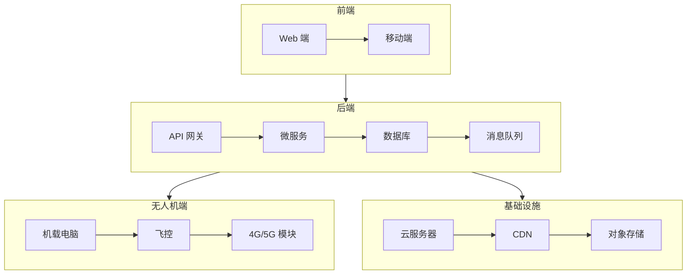
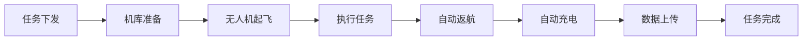

# 云端平台

> 无人机云系统、机库调度 —— 打造无人机运营管理平台

---

## 一、平台概述

### 1.1 核心功能

**设备管理：**
- 无人机档案管理
- 电池管理
- 载荷管理
- 维修记录

**飞行管理：**
- 飞行计划审批
- 实时监控
- 飞行记录
- 违规告警

**任务管理：**
- 任务下发
- 航线规划
- 自动执行
- 成果管理

**数据管理：**
- 影像数据
- 视频数据
- 飞行日志
- 数据分析

### 1.2 主流平台

| 平台 | 厂商 | 特点 | 价格 |
|------|------|------|------|
| DJI FlightHub 2 | 大疆 | 生态完善、易用 | 按设备收费 |
| UGCS Enterprise | SPH Engineering | 支持多品牌、功能强 | 年费制 |
| DroneDeploy | DroneDeploy | 云端处理、SaaS | 订阅制 |
| 自研平台 | - | 定制化、可控 | 开发成本高 |

---

## 二、系统架构

### 2.1 技术架构



### 2.2 通信协议

**无人机↔云端：**
- MQTT：遥测数据上报
- HTTP/HTTPS：文件上传、API 调用
- WebSocket：实时控制
- RTMP/SRT：视频流

**数据格式：**
```json
{
  "device_id": "drone_001",
  "timestamp": 1712307600,
  "position": {
    "lat": 30.1234,
    "lon": 120.5678,
    "alt": 100.0
  },
  "attitude": {
    "roll": 0.1,
    "pitch": 0.2,
    "yaw": 90.0
  },
  "battery": 85,
  "status": "flying"
}
```

---

## 三、自研平台开发

### 3.1 后端开发

**技术栈：**
- 语言：Java/Go/Python
- 框架：Spring Boot/Gin/Django
- 数据库：PostgreSQL/MySQL
- 缓存：Redis
- 消息队列：Kafka/RabbitMQ

**用户服务：**
```java
@RestController
@RequestMapping("/api/users")
public class UserController {
    
    @Autowired
    private UserService userService;
    
    @PostMapping("/login")
    public ResponseEntity<LoginResponse> login(@RequestBody LoginRequest request) {
        LoginResponse response = userService.login(request);
        return ResponseEntity.ok(response);
    }
    
    @GetMapping("/profile")
    public ResponseEntity<UserProfile> getProfile() {
        UserProfile profile = userService.getCurrentProfile();
        return ResponseEntity.ok(profile);
    }
}
```

**设备服务：**
```java
@Service
public class DeviceService {
    
    public void registerDevice(Device device) {
        // 设备注册
        deviceRepository.save(device);
    }
    
    public DeviceStatus getStatus(String deviceId) {
        // 获取设备状态
        return deviceRepository.findById(deviceId).getStatus();
    }
    
    @KafkaListener(topics = "telemetry")
    public void handleTelemetry(TelemetryData data) {
        // 处理遥测数据
        telemetryRepository.save(data);
        
        // 实时推送
        websocketTemplate.convertAndSend(
            "/topic/telemetry/" + data.getDeviceId(),
            data
        );
    }
}
```

### 3.2 前端开发

**技术栈：**
- 框架：Vue 3/React
- 地图：Cesium/Leaflet
- UI：Element Plus/Ant Design
- 状态管理：Pinia/Redux

**地图组件：**
```vue
<template>
  <div class="map-container">
    <div ref="cesiumContainer" class="cesium-container"></div>
    
    <div class="overlay">
      <device-list :devices="devices" />
      <flight-info :info="currentFlight" />
    </div>
  </div>
</template>

<script setup>
import { ref, onMounted } from 'vue';
import * as Cesium from 'cesium';

const cesiumContainer = ref(null);
const devices = ref([]);

onMounted(() => {
  const viewer = new Cesium.Viewer(cesiumContainer.value, {
    terrainProvider: Cesium.createWorldTerrain()
  });
  
  // 订阅无人机位置
  subscribeTelemetry((data) => {
    updateDronePosition(viewer, data);
  });
});
</script>
```

### 3.3 数据库设计

**设备表：**
```sql
CREATE TABLE devices (
    id VARCHAR(64) PRIMARY KEY,
    name VARCHAR(128) NOT NULL,
    model VARCHAR(64),
    serial_number VARCHAR(64) UNIQUE,
    owner_id VARCHAR(64),
    status VARCHAR(32),
    created_at TIMESTAMP DEFAULT CURRENT_TIMESTAMP,
    updated_at TIMESTAMP DEFAULT CURRENT_TIMESTAMP
);
```

**飞行记录表：**
```sql
CREATE TABLE flight_records (
    id BIGSERIAL PRIMARY KEY,
    device_id VARCHAR(64),
    user_id VARCHAR(64),
    start_time TIMESTAMP,
    end_time TIMESTAMP,
    start_location GEOGRAPHY(POINT),
    end_location GEOGRAPHY(POINT),
    max_altitude FLOAT,
    max_distance FLOAT,
    flight_path GEOGRAPHY(LINESTRING),
    status VARCHAR(32),
    created_at TIMESTAMP DEFAULT CURRENT_TIMESTAMP
);
```

**遥测数据表（时序数据库）：**
```sql
-- 使用 TimescaleDB
CREATE TABLE telemetry (
    time TIMESTAMPTZ NOT NULL,
    device_id VARCHAR(64),
    latitude DOUBLE PRECISION,
    longitude DOUBLE PRECISION,
    altitude DOUBLE PRECISION,
    battery INTEGER,
    speed FLOAT,
    heading FLOAT
);

SELECT create_hypertable('telemetry', 'time');
```

---

## 四、机库调度

### 4.1 系统组成

**硬件系统：**
- 无人机机库（防水、恒温）
- 自动充电系统
- 气象站
- 网络通信

**软件系统：**
- 机库控制
- 任务调度
- 健康管理
- 远程监控

### 4.2 工作流程



### 4.3 控制接口

**机库 API：**
```python
class HangarController:
    def __init__(self, hangar_id):
        self.hangar_id = hangar_id
        self.base_url = f'http://hangar-{hangar_id}/api'
    
    def prepare_flight(self, drone_id):
        """准备飞行"""
        response = requests.post(f'{self.base_url}/prepare', json={
            'drone_id': drone_id
        })
        return response.json()
    
    def start_charging(self, drone_id):
        """开始充电"""
        response = requests.post(f'{self.base_url}/charge', json={
            'drone_id': drone_id
        })
        return response.json()
    
    def get_status(self):
        """获取机库状态"""
        response = requests.get(f'{self.base_url}/status')
        return response.json()
```

---

## 五、部署方案

### 5.1 云端部署

**阿里云部署：**
```yaml
# docker-compose.yml
version: '3'
services:
  api:
    image: drone-platform/api:latest
    ports:
      - "8080:8080"
    environment:
      - DATABASE_URL=postgresql://user:pass@db:5432/drone
      - REDIS_URL=redis://redis:6379
    depends_on:
      - db
      - redis
  
  db:
    image: postgres:14
    volumes:
      - postgres_data:/var/lib/postgresql/data
  
  redis:
    image: redis:7-alpine
  
  nginx:
    image: nginx:alpine
    ports:
      - "80:80"
      - "443:443"
    volumes:
      - ./nginx.conf:/etc/nginx/nginx.conf
      - ./ssl:/etc/nginx/ssl
```

### 5.2 私有化部署

**硬件要求：**
| 组件 | 配置 | 数量 |
|------|------|------|
| 应用服务器 | 8 核 16G | 2 台 |
| 数据库服务器 | 16 核 32G | 2 台 |
| 存储服务器 | 8 核 32G + 10TB | 2 台 |
| 负载均衡 | 4 核 8G | 2 台 |

**网络要求：**
- 带宽：≥100Mbps
- 延迟：<50ms
- 可用性：99.9%

---

## 六、安全加固

### 6.1 认证授权

**JWT 认证：**
```java
@Component
public class JwtTokenProvider {
    
    @Value("${jwt.secret}")
    private String secretKey;
    
    public String generateToken(Authentication auth) {
        Claims claims = Jwts.claims()
            .setSubject(auth.getName())
            .setIssuedAt(new Date())
            .setExpiration(new Date(System.currentTimeMillis() + 3600000));
        
        return Jwts.builder()
            .setClaims(claims)
            .signWith(SignatureAlgorithm.HS256, secretKey)
            .compact();
    }
    
    public boolean validateToken(String token) {
        try {
            Jwts.parser().setSigningKey(secretKey).parseClaimsJws(token);
            return true;
        } catch (Exception e) {
            return false;
        }
    }
}
```

### 6.2 数据加密

**敏感数据加密：**
```java
@Component
public class EncryptionService {
    
    @Value("${encryption.key}")
    private String encryptionKey;
    
    public String encrypt(String data) throws Exception {
        Cipher cipher = Cipher.getInstance("AES/GCM/NoPadding");
        SecretKeySpec keySpec = new SecretKeySpec(
            encryptionKey.getBytes(), "AES"
        );
        cipher.init(Cipher.ENCRYPT_MODE, keySpec);
        
        byte[] encrypted = cipher.doFinal(data.getBytes());
        return Base64.getEncoder().encodeToString(encrypted);
    }
    
    public String decrypt(String encrypted) throws Exception {
        Cipher cipher = Cipher.getInstance("AES/GCM/NoPadding");
        SecretKeySpec keySpec = new SecretKeySpec(
            encryptionKey.getBytes(), "AES"
        );
        cipher.init(Cipher.DECRYPT_MODE, keySpec);
        
        byte[] decrypted = cipher.doFinal(
            Base64.getDecoder().decode(encrypted)
        );
        return new String(decrypted);
    }
}
```

---

## 七、常见问题

### Q1：如何保证实时性？

**答：**
- 使用 WebSocket 推送
- 消息队列异步处理
- CDN 加速静态资源
- 数据库读写分离

### Q2：如何保证数据安全？

**答：**
- HTTPS 加密传输
- 数据加密存储
- 访问控制（RBAC）
- 定期安全审计

### Q3：如何扩展？

**答：**
- 微服务架构
- 容器化部署
- 自动扩缩容
- 分布式数据库

### Q4：如何对接第三方？

**答：**
- 提供 OpenAPI
- Webhook 回调
- SDK 开发包
- 标准数据格式

---

<div align="center">

**继续学习 →** [04-开发工具链](./04-开发工具链.md)

**最后更新**: 2026-04-05

</div>
