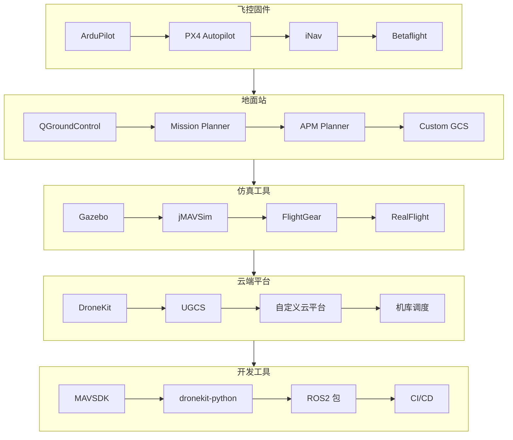

# 07-OpenSource-Awesome：开源生态与工具链

> 🛠️ ArduPilot、PX4、QGC、云端平台 —— 无人机开源生态全景

---

## 📌 模块定位

本模块面向**开发者、技术选型人员、快速原型搭建者**，整理无人机领域优质开源项目与开发工具。

---

## 🎯 目标读者

- 飞控二次开发工程师
- 地面站定制人员
- 云端平台搭建人员
- 快速原型验证团队

---

## 📚 内容导航

| 文档 | 预计耗时 | 核心内容 |
|------|---------|---------|
| [01-开源飞控](./01-开源飞控.md) | 30 分钟 | ArduPilot、PX4 对比与选型 |
| [02-地面站软件](./02-地面站软件.md) | 20 分钟 | QGroundControl、Mission Planner 定制 |
| [03-云端平台](./03-云端平台.md) | 35 分钟 | 无人机云系统、机库调度平台 |
| [04-开发工具链](./04-开发工具链.md) | 25 分钟 | 仿真、调试、CI/CD 工具 |

---

## 🛠️ 开源生态图谱

---

## 📦 推荐技术栈

### 快速原型（1-2 周）

| 组件 | 推荐方案 |
|------|---------|
| 飞控 | Pixhawk + ArduPilot |
| 地面站 | QGroundControl（官方编译版） |
| 开发 | MAVSDK-Python |
| 仿真 | Gazebo + PX4 SITL |

### 生产级部署（1-3 月）

| 组件 | 推荐方案 |
|------|---------|
| 飞控 | 定制硬件 + PX4（二次开发） |
| 地面站 | 定制开发（Electron + MAVSDK） |
| 云端 | 自研平台（Spring Boot + Vue） |
| 运维 | Kubernetes + Docker |

---

## 🔗 相关模块

| 关联内容 | 推荐模块 |
|---------|---------|
| 通讯协议 | [03-Protocols-Dev](../03-Protocols-Dev/) |
| 硬件选型 | [02-Hardware-Systems](../02-Hardware-Systems/) |

---

## 📅 更新记录

| 日期 | 更新内容 |
|------|---------|
| 2026-04-05 | 模块初始化完成 |
| 每日 02:30 | 自动追踪开源项目更新 |

---

**开始学习 →** [开源飞控](./01-开源飞控.md)

