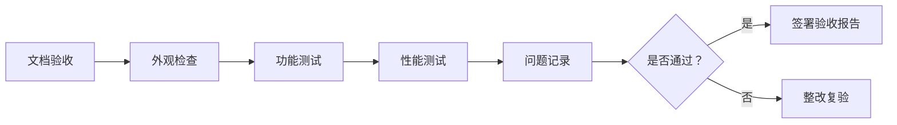

# 项目交付标准

> 验收文档模板、交付清单、质量标准 —— 确保项目顺利验收

---

## 一、交付文档体系

### 1.1 文档清单

| 文档 | 用途 | 提交阶段 |
|------|------|---------|
| 需求规格说明书 | 明确需求边界 | 项目启动 |
| 系统设计方案 | 技术方案说明 | 设计阶段 |
| 硬件配置清单 | 设备明细 | 采购阶段 |
| 软件部署手册 | 安装部署指南 | 部署阶段 |
| 操作维护手册 | 使用培训 | 交付阶段 |
| 验收测试报告 | 验收依据 | 验收阶段 |
| 培训材料 | 用户培训 | 交付阶段 |

### 1.2 文档模板

**需求规格说明书模板：**
```markdown
# 无人机系统需求规格说明书

## 1. 项目概述
1.1 项目背景
1.2 项目目标
1.3 适用范围

## 2. 功能需求
2.1 飞行功能
2.2 载荷功能
2.3 地面站功能
2.4 数据处理功能

## 3. 性能需求
3.1 飞行性能（续航、载重、抗风）
3.2 图传性能（距离、延迟、画质）
3.3 定位精度（RTK、PPK）

## 4. 环境要求
4.1 工作温度
4.2 防护等级
4.3 电磁兼容

## 5. 验收标准
5.1 功能验收
5.2 性能验收
5.3 文档验收
```

---

## 二、硬件交付标准

### 2.1 无人机系统

**交付清单：**
| 设备 | 数量 | 序列号 | 备注 |
|------|------|-------|------|
| 无人机主机 | 1 | SN:XXXXX | 含螺旋桨×4 |
| 遥控器 | 1 | SN:XXXXX | 含背夹 |
| 智能电池 | 6 | SN:XXXXX | 满电存放 |
| 充电器 | 1 | SN:XXXXX | 100W |
| 运输箱 | 1 | - | 定制 |

**验收标准：**
- ✅ 外观无损伤
- ✅ 功能正常（起飞、降落、悬停）
- ✅ 图传清晰
- ✅ GPS 定位准确
- ✅ 电池健康度>95%

### 2.2 任务载荷

**可见光相机：**
| 指标 | 要求 | 实测 |
|------|------|------|
| 分辨率 | ≥2000 万像素 | 2000 万 |
| 变焦 | ≥20 倍 | 28 倍 |
| 云台 | 三轴机械增稳 | 三轴 |
| 存储 | 支持 256GB | 支持 |

**红外相机：**
| 指标 | 要求 | 实测 |
|------|------|------|
| 分辨率 | ≥640×512 | 640×512 |
| 热灵敏度 | <50mK | 40mK |
| 测温范围 | -20℃~150℃ | -20℃~150℃ |
| 测温精度 | ±2℃ | ±1.5℃ |

---

## 三、软件交付标准

### 3.1 地面站软件

**交付内容：**
- 安装包（Windows/Mac/Android/iOS）
- 安装手册
- 用户手册
- 源代码（如合同约定）

**验收标准：**
- ✅ 安装顺利
- ✅ 连接稳定
- ✅ 功能完整（航线规划、实时监控、数据回放）
- ✅ 界面无明显 Bug
- ✅ 响应时间<2 秒

### 3.2 数据处理软件

**交付内容：**
- 软件安装包
- 授权文件
- 使用手册
- 示例数据

**验收标准：**
- ✅ 正射影像生成
- ✅ 三维建模
- ✅ 精度达标
- ✅ 导出格式支持

---

## 四、培训交付标准

### 4.1 培训内容

**理论培训（8 课时）：**
| 课程 | 课时 | 内容 |
|------|------|------|
| 无人机基础 | 2 | 原理、分类、法规 |
| 飞行操作 | 2 | 起飞、降落、航线 |
| 任务规划 | 2 | 地面站使用 |
| 维护保养 | 2 | 日常检查、故障排查 |

**实操培训（16 课时）：**
| 课程 | 课时 | 内容 |
|------|------|------|
| 模拟飞行 | 4 | 模拟器练习 |
| 实飞训练 | 8 | 真机操作 |
| 任务演练 | 4 | 实际作业 |

### 4.2 培训考核

**理论考试：**
- 满分 100 分，80 分及格
- 题型：选择、判断、简答

**实操考核：**
- 起飞降落（30 分）
- 航线飞行（40 分）
- 应急处置（30 分）
- 总分 80 分及格

### 4.3 培训材料

**交付清单：**
- 培训 PPT
- 操作视频
- 练习题库
- 培训证书模板

---

## 五、验收流程

### 5.1 验收准备

**甲方准备：**
- [ ] 验收人员确定
- [ ] 验收场地准备
- [ ] 验收设备准备
- [ ] 验收表格打印

**乙方准备：**
- [ ] 交付文档准备
- [ ] 设备调试完成
- [ ] 验收演示准备
- [ ] 问题预案准备

### 5.2 验收步骤



### 5.3 验收报告

**验收报告模板：**
```markdown
# 无人机系统验收报告

## 一、项目信息
- 项目名称：XXX 无人机系统采购
- 甲方：XXX 公司
- 乙方：XXX 公司
- 验收日期：2026-04-05

## 二、验收内容
2.1 文档验收：□通过 □不通过
2.2 外观检查：□通过 □不通过
2.3 功能测试：□通过 □不通过
2.4 性能测试：□通过 □不通过

## 三、问题记录
（如有问题，详细记录）

## 四、验收结论
□ 通过验收
□ 整改后复验
□ 不通过

## 五、签字确认
甲方代表：________ 日期：________
乙方代表：________ 日期：________
```

---

## 六、质量保证

### 6.1 质保期

| 项目 | 质保期 | 说明 |
|------|-------|------|
| 无人机主机 | 1 年 | 非人为损坏免费维修 |
| 电池 | 6 个月 | 容量衰减>30% 更换 |
| 螺旋桨 | 不保修 | 易耗品 |
| 软件 | 1 年 | Bug 修复、版本升级 |

### 6.2 售后服务

**响应时间：**
- 电话支持：即时响应
- 远程支持：2 小时内
- 现场支持：24-48 小时（省内）

**服务内容：**
- 技术咨询
- 故障排查
- 设备维修
- 软件升级
- 定期巡检

### 6.3 备件支持

**推荐备件清单：**
| 备件 | 数量 | 价格 |
|------|------|------|
| 螺旋桨 | 4 对 | 200 元 |
| 电池 | 2 块 | 6000 元 |
| 起落架 | 1 套 | 500 元 |
| 云台 | 1 套 | 3000 元 |

**备件供应承诺：**
- 停产产品提前 6 个月通知
- 停产后继续供应 3 年备件
- 提供替代方案

---

## 七、风险管理

### 7.1 常见风险

| 风险 | 概率 | 影响 | 应对措施 |
|------|------|------|---------|
| 交付延期 | 中 | 高 | 提前沟通、分阶段交付 |
| 质量不达标 | 低 | 高 | 严格质检、预留整改时间 |
| 培训效果差 | 中 | 中 | 增加实操、补考机制 |
| 售后响应慢 | 低 | 中 | 建立 SLA、专人对接 |

### 7.2 变更管理

**变更流程：**


**变更文档：**
- 变更申请单
- 变更评估报告
- 变更通知单
- 变更验证报告

---

## 八、案例分析

### 案例 1：电力巡检项目交付

**项目概况：**
- 客户：某省电力公司
- 设备：DJI M350 RTK×2 套
- 软件：巡检管理系统
- 培训：20 人

**交付周期：** 30 天
- 设备采购：7 天
- 软件部署：7 天
- 培训考核：5 天
- 验收整改：11 天

**验收结果：** 一次性通过

**经验总结：**
- 提前准备验收文档
- 充分演练验收流程
- 预留整改时间

### 案例 2：安防监控项目交付

**项目概况：**
- 客户：某市公安局
- 设备：无人机 + 机库×5 套
- 软件：指挥平台
- 培训：50 人

**交付周期：** 90 天

**遇到的问题：**
- 空域审批延迟
- 网络环境复杂
- 培训人员水平参差不齐

**解决方案：**
- 协助办理空域手续
- 现场网络测试优化
- 分层次培训（基础班/进阶班）

**验收结果：** 整改后通过

**经验总结：**
- 提前了解客户环境
- 制定详细培训计划
- 建立长期服务机制

---

<div align="center">

**继续学习 →** [02-避坑指南](./02-避坑指南.md)

**最后更新**: 2026-04-05

</div>
