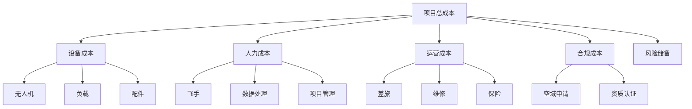

# 成本估算表

> 硬件/软件/人力/合规 —— 无人机项目成本详解

---

## 一、成本构成

### 1.1 成本分类



### 1.2 成本占比

| 类别 | 占比 | 说明 |
|------|------|------|
| 设备成本 | 30-40% | 一次性投入，可复用 |
| 人力成本 | 30-40% | 按天计算 |
| 运营成本 | 10-15% | 差旅、维修等 |
| 合规成本 | 5-10% | 空域、资质 |
| 风险储备 | 5-10% | 应对意外 |
| 利润 | 20-30% | 合理利润空间 |

---

## 二、设备成本

### 2.1 无人机系统

**航拍方案：**
| 项目 | 型号 | 数量 | 单价 | 总价 |
|------|------|------|------|------|
| 无人机 | DJI Mavic 3 | 2 | 1.5 万 | 3 万 |
| 备用电池 | - | 6 | 0.1 万 | 0.6 万 |
| 充电器 | - | 2 | 0.05 万 | 0.1 万 |
| 运输箱 | - | 2 | 0.05 万 | 0.1 万 |
| **合计** | - | - | - | **3.8 万** |

**巡检方案：**
| 项目 | 型号 | 数量 | 单价 | 总价 |
|------|------|------|------|------|
| 无人机 | DJI M350 RTK | 2 | 28 万 | 56 万 |
| 负载 | H20T | 2 | 8 万 | 16 万 |
| 备用电池 | - | 6 | 0.3 万 | 1.8 万 |
| 充电器 | - | 2 | 0.2 万 | 0.4 万 |
| 基站 | D-RTK 2 | 1 | 2 万 | 2 万 |
| **合计** | - | - | - | **76.2 万** |

**植保方案：**
| 项目 | 型号 | 数量 | 单价 | 总价 |
|------|------|------|------|------|
| 植保机 | DJI T40 | 2 | 8 万 | 16 万 |
| 多光谱机 | DJI M3M | 1 | 5 万 | 5 万 |
| 备用电池 | - | 10 | 0.5 万 | 5 万 |
| 充电器 | - | 2 | 0.3 万 | 0.6 万 |
| RTK 基站 | - | 1 | 2 万 | 2 万 |
| 车辆 | 皮卡 | 1 | 5 万 | 5 万 |
| **合计** | - | - | - | **33.6 万** |

### 2.2 折旧计算

**直线折旧法：**
```
年折旧额 = (原值 - 残值) / 使用年限

残值率：5%
使用年限：5 年

例：76.2 万设备
年折旧 = 76.2 × (1 - 5%) / 5 = 14.5 万/年
月折旧 = 14.5 / 12 = 1.2 万/月
```

---

## 三、人力成本

### 3.1 人员配置

**小型项目（<10 万）：**
| 角色 | 人数 | 天数 | 单价 | 总价 |
|------|------|------|------|------|
| 飞手 | 2 | 5 | 2000 | 2 万 |
| 数据处理 | 1 | 3 | 1500 | 0.45 万 |
| 项目经理 | 0.5 | 5 | 3000 | 0.75 万 |
| **合计** | - | - | - | **3.2 万** |

**中型项目（10-50 万）：**
| 角色 | 人数 | 天数 | 单价 | 总价 |
|------|------|------|------|------|
| 飞手 | 2 | 10 | 2000 | 4 万 |
| 数据处理 | 2 | 5 | 1500 | 1.5 万 |
| 项目经理 | 1 | 10 | 3000 | 3 万 |
| 技术支持 | 1 | 3 | 2500 | 0.75 万 |
| **合计** | - | - | - | **9.25 万** |

**大型项目（>50 万）：**
| 角色 | 人数 | 天数 | 单价 | 总价 |
|------|------|------|------|------|
| 飞手 | 4 | 20 | 2000 | 16 万 |
| 数据处理 | 4 | 10 | 1500 | 6 万 |
| 项目经理 | 1 | 30 | 3000 | 9 万 |
| 技术支持 | 2 | 10 | 2500 | 5 万 |
| 安全专员 | 1 | 20 | 2000 | 4 万 |
| **合计** | - | - | - | **40 万** |

### 3.2 社保公积金

**额外成本：**
```
社保：工资 × 30%
公积金：工资 × 12%
总比例：约 42%

例：月工资 2 万
社保公积金 = 2 万 × 42% = 0.84 万
实际成本 = 2 万 + 0.84 万 = 2.84 万
```

---

## 四、运营成本

### 4.1 差旅费用

**标准：**
| 项目 | 标准 | 说明 |
|------|------|------|
| 交通 | 高铁二等座/飞机经济舱 | 实报实销 |
| 住宿 | 300-500 元/间夜 | 双人标间 |
| 餐饮 | 150 元/人天 | 含招待 |
| 市内交通 | 100 元/人天 | 打车/租车 |

**估算：**
```
省外项目（5 天，2 人）：
- 往返交通：2000 × 2 = 4000 元
- 住宿：400 × 2 间 × 4 晚 = 3200 元
- 餐饮：150 × 2 × 5 = 1500 元
- 市内交通：100 × 2 × 5 = 1000 元
合计：9700 元 ≈ 1 万
```

### 4.2 维修保养

**年度预算：**
| 项目 | 费用 | 说明 |
|------|------|------|
| 定期保养 | 设备价值 2% | 每年 1-2 次 |
| 易损件更换 | 设备价值 3% | 螺旋桨、电机等 |
| 意外维修 | 设备价值 5% | 炸机维修 |
| **合计** | **设备价值 10%** | - |

### 4.3 保险费用

| 险种 | 保额 | 费用/年 | 说明 |
|------|------|--------|------|
| 第三方责任险 | 100 万 | 5000 元 | 必买 |
| 机身险 | 设备价值 | 设备价值 5% | 推荐 |
| 人员意外险 | 50 万/人 | 500 元/人 | 推荐 |

---

## 五、合规成本

### 5.1 空域申请

**费用：**
| 类型 | 费用 | 时间 |
|------|------|------|
| 常规空域 | 免费 | 1-3 天 |
| 管制空域 | 5000-20000 元 | 7-15 天 |
| 临时空域 | 2000-5000 元 | 3-7 天 |

### 5.2 资质认证

| 资质 | 费用 | 有效期 | 说明 |
|------|------|-------|------|
| CAAC 执照 | 1-2 万/人 | 长期 | 飞手必备 |
| 运营合格证 | 5-10 万 | 3 年 | 商业飞行 |
| ISO 认证 | 3-5 万 | 3 年 | 企业资质的 |

---

## 六、报价模板

### 6.1 成本汇总

```markdown
# 项目成本估算表

## 一、设备成本
- 无人机系统：XX 万
- 折旧（X 天）：XX 万
- 小计：XX 万

## 二、人力成本
- 飞手：XX 万
- 数据处理：XX 万
- 项目管理：XX 万
- 社保公积金：XX 万
- 小计：XX 万

## 三、运营成本
- 差旅：XX 万
- 维修保养：XX 万
- 保险：XX 万
- 小计：XX 万

## 四、合规成本
- 空域申请：XX 万
- 资质摊销：XX 万
- 小计：XX 万

## 五、风险储备
- 不可预见费：XX 万（5-10%）

## 六、总成本
- 合计：XX 万

## 七、报价
- 成本：XX 万
- 利润（30%）：XX 万
- **报价：XX 万**
```

### 6.2 报价策略

**竞争策略：**
| 策略 | 利润率 | 适用场景 |
|------|-------|---------|
| 低价策略 | 10-15% | 开拓市场、标杆项目 |
| 常规策略 | 20-30% | 常规项目 |
| 高价策略 | 40-50% | 技术壁垒、紧急项目 |

**谈判空间：**
```
报价：100 万
底价：75 万（成本 60 万 + 最低利润 15 万）
谈判空间：25 万

首次报价留足谈判空间
```

---

## 七、案例分析

### 案例 1：电力巡检项目

**项目概况：**
- 内容：220kV 线路巡检，100 基杆塔
- 工期：10 天
- 交付：巡检报告 + 缺陷清单

**成本估算：**
```
设备成本：
- 无人机折旧：76.2 万 / 250 天 × 10 天 = 3 万
- 负载折旧：16 万 / 250 天 × 10 天 = 0.64 万

人力成本：
- 飞手：2 人 × 10 天 × 2000 = 4 万
- 数据处理：2 人 × 5 天 × 1500 = 1.5 万
- 项目经理：1 人 × 10 天 × 3000 = 3 万
- 社保公积金：8.5 万 × 42% = 3.57 万

运营成本：
- 差旅：1 万
- 维修保养：0.5 万
- 保险：0.2 万

合规成本：
- 空域申请：0.5 万

风险储备：5% × 16.31 万 = 0.82 万

总成本：16.31 万
报价（30% 利润）：21.2 万
```

### 案例 2：测绘项目

**项目概况：**
- 内容：1:500 正射影像，5km²
- 工期：15 天
- 交付：DOM+DSM

**成本估算：**
```
设备成本：
- 无人机折旧：3.8 万 / 250 天 × 15 天 = 0.23 万

人力成本：
- 飞手：2 人 × 5 天 × 2000 = 2 万
- 数据处理：2 人 × 10 天 × 1500 = 3 万
- 项目经理：1 人 × 15 天 × 3000 = 4.5 万
- 社保公积金：9.5 万 × 42% = 3.99 万

运营成本：
- 差旅：1.5 万
- 维修保养：0.3 万
- 保险：0.2 万

合规成本：
- 空域申请：0.5 万

风险储备：5% × 16.22 万 = 0.81 万

总成本：16.22 万
报价（30% 利润）：21.1 万
```

---

<div align="center">

**继续学习 →** [04-案例复盘](./04-案例复盘.md)

**最后更新**: 2026-04-05

</div>
