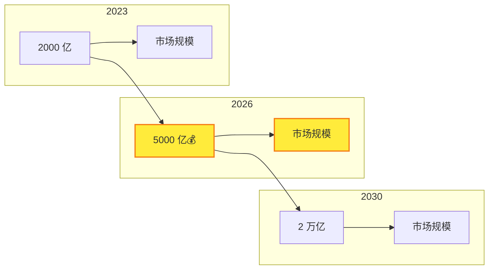
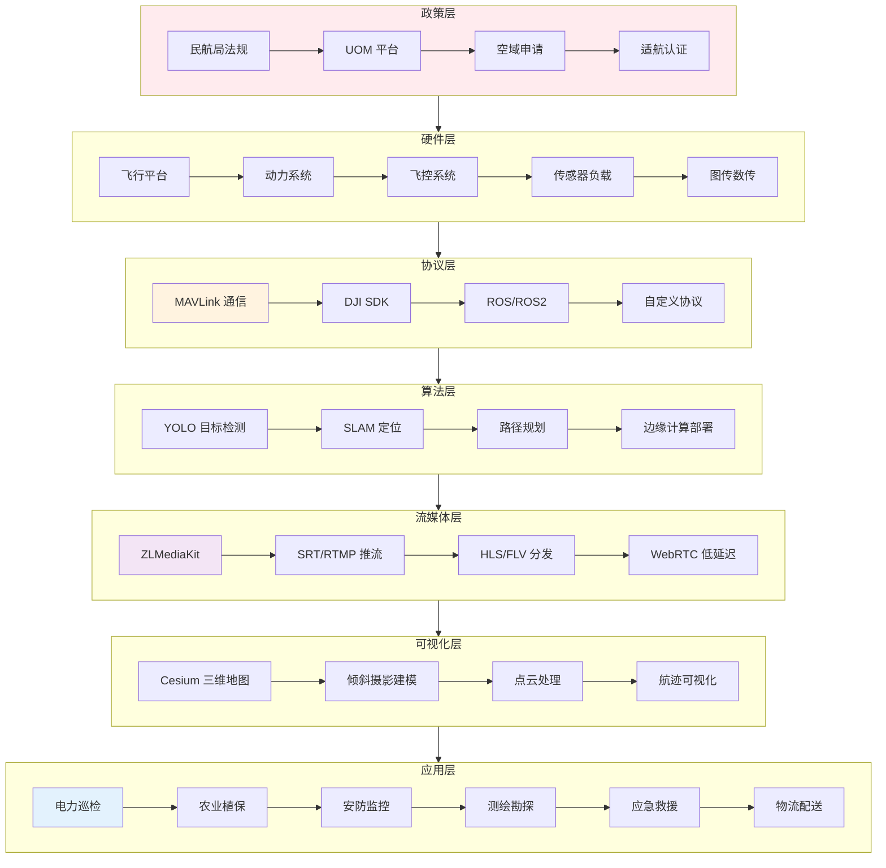

# 🚀 UAV-Mastery-Hub：低空经济时代的全栈知识库

> **2026 年低空经济爆发，你准备好了吗？**
>
> 这是一个为**无人机开发者、系统集成商、行业应用人员**打造的知识库 —— 从政策解读到代码落地，从硬件选型到 AI 识别，帮你少走 3 年弯路。

[](https://opensource.org/licenses/MIT)
[](https://github.com/zhouzhupianbei/UAV-Stack-Knowledge-Base/stargazers)
[](https://github.com/zhouzhupianbei/UAV-Stack-Knowledge-Base/commits/main)
[](https://github.com/zhouzhupianbei/UAV-Stack-Knowledge-Base/commits/main)

---

## 🚀 快速使用

### 方式一：直接阅读（推荐新手）

**适合人群**：想系统学习无人机知识，不着急做项目

1. 从 [`00-QuickStart/`](./00-QuickStart/) 开始，30 分钟建立行业认知
2. 根据你的角色，跳转到对应模块：
   - 开发者 → [`03-Protocols-Dev/`](./03-Protocols-Dev/)
   - 算法工程师 → [`04-Streaming-AI/`](./04-Streaming-AI/)
   - 系统集成商 → [`06-Industry-Solutions/`](./06-Industry-Solutions/)
3. 遇到不懂的术语？查阅 [`00-QuickStart/02-术语表.md`](./00-QuickStart/02-术语表.md)

---

### 方式二：通过 OpenClaw Skills 使用（推荐从业者）

**适合人群**：需要快速查询、整理资料、生成方案的专业人士

如果你使用 [OpenClaw](https://github.com/openclaw/openclaw) 作为个人 AI 助手，可以将本知识库作为 Skill 导入，让 AI 帮你查询和整理资料。

#### 📦 创建方法

在 `~/.openclaw/workspace/skills/` 目录下创建 `uav-knowledge/SKILL.md`：

```markdown
---
name: uav-knowledge
description: 无人机（UAV）全栈知识库。提供政策解读、硬件选型、协议开发、AI 部署、行业方案等查询与整理服务。触发词：无人机、UAV、大疆、PX4、MAVLink、电力巡检、低空经济。
---

定时加载仓库：https://github.com/zhouzhupianbei/UAV-Stack-Knowledge-Base

当用户提问无人机相关知识时，优先从仓库中查询并整理答案。
```

#### 🔧 使用方式

配置完成后，在 OpenClaw 中直接询问：

```
无人机飞行前需要在 UOM 平台报备吗？
```

```
帮我写一份电力巡检无人机方案，包含航线规划和缺陷识别
```

```
PX4 和 ArduPilot 哪个更适合行业应用？
```

AI 会自动从知识库中检索并整理答案！

---

### 方式三：克隆到本地（推荐开发者）

**适合人群**：想离线阅读、二次开发、贡献内容

```bash
git clone https://github.com/zhouzhupianbei/UAV-Stack-Knowledge-Base.git
cd UAV-Stack-Knowledge-Base
```

**目录结构**：
```
UAV-Stack-Knowledge-Base/
├── 00-QuickStart/          # 入门区
├── 01-Policy-Standard/     # 政策区
├── 02-Hardware-Systems/    # 硬件层
├── 03-Protocols-Dev/       # 协议层
├── 04-Streaming-AI/        # 算法层
├── 05-GIS-DigitalTwin/     # 空间层
├── 06-Industry-Solutions/  # 方案层
├── 07-OpenSource-Awesome/  # 生态区
└── 08-Project-Analysis/    # 实战区
```

---

## 💡 为什么需要这个项目？

### 🎯 你可能正在经历...

| 痛点 | 传统解决方案 | 这里能给你什么 |
|------|-------------|---------------|
| ❌ 政策分散难查找 | 到处搜官网、论坛、微信群 | ✅ **政策汇编 + UOM 实操指南**，1 小时搞定合规报备 |
| ❌ 技术栈太复杂 | 买课、报培训班、踩坑自学 | ✅ **全链路知识图谱**，从 MAVLink 到 YOLO 一站式学习 |
| ❌ 项目交付没标准 | 靠经验、靠摸索、靠运气 | ✅ **交钥匙方案 + 验收模板**，直接复用成熟案例 |
| ❌ 行业动态跟不上 | 关注 10+ 公众号、刷各种群 | ✅ **持续追踪**，政策/技术/产品动态及时整理 |

### 📊 低空经济风口已来



> 💡 **2026 年是低空经济商业化元年** —— 政策放开 + 技术成熟 + 成本下降，现在入局正是时候！

---

## 🎯 这个项目能帮你什么？

### 👶 如果你是**新手入门**

**30 分钟建立行业认知 → 3 天完成首飞 → 2 周掌握开发基础**

```
✅ 行业全景图 → 了解无人机分类与应用场景
✅ 术语速查表 → 搞懂电调/飞控/IMU/RTK 等 50+ 核心概念
✅ 学习路径图 → 规划从小白到工程师的成长路线
✅ 避坑指南 → 新手最常见的 20 个错误与解决方案
```

👉 **从这里开始**: [`00-QuickStart/`](./00-QuickStart/)

---

### 👨‍💻 如果你是**开发者/工程师**

**协议解析 + 代码模板 + 实战案例，直接复用**

```
✅ MAVLink 协议详解 → 消息结构 + 常用命令 + 抓包分析
✅ DJI SDK 开发指南 → OSDK/PSDK/MSDK 对比 + 示例代码
✅ ROS2 无人机集成 → 从仿真到真机的完整流程
✅ YOLO 边缘部署 → Jetson/RK3588 上的目标检测实战
✅ ZLMediaKit 图传 → 低延迟直播搭建与优化
```

👉 **从这里开始**: [`03-Protocols-Dev/`](./03-Protocols-Dev/) · [`04-Streaming-AI/`](./04-Streaming-AI/)

---

### 🏢 如果你是**系统集成商/项目交付方**

**交钥匙方案 + 验收标准 + 成本估算，拿来就用**

```
✅ 电力巡检方案 → 航线规划 + 缺陷识别 + 报告生成
✅ 农业植保方案 → 变量喷洒 + 多光谱分析 + 效果评估
✅ 安防监控方案 → 实时图传 + AI 预警 + 应急联动
✅ 项目交付标准 → 验收文档模板 + 成本控制表 + 风险清单
```

👉 **从这里开始**: [`06-Industry-Solutions/`](./06-Industry-Solutions/) · [`08-Project-Analysis/`](./08-Project-Analysis/)

---

## 🗺️ 无人机技术栈全景图



> 📌 **9 大模块，覆盖从政策到代码的全链路** —— 不只是资料收集，更是实战指南

---

## 📚 9 大核心模块

### 📖 详细目录

#### **00 🚀 QuickStart - 入门区**
- [行业全景图](./00-QuickStart/01-行业全景图.md) — 了解无人机分类与应用场景
- [术语表](./00-QuickStart/02-术语表.md) — 掌握 50+ 核心概念
- [学习路径图](./00-QuickStart/03-学习路径图.md) — 规划成长路线
- [避坑指南](./00-QuickStart/04-避坑指南.md) — 新手常见错误与解决方案

#### **01 📋 Policy-Standard - 政策区**
- [法规汇编](./01-Policy-Standard/01-法规汇编.md) — 《无人驾驶航空器飞行管理暂行条例》解读
- [UOM 平台实操](./01-Policy-Standard/02-UOM 平台实操.md) — 飞行报备流程指南
- [禁飞区查询](./01-Policy-Standard/03-禁飞区查询.md) — 全国禁飞区/限飞区查询方法
- [行业标准](./01-Policy-Standard/04-行业标准.md) — 无人机行业技术标准汇总

#### **02 🔧 Hardware-Systems - 硬件层**
- [飞行平台选型](./02-Hardware-Systems/01-飞行平台选型.md) — 多旋翼/固定翼/垂起固定翼对比
- [动力系统](./02-Hardware-Systems/02-动力系统.md) — 电机、电调、螺旋桨选型
- [传感器详解](./02-Hardware-Systems/03-传感器详解.md) — IMU、GPS、气压计、空速管
- [图传系统](./02-Hardware-Systems/04-图传系统.md) — 数字图传、模拟图传、4G/5G 图传

#### **03 🔌 Protocols-Dev - 协议层**
- [MAVLink 协议详解](./03-Protocols-Dev/01-MAVLink 协议详解.md) — 消息结构与常用命令
- [DJI SDK 对比](./03-Protocols-Dev/02-DJI-SDK 对比.md) — OSDK/PSDK/MSDK 选型指南
- [ROS2 无人机集成](./03-Protocols-Dev/03-ROS2 无人机集成.md) — 从仿真到真机
- [通信模版代码](./03-Protocols-Dev/04-通信模版代码.md) — Python/Java 示例代码

#### **04 🤖 Streaming-AI - 算法层**
- [ZLMediaKit 部署](./04-Streaming-AI/01-ZLMediaKit 部署.md) — 低延迟直播搭建
- [YOLO 目标检测](./04-Streaming-AI/02-YOLO 目标检测.md) — Jetson/RK3588 边缘部署
- [边缘计算方案](./04-Streaming-AI/03-边缘计算方案.md) — 无人机上的 AI 推理优化
- [SLAM 入门](./04-Streaming-AI/04-SLAM 入门.md) — 视觉/激光 SLAM 定位

#### **05 🗺️ GIS-DigitalTwin - 空间层**
- [Cesium 入门](./05-GIS-DigitalTwin/01-Cesium 入门.md) — 三维地球引擎基础
- [倾斜摄影建模](./05-GIS-DigitalTwin/02-倾斜摄影建模.md) — 实景三维建模流程
- [点云处理](./05-GIS-DigitalTwin/03-点云处理.md) — 激光雷达点云数据处理
- [三维重建流程](./05-GIS-DigitalTwin/04-三维重建流程.md) — 从照片到三维模型

#### **06 🏭 Industry-Solutions - 方案层**
- [电力巡检方案](./06-Industry-Solutions/01-电力巡检方案.md) — 航线规划 + 缺陷识别
- [农业植保方案](./06-Industry-Solutions/02-农业植保方案.md) — 变量喷洒 + 多光谱
- [安防监控方案](./06-Industry-Solutions/03-安防监控方案.md) — 实时图传 + AI 预警
- [测绘勘探方案](./06-Industry-Solutions/04-测绘勘探方案.md) — 正射影像 + 三维建模

#### **07 🛠️ OpenSource-Awesome - 生态区**
- [开源飞控](./07-OpenSource-Awesome/01-开源飞控.md) — ArduPilot、PX4、Betaflight
- [地面站软件](./07-OpenSource-Awesome/02-地面站软件.md) — QGroundControl、Mission Planner
- [云端平台](./07-OpenSource-Awesome/03-云端平台.md) — 无人机云系统、机库调度
- [开发工具链](./07-OpenSource-Awesome/04-开发工具链.md) — 仿真、调试、部署工具

#### **08 📊 Project-Analysis - 实战区**
- [项目交付标准](./08-Project-Analysis/01-项目交付标准.md) — 验收文档模板
- [避坑指南](./08-Project-Analysis/02-避坑指南.md) — 项目交付常见陷阱
- [成本估算表](./08-Project-Analysis/03-成本估算表.md) — 硬件 + 软件 + 人力成本
- [案例复盘](./08-Project-Analysis/04-案例复盘.md) — 真实项目经验总结

---

## 🔥 核心亮点

### ✨ 全链路覆盖

```
政策合规 → 硬件选型 → 协议开发 → AI 算法 → 流媒体 → GIS 可视化 → 行业落地
   ↓           ↓           ↓          ↓         ↓           ↓            ↓
 UOM 报备    飞控对比    MAVLink    YOLO 检测   低延迟直播   Cesium 地图   电力巡检
```

### 🎯 角色导向设计

| 角色 | 你能得到什么 | 推荐起点 |
|------|-------------|---------|
| 🎓 学生/转行 | 系统学习路径 + 面试指南 | `00-QuickStart/` |
| 💻 开发工程师 | 协议解析 + 代码模板 | `03-Protocols-Dev/` |
| 🤖 算法工程师 | YOLO 部署 + SLAM 实战 | `04-Streaming-AI/` |
| 🏢 系统集成商 | 交钥匙方案 + 验收标准 | `06-Industry-Solutions/` |
| 📊 项目负责人 | 成本估算 + 风险清单 | `08-Project-Analysis/` |

### 📊 可视化呈现

- ✅ 行业全景技术架构图
- ✅ 业务流程地图
- ✅ 学习路径可视化
- ✅ 各模块知识图谱

### 🔄 持续维护更新

我们长期追踪以下来源，保持内容与行业同步：

```yaml
资料来源:
  - 政策法规：民航局官网、UOM 平台、各省市政策
  - 技术进展：PX4/ArduPilot 博客、DJI 开发者社区
  - 行业应用：无人机世界、全球无人机网
  - 硬件产品：大疆/极飞/纵横新品发布
```

> 不是"死"的资料库，而是**持续成长的生态系统**

---

## 🚀 快速开始

### 30 分钟入门流程

| 步骤 | 内容 | 时间 | 收获 |
|------|------|------|------|
| 1️⃣ | [行业全景图](./00-QuickStart/01-行业全景图.md) | 5 分钟 | 了解无人机分类与应用场景 |
| 2️⃣ | [术语表](./00-QuickStart/02-术语表.md) | 10 分钟 | 掌握 50+ 核心概念 |
| 3️⃣ | [学习路径图](./00-QuickStart/03-学习路径图.md) | 5 分钟 | 规划成长路线 |
| 4️⃣ | [避坑指南](./00-QuickStart/04-避坑指南.md) | 10 分钟 | 避开新手常见错误 |

**完成以上步骤，你将建立对无人机行业的系统性认知！**

---

## 📬 更新日志

| 日期 | 更新内容 |
|------|---------|
| 2026-04-06 | ✅ 优化 README，增强吸引力与导航体验 |
| 2026-04-06 | ✅ 内容质量审查完成，9 大模块内容验收通过 |
| 2026-04-05 | 🎉 仓库初始化完成，9 大模块框架搭建 |

---

## 🤝 贡献指南

欢迎以以下方式参与贡献：

- 🐛 **发现错误** → 提交 [Issue](https://github.com/zhouzhupianbei/UAV-Stack-Knowledge-Base/issues)
- 📝 **补充内容** → 提交 [Pull Request](https://github.com/zhouzhupianbei/UAV-Stack-Knowledge-Base/pulls)
- 💡 **建议改进** → 发起 [Discussion](https://github.com/zhouzhupianbei/UAV-Stack-Knowledge-Base/discussions)
- 📢 **分享案例** → 欢迎投稿行业应用实战经验

---

## 📄 许可证

MIT License © 2026 UAV-Mastery-Hub Contributors

---

## 🌟 致谢

感谢所有为开源无人机生态做出贡献的开发者与组织：

- [ArduPilot](https://ardupilot.org/) - 开源飞控先驱
- [PX4](https://px4.io/) - 专业级开源飞控
- [DJI Developer](https://developer.dji.com/) - 大疆开放生态
- [MAVLink](https://mavlink.io/) - 无人机通信协议标准
- [ZLMediaKit](https://github.com/ZLMediaKit/ZLMediaKit) - 高性能流媒体框架
- [Cesium](https://cesium.com/) - 三维地球引擎

---

<div align="center">

## 🌟 如果这个项目对你有帮助

### **请给一个 ⭐ Star！**

你的支持是我们持续更新的动力！

[📬 问题反馈](https://github.com/zhouzhupianbei/UAV-Stack-Knowledge-Base/issues) · [💡 需求建议](https://github.com/zhouzhupianbei/UAV-Stack-Knowledge-Base/discussions) · [📖 查看文档](https://github.com/zhouzhupianbei/UAV-Stack-Knowledge-Base/tree/main/docs)

---

**🚀 低空经济已来，一起乘风破浪！**

</div>
