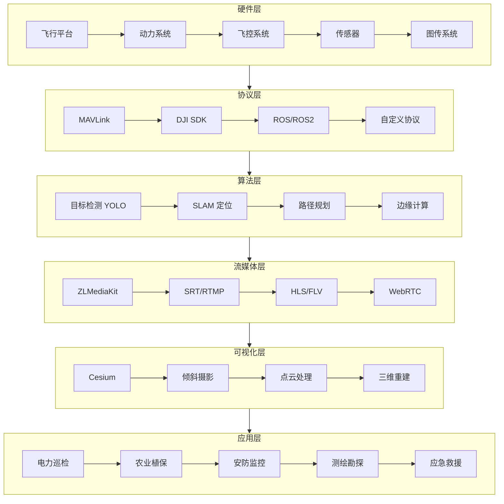
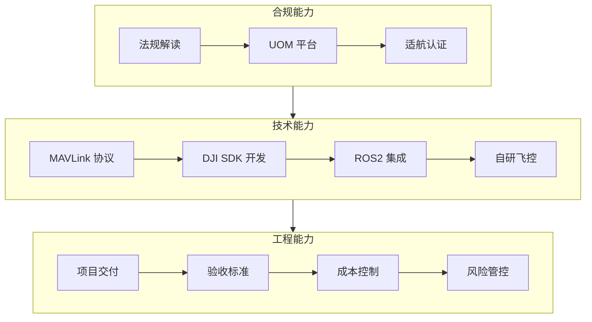

# 🚀 UAV-Mastery-Hub：航拍与低空经济全栈知识库

> 打造无人机（UAV）领域的"百科全书" —— 从底层协议解析到高层云端调度，助力每一个低空梦想平稳落地。

[](https://opensource.org/licenses/MIT)
[](https://github.com/zhouzhupianbei/UAV-Stack-Knowledge-Base/stargazers)
[](https://github.com/zhouzhupianbei/UAV-Stack-Knowledge-Base/commits/main)

---

## 📖 项目愿景

本项目深度整合无人机**政策解读、硬件选型、通讯协议（MAVLink/SDK）、边缘计算（YOLO/AI）、流媒体分发（ZLMediaKit）及 GIS 可视化（Cesium）**的全链路知识，构建一套完整的产业图谱。

### 🛡️ 核心价值

| 受众 | 价值 |
|------|------|
| **入门者** | 提供清晰的学习路径，从零建立无人机行业认知 |
| **从业者** | 提供合规与技术指南，支撑项目交付与持续演进 |
| **应用者** | 提供开箱即用的行业解决方案，快速搭建系统原型 |

---

## 🗺️ 无人机行业全景图



---

## 🎯 三类受众导航

### 👶 入门者（Beginner）→ 从 0 到 1

**起点：** [`00-QuickStart/`](./00-QuickStart/)

**学习路径：**


**推荐顺序：**
1. 📖 [行业全景图](./00-QuickStart/01-行业全景图.md) — 了解无人机分类与应用场景
2. 📖 [术语表](./00-QuickStart/02-术语表.md) — 掌握电调/飞控/IMU/RTK 等核心概念
3. 📖 [学习路径图](./00-QuickStart/03-学习路径图.md) — 规划你的成长路线
4. 📖 [避坑指南](./00-QuickStart/04-避坑指南.md) — 新手常见问题与解决方案

---

### 👨‍💻 从业者（Professional）→ 技术深耕

**起点：** [`03-Protocols-Dev/`](./03-Protocols-Dev/) · [`01-Policy-Standard/`](./01-Policy-Standard/)

**核心能力栈：**


**推荐模块：**
- 📋 [法规汇编](./01-Policy-Standard/01-法规汇编.md) — 《无人驾驶航空器飞行管理暂行条例》解读
- 🔧 [MAVLink 协议详解](./03-Protocols-Dev/01-MAVLink 协议详解.md) — 消息结构与常用命令
- 💻 [通信模版代码](./03-Protocols-Dev/04-通信模版代码.md) — Python/Java 示例
- 📝 [项目交付标准](./08-Project-Analysis/01-项目交付标准.md) — 验收文档模板

---

### 🏢 应用者（Implementer）→ 快速落地

**起点：** [`06-Industry-Solutions/`](./06-Industry-Solutions/) · [`07-OpenSource-Awesome/`](./07-OpenSource-Awesome/)

**业务流程：**


**推荐方案：**
- ⚡ [电力巡检方案](./06-Industry-Solutions/01-电力巡检方案.md) — 航线规划 + 缺陷识别
- 🌾 [农业植保方案](./06-Industry-Solutions/02-农业植保方案.md) — 变量喷洒 + 多光谱
- 🏠 [安防监控方案](./06-Industry-Solutions/03-安防监控方案.md) — 实时图传 + AI 预警
- 🗺️ [测绘勘探方案](./06-Industry-Solutions/04-测绘勘探方案.md) — 正射影像 + 三维建模

**快速原型工具：**
- 🛠️ [开源飞控](./07-OpenSource-Awesome/01-开源飞控.md) — ArduPilot、PX4
- 🖥️ [地面站软件](./07-OpenSource-Awesome/02-地面站软件.md) — QGroundControl、Mission Planner
- ☁️ [云端平台](./07-OpenSource-Awesome/03-云端平台.md) — 无人机云系统、机库调度

---

## 📚 仓库目录结构

```
UAV-Mastery-Hub/
├── 00-QuickStart/          # 【入门区】30 分钟了解无人机行业
│   ├── 01-行业全景图.md
│   ├── 02-术语表.md
│   ├── 03-学习路径图.md
│   └── 04-避坑指南.md
├── 01-Policy-Standard/     # 【政策区】法规、适航、禁飞区、行业标准
│   ├── 01-法规汇编.md
│   ├── 02-UOM 平台实操.md
│   ├── 03-禁飞区查询.md
│   └── 04-行业标准.md
├── 02-Hardware-Systems/    # 【硬件层】飞行平台、动力、传感器、图传
│   ├── 01-飞行平台选型.md
│   ├── 02-动力系统.md
│   ├── 03-传感器详解.md
│   └── 04-图传系统.md
├── 03-Protocols-Dev/       # 【协议层】MAVLink、SDK、ROS/ROS2
│   ├── 01-MAVLink 协议详解.md
│   ├── 02-DJI-SDK 对比.md
│   ├── 03-ROS2 无人机集成.md
│   └── 04-通信模版代码.md
├── 04-Streaming-AI/        # 【算法层】ZLMediaKit、YOLO、目标识别、SLAM
│   ├── 01-ZLMediaKit 部署.md
│   ├── 02-YOLO 目标检测.md
│   ├── 03-边缘计算方案.md
│   └── 04-SLAM 入门.md
├── 05-GIS-DigitalTwin/     # 【空间层】Cesium、倾斜摄影、点云、三维重建
│   ├── 01-Cesium 入门.md
│   ├── 02-倾斜摄影建模.md
│   ├── 03-点云处理.md
│   └── 04-三维重建流程.md
├── 06-Industry-Solutions/  # 【方案层】电力、农业、巡检、测绘实战
│   ├── 01-电力巡检方案.md
│   ├── 02-农业植保方案.md
│   ├── 03-安防监控方案.md
│   └── 04-测绘勘探方案.md
├── 07-OpenSource-Awesome/  # 【生态区】开源系统、地面站、Gogs 托管模版
│   ├── 01-开源飞控.md
│   ├── 02-地面站软件.md
│   ├── 03-云端平台.md
│   └── 04-开发工具链.md
└── 08-Project-Analysis/    # 【实战区】从需求到交付的全过程案例复盘
    ├── 01-项目交付标准.md
    ├── 02-避坑指南.md
    ├── 03-成本估算表.md
    └── 04-案例复盘.md
```

---

## 🔥 核心亮点

### ✨ 全链路覆盖

从底层硬件选型 → 通讯协议解析 → 边缘计算部署 → 流媒体分发 → GIS 可视化 → 行业应用落地，形成完整闭环。

### 🎯 角色导向设计

不同背景的用户都能快速找到所需内容：
- **新手**不迷路：清晰的入门路径
- **开发者**有深度：协议解析 + 代码模版
- **集成商**能落地：交钥匙方案 + 成本估算

### 📊 可视化呈现

- 行业全景技术架构图
- 业务流程地图
- 学习路径可视化
- 各模块知识图谱

### 🔄 持续更新

每日自动维护，追踪行业动态、政策法规、技术进展，保持内容时效性。

---

## 🚀 快速开始

### 30 分钟入门流程

1. **5 分钟** → 阅读 [行业全景图](./00-QuickStart/01-行业全景图.md)
2. **10 分钟** → 查阅 [术语表](./00-QuickStart/02-术语表.md)
3. **5 分钟** → 查看 [学习路径图](./00-QuickStart/03-学习路径图.md)
4. **10 分钟** → 浏览 [避坑指南](./00-QuickStart/04-避坑指南.md)

完成以上步骤，你将建立对无人机行业的系统性认知！

---

## 📬 更新日志

| 日期 | 更新内容 |
|------|---------|
| 2026-04-05 | 🎉 仓库初始化完成，9 大模块框架搭建 |
| 2026-04-06 | 计划：核心内容填充（入门区 + 政策区） |

---

## 🤝 贡献指南

欢迎提交 Issue 和 Pull Request！

- 🐛 发现错误？提交 Issue
- 📝 补充内容？提交 PR
- 💡 建议改进？发起 Discussion

---

## 📄 许可证

MIT License © 2026 UAV-Mastery-Hub Contributors

---

## 🌟 致谢

感谢所有为开源无人机生态做出贡献的开发者与组织：
- [ArduPilot](https://ardupilot.org/)
- [PX4](https://px4.io/)
- [DJI Developer](https://developer.dji.com/)
- [MAVLink](https://mavlink.io/)
- [ZLMediaKit](https://github.com/ZLMediaKit/ZLMediaKit)
- [Cesium](https://cesium.com/)

---

<div align="center">

**如果这个项目对你有帮助，请给一个 ⭐ Star！**

[问题反馈](https://github.com/zhouzhupianbei/UAV-Stack-Knowledge-Base/issues) · [需求建议](https://github.com/zhouzhupianbei/UAV-Stack-Knowledge-Base/discussions)

</div>
